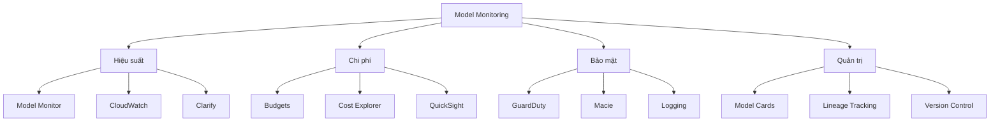

# Hướng Dẫn Giám Sát Hệ Thống ML

## Mục lục
- [Tổng quan hệ thống giám sát](#tổng-quan-hệ-thống-giám-sát)
- [Giám sát hiệu suất và chất lượng](#giám-sát-hiệu-suất-và-chất-lượng)
- [Quản lý chi phí và ROI](#quản-lý-chi-phí-và-roi)
- [Bảo mật và quản trị](#bảo-mật-và-quản-trị)

## Tổng quan hệ thống giám sát

## Công cụ giám sát chính

### 1. Model Observability
- SageMaker Model Monitor
- CloudWatch
- SageMaker Clarify model cards
- SageMaker lineage tracking

### 2. Bảo mật và Access Control
- Amazon GuardDuty
- Amazon Macie
- Logging systems
- Secure inference endpoints

## Giám sát hiệu suất và chất lượng

### 1. Đánh giá Model Performance
- **Model Drift Detection**
  - Sử dụng Clarify
  - Model Monitor
  - OpenSearch cho visualization

- **Model Explainability**
  - Feature importance tracking
  - Bias monitoring
  - Performance degradation detection

### 2. Retraining Framework
- **Automated Retraining**
  - SageMaker pipelines
  - AWS Step Functions
  - Jenkins

- **Data Quality Monitoring**
  - SageMaker Data Wrangler
  - Feature monitoring
  - Data drift detection

### 3. Human-in-the-Loop
- Amazon Augmented AI (A2I)
- Human evaluation teams
- Quality assessment

## Quản lý chi phí và ROI

### 1. Monitoring Metrics
- **Material Efficiency**
  - Provisioned resources/Business outcomes
  - Cost tracking
  - Value measurement

- **Instance Fleet Management**
  - CloudWatch monitoring
  - SageMaker autoscaling
  - Right-sizing

### 2. Optimizations
- **Storage Optimization**
  - Amazon FSX for Lustre
  - S3 optimization
  - Data access patterns

- **Training Efficiency**
  - Selective retraining
  - Cost-benefit analysis
  - Performance thresholds

## Bảo mật và quản trị

### 1. Configuration Management
- CloudFormation templates
- Architecture synchronization
- Environment skew monitoring

### 2. Version Control
- ECR
- CodeCommit
- SageMaker Pipelines
- SageMaker Projects

### 3. Scaling và Recovery
- **Auto-scaling**
  - Endpoint scaling
  - Elastic inference
  - Traffic management

- **Disaster Recovery**
  - Version rollback
  - Backup strategies
  - Recovery procedures

## Best Practices

1. **Tự động hóa**
   - Thiết lập auto-scaling
   - Automated retraining pipelines
   - Automated monitoring alerts

2. **Hiệu quả chi phí**
   - Chỉ retrain khi cần thiết
   - Tối ưu hóa instance usage
   - Monitor material efficiency

3. **Quản trị dữ liệu**
   - Regular data quality checks
   - Feature consistency monitoring
   - Data drift detection

4. **Bảo mật**
   - Regular security audits
   - Access control monitoring
   - PII detection và protection

## Kết luận
Giám sát hệ thống ML là một quá trình đa chiều đòi hỏi sự cân bằng giữa hiệu suất, chi phí, bảo mật và quản trị. Việc áp dụng các công cụ phù hợp và thực hành tốt sẽ giúp đảm bảo hệ thống hoạt động hiệu quả và tạo giá trị kinh doanh bền vững.