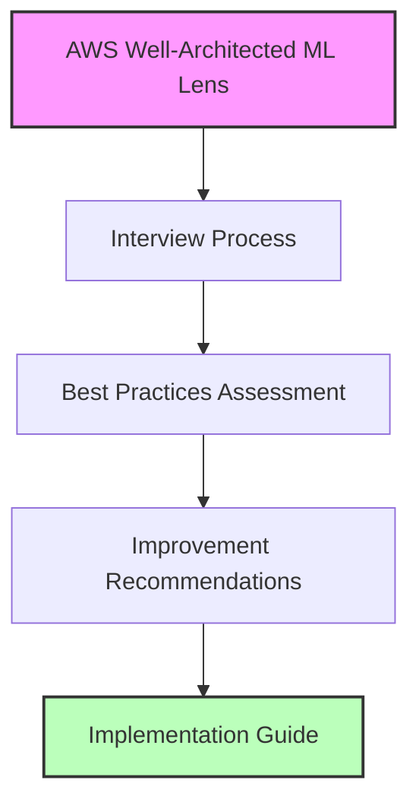

# AWS Well-Architected Framework cho Machine Learning

## Giới thiệu
AWS Well-Architected Framework cung cấp các hướng dẫn và best practices để xây dựng hệ thống ML an toàn, hiệu quả và bền vững. Framework này được tích hợp trong AWS Well-Architected Tool dưới dạng một custom lens.

## Cấu trúc Framework

### 1. Well-Architected Tool
- Custom lens dạng file JSON
- Hướng dẫn phỏng vấn về việc sử dụng ML
- Đánh giá và đề xuất cải tiến

### 2. Các giai đoạn chính
- Training và Model Development
- Deployment
- Monitoring và Maintenance
- Security và Governance

### 3. Tài liệu tham khảo
- Whitepaper chi tiết từ AWS
- Documentation cho từng service
- Implementation guides

## Working Backwards Approach

### 1. Xác định services từ best practices
- Mỗi best practice gắn với specific AWS services
- Focus vào các công nghệ thiết yếu
- Hiểu rõ use case của từng service

### 2. Key Services cần nắm vững
- **Development**: SageMaker, Feature Store
- **Deployment**: Endpoints, Pipelines
- **Monitoring**: Model Monitor, CloudWatch
- **Security**: GuardDuty, Macie

## Ý nghĩa với AWS ML Certification

### 1. Trọng tâm kiến thức
- Well-Architected Framework là nền tảng
- Best practices định hướng học tập
- Services liên quan là trọng tâm thi

### 2. Chiến lược học tập
- Hiểu rõ best practices
- Nắm vững các services liên quan
- Thực hành theo framework

## Kết luận
AWS Well-Architected Framework cho ML là kim chỉ nam để xây dựng và vận hành hệ thống ML. Việc nắm vững framework này không chỉ giúp chuẩn bị tốt cho chứng chỉ AWS Certified Machine Learning Engineer mà còn giúp xây dựng hệ thống ML hiệu quả trong thực tế.