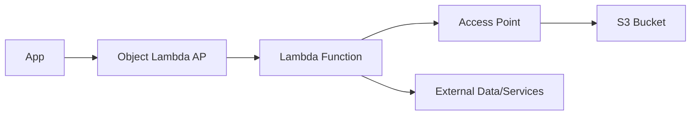

# S3 Object Lambda: Biến Đổi Objects theo Yêu Cầu

## 1. Tổng Quan

### 1.1 Định Nghĩa
- Biến đổi objects khi truy xuất
- Không cần duplicate data
- Tích hợp với Lambda functions

### 1.2 Kiến Trúc
```plaintext
Application → S3 Object Lambda Access Point → Lambda Function → S3 Access Point → S3 Bucket
```

## 2. Use Cases

### 2.1 Redacted Data Access
1. **Quy Trình**
   - E-commerce app → Original data
   - Analytics app → Redacted data
   - Lambda function xóa sensitive data

2. **Implementation**
```plaintext
Analytics App → Object Lambda AP → Lambda (Redact) → Access Point → Bucket
```

### 2.2 Enriched Data Access
1. **Quy Trình**
   - Marketing app → Enriched data
   - Lambda function thêm customer loyalty data
   - Single source of truth

2. **Implementation**
```plaintext
Marketing App → Object Lambda AP → Lambda (Enrich) → Access Point → Bucket
```

## 3. Common Transformations

### 3.1 Data Processing
1. **Format Conversion**
   - XML → JSON
   - CSV → Parquet
   - Data restructuring

2. **Data Protection**
   - PII redaction
   - Data masking
   - Filtering sensitive info

3. **Image Processing**
   - Resize on-the-fly
   - Dynamic watermarking
   - Format conversion

## 4. Implementation Details

### 4.1 Components
1. **S3 Bucket**
   - Original data storage
   - Single source of truth

2. **S3 Access Point**
   - Standard access to bucket
   - Permission management

3. **Lambda Function**
   - Transformation logic
   - Data processing code

4. **Object Lambda Access Point**
   - Entry point for applications
   - Routes requests through Lambda

### 4.2 Flow


## 5. Benefits

### 5.1 Storage Optimization
- Single copy of data
- Reduce storage costs
- Simplified management

### 5.2 Flexibility
- Dynamic transformations
- Custom processing
- User-specific modifications

### 5.3 Security
- Data protection
- Access control
- Audit capability

## 6. Best Practices

### 6.1 Design Considerations
- Keep transformations lightweight
- Handle errors gracefully
- Cache when possible
- Monitor performance

### 6.2 Implementation Tips
1. **Lambda Function**
   - Optimize code performance
   - Handle timeouts
   - Manage memory usage

2. **Access Points**
   - Clear naming convention
   - Proper permissions
   - Regular monitoring

## 7. Use Case Examples

### 7.1 Data Protection
```python
def lambda_handler(event, context):
    # Get object from S3
    object = get_object_from_s3(event)
    
    # Redact PII
    redacted_data = remove_pii(object)
    
    return {
        'statusCode': 200,
        'body': redacted_data
    }
```

### 7.2 Image Processing
```python
def lambda_handler(event, context):
    # Get image
    image = get_image_from_s3(event)
    
    # Add user-specific watermark
    user = event['userIdentity']
    watermarked = add_watermark(image, user)
    
    return {
        'statusCode': 200,
        'body': watermarked
    }
```

## 8. Monitoring và Maintenance

### 8.1 Metrics to Watch
- Lambda execution time
- Error rates
- Response latency
- Resource usage

### 8.2 Regular Tasks
- Review transformations
- Update Lambda functions
- Optimize performance
- Audit access patterns