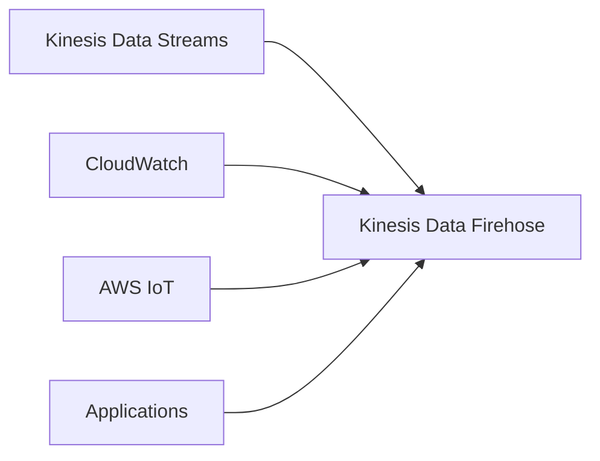
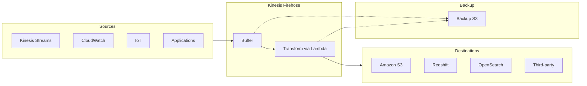

# Amazon Kinesis Data Firehose - Hướng dẫn Toàn diện

## Mục lục
- [Tổng quan](#tổng-quan)
- [Kiến trúc và Luồng dữ liệu](#kiến-trúc-và-luồng-dữ-liệu)
- [Buffer và Delivery](#buffer-và-delivery)
- [So sánh với Kinesis Data Streams](#so-sánh-với-kinesis-data-streams)
- [Use Cases và Best Practices](#use-cases-và-best-practices)

## Tổng quan

### Đặc điểm chính
- Dịch vụ fully managed 
- Near real-time delivery
- Auto-scaling
- Pay for what you use
- Không cần administration

### Nguồn dữ liệu (Sources)


### Destinations chính
1. **AWS Services**:
   - Amazon S3
   - Amazon Redshift
   - Amazon OpenSearch

2. **Third-party Partners**:
   - Datadog
   - Splunk
   - New Relic
   - MongoDB

3. **Custom Destinations**:
   - HTTP Endpoints
   - APIs

## Kiến trúc và Luồng dữ liệu

### Quá trình xử lý


### Data Transformation
1. **Format Conversion**:
   - JSON sang Parquet/ORC
   - CSV sang JSON
   - Custom transformations

2. **Compression**:
   - GZIP (hỗ trợ cho Redshift)
   - ZIP
   - SNAPPY (cho S3)

### Error Handling
- Source data backup
- Transformation failure backup
- Delivery failure backup

## Buffer và Delivery

### Buffer Sizing
1. **Buffer Size**:
   - Minimum: vài MB
   - Auto-scaling theo throughput
   - Flush khi đạt giới hạn

2. **Buffer Time**:
   - Minimum: 1 phút
   - Flush theo thời gian
   - Áp dụng khi throughput thấp

### Delivery Rules
```plaintext
Flush Conditions:
1. Buffer Size Reached   OR
2. Buffer Time Exceeded  OR
3. Buffer Disabled (immediate delivery)
```

### Throughput Scenarios
1. **High Throughput**:
   - Buffer size limit hit first
   - Frequent flushes
   - Efficient batching

2. **Low Throughput**:
   - Buffer time limit hit first
   - Regular interval flushes
   - Smaller batches

## So sánh với Kinesis Data Streams

| Feature | Data Streams | Data Firehose |
|---------|--------------|---------------|
| Latency | Real-time (70-200ms) | Near real-time |
| Scaling | Manual (shard management) | Automatic |
| Storage | 1-365 days | No storage |
| Consumers | Multiple | Single destination |
| Use Case | Real-time processing | Data loading/archival |
| Management | Custom code needed | Fully managed |
| Cost Model | Per shard provisioned | Pay per use |

## Use Cases và Best Practices

### Ideal Use Cases
1. **Data Lake Integration**:
   - Loaded into S3
   - Format conversion
   - Compression

2. **Analytics Pipeline**:
   - Loading into Redshift
   - Real-time analytics
   - Data warehousing

3. **Log Processing**:
   - CloudWatch integration
   - Splunk delivery
   - Monitoring solutions

### Best Practices
1. **Buffer Configuration**
   - Balance latency vs efficiency
   - Monitor buffer metrics
   - Adjust based on patterns

2. **Transformation**
   - Use Lambda efficiently
   - Keep transformations light
   - Handle errors properly

3. **Monitoring**
   - Track delivery success
   - Monitor latency
   - Set up alerts

4. **Cost Optimization**
   - Use compression
   - Optimize buffer size
   - Monitor usage patterns

### Lưu ý quan trọng
1. **Spark/KCL Limitations**:
   - Không thể đọc từ Firehose
   - Chỉ đọc được từ Data Streams

2. **Delivery Guarantees**:
   - At-least-once delivery
   - Backup options available
   - Error handling built-in