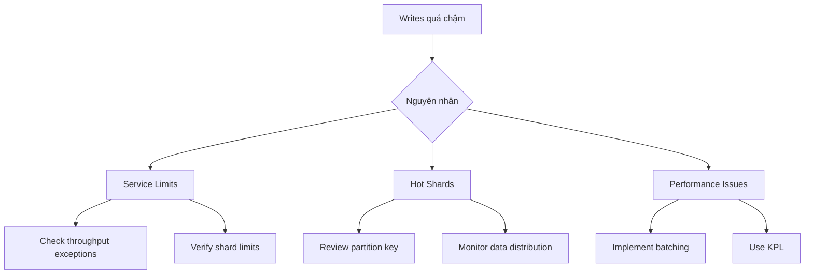
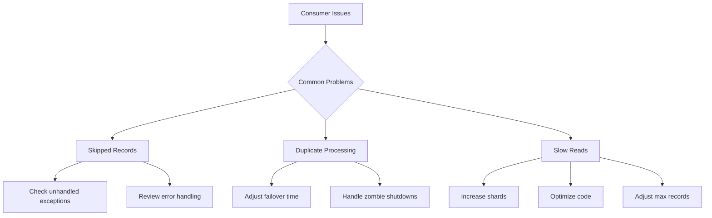

# Hướng dẫn Troubleshooting cho Kinesis Data Streams

## Mục lục
- [Vấn đề với Producer](#vấn-đề-với-producer)
- [Vấn đề với Consumer](#vấn-đề-với-consumer)
- [Best Practices và Giải pháp](#best-practices-và-giải-pháp)

## Vấn đề với Producer

### 1. Writes quá chậm


#### Giải pháp
1. **Service Limits**:
   - Kiểm tra throughput exceptions
   - Verify shard-level limits
   - Kiểm tra stream-level limits (5-20 calls/second)

2. **Hot Shards**:
   - Optimize partition key
   - Phân phối đều data
   - Monitor shard metrics

3. **Performance**:
   - Sử dụng KPL với PutRecords
   - Batch records
   - Aggregate thành larger files

### 2. Error Handling

#### HTTP Errors (500/503)
- Indicates > 1% exception rate
- Implement retry mechanism
- Monitor error rates

#### Connection Issues
1. **Flink to Kinesis**:
   - Check network connectivity
   - Verify VPC configuration
   - Review resource allocation

2. **Timeout Errors**:
   - Increase request timeout
   - Adjust queue limits
   - Monitor connection metrics

### 3. Throttling Issues

#### Nguyên nhân và Giải pháp
1. **Hot Shards**:
   - Use enhanced monitoring
   - Check for micro spikes
   - Review partition strategy

2. **Rate Limiting**:
   - Implement exponential backoff
   - Set appropriate rate limits
   - Monitor throughput metrics

## Vấn đề với Consumer

### 1. Record Processing Issues


#### Skipped Records
- Check unhandled exceptions
- Review process records implementation
- Monitor record processing

#### Duplicate Processing
- Adjust failover timing
- Handle shutdown with reason "ZOMBIE"
- Monitor worker states

#### Performance Issues
- Increase shard count
- Adjust max records per call
- Test with empty processor

### 2. Lambda Integration Issues

#### Common Problems
1. **Function not invoked**:
   - Check IAM permissions
   - Verify execution role
   - Review trigger configuration

2. **Timeouts**:
   - Adjust max execution time
   - Monitor function duration
   - Review resource allocation

3. **Concurrency**:
   - Check concurrency limits
   - Monitor iterator age
   - Consider scaling options

### 3. Throughput Issues

#### Read Throughput Exceeded
1. **Immediate Actions**:
   - Implement retries
   - Use exponential backoff
   - Consider Enhanced Fan-Out

2. **Long-term Solutions**:
   - Reshard stream
   - Optimize request size
   - Monitor throughput metrics

#### High Latency
- Monitor GetRecords latency
- Check iterator age
- Review CPU/memory usage

## Best Practices và Giải pháp

### 1. Monitoring Strategy
- Set up CloudWatch metrics
- Monitor key indicators
- Create appropriate alarms

### 2. Performance Optimization
```plaintext
1. Producer Side:
   - Use batching
   - Implement proper partition keys
   - Monitor hot shards

2. Consumer Side:
   - Optimize processing code
   - Use appropriate scaling
   - Monitor resource usage
```

### 3. Error Handling
1. **Retry Strategy**:
   - Implement exponential backoff
   - Set appropriate timeouts
   - Handle specific error types

2. **Resource Management**:
   - Monitor DynamoDB capacity
   - Adjust retention period
   - Scale resources appropriately

### 4. Troubleshooting Checklist
- [ ] Verify service limits
- [ ] Check error logs
- [ ] Monitor performance metrics
- [ ] Review configuration
- [ ] Test with minimal setup
- [ ] Implement proper monitoring
- [ ] Document issues and solutions

### Lưu ý cho Exam
1. Nhận biết các triệu chứng phổ biến
2. Hiểu các giải pháp tương ứng
3. Biết khi nào dùng Enhanced Fan-Out
4. Hiểu về retry mechanisms và error handling