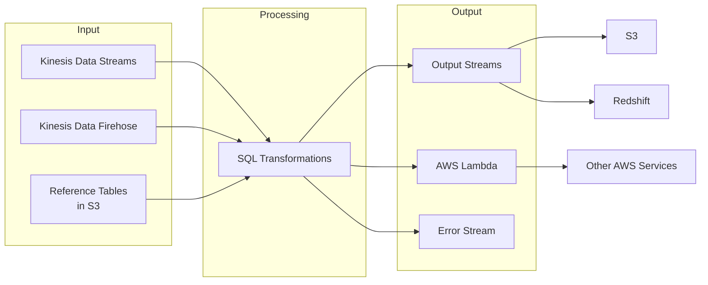
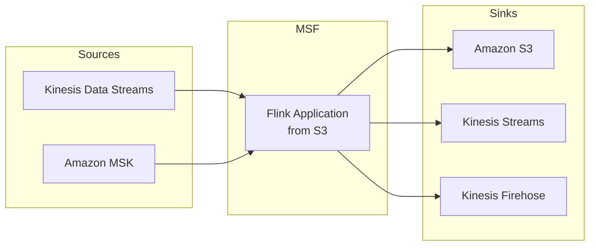

# Kinesis Data Analytics và AWS MSF

## Mục lục
- [Kinesis Data Analytics for SQL](#kinesis-data-analytics-for-sql)
- [AWS Managed Service for Apache Flink](#aws-managed-service-for-apache-flink)
- [Use Cases và Ứng dụng](#use-cases-và-ứng-dụng)

## Kinesis Data Analytics for SQL

### Tổng quan
- Xử lý và query streaming data bằng SQL
- Đang dần được thay thế bởi MSF
- Hỗ trợ real-time processing

### Kiến trúc

### Reference Tables
- Stored trong S3
- Dùng cho quick lookups
- Join với streaming data
- Ví dụ: mapping ZIP codes với cities

### Lambda Integration
- Post-processing capabilities
- Data transformation
- Data enrichment
- Service integration
- Custom destinations

## AWS Managed Service for Apache Flink

### Evolution
1. Kinesis Data Analytics for Java
2. Kinesis Data Analytics for Apache Flink
3. AWS Managed Service for Apache Flink (MSF)

### Đặc điểm chính
- Serverless và fully managed
- Support Python, Java, Scala
- Tích hợp sâu với AWS services
- Hai API chính:
  - Data Stream API
  - Table API (SQL access)

### Kiến trúc MSF

### Development Flow
1. Phát triển Flink application
2. Upload application lên S3
3. Deploy qua MSF
4. MSF quản lý runtime environment

## Use Cases và Ứng dụng

### 1. Streaming ETL
- Real-time data transformation
- On-the-fly processing
- Data enrichment
- Format conversion

### 2. Continuous Metrics
- Real-time monitoring
- Performance tracking
- Business metrics
- System health monitoring

### 3. Responsive Analytics
- Website analytics
- User behavior analysis
- Real-time dashboards
- Instant insights

### Best Practices
1. **Development**
   - Test locally trước khi deploy
   - Implement proper error handling
   - Monitor performance metrics
   - Use checkpointing

2. **Operations**
   - Set up monitoring
   - Plan for scaling
   - Configure backups
   - Implement security controls

3. **Integration**
   - Choose appropriate sources/sinks
   - Consider latency requirements
   - Plan for data volume
   - Design for fault tolerance

### Lưu ý cho Exam
1. **Kinesis Analytics for SQL**
   - Basic SQL transformations
   - Reference table concept
   - Integration với Lambda

2. **MSF**
   - Serverless nature
   - Application deployment process
   - Sources và sinks
   - Use cases

3. **Architecture**
   - Understand data flow
   - Know integration points
   - Familiar với common patterns