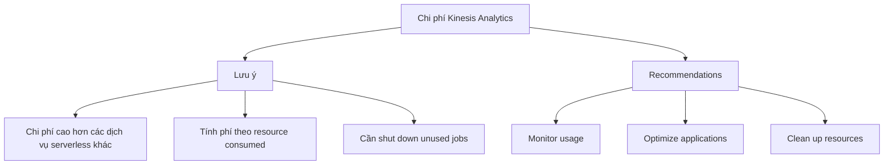
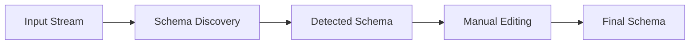
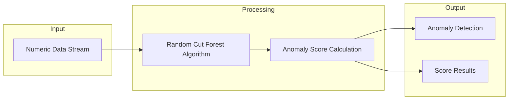

# Chi phí và Tính năng Đặc biệt của Kinesis Analytics

## Mục lục
- [Mô hình Chi phí](#mô-hình-chi-phí)
- [Bảo mật](#bảo-mật)
- [Schema Discovery](#schema-discovery)
- [Random Cut Forest](#random-cut-forest)

## Mô hình Chi phí

### Đặc điểm Serverless
- Pay-per-use model
- Tự động scale
- Không cần quản lý infrastructure

### Chi phí Considerations


### Best Practices về Chi phí
1. **Resource Management**:
   - Shut down unused analytics jobs
   - Monitor resource usage
   - Optimize application performance

2. **Cost Optimization**:
   - Regular cost analysis
   - Resource cleanup
   - Usage monitoring

## Bảo mật

### IAM Integration
- Quản lý permissions cho:
  - Source streams
  - Destination services
  - Application access

### IAM Configuration Example
```json
{
    "Version": "2012-10-17",
    "Statement": [
        {
            "Effect": "Allow",
            "Action": [
                "kinesis:GetRecords",
                "kinesis:GetShardIterator",
                "kinesis:DescribeStream"
            ],
            "Resource": "arn:aws:kinesis:region:account:stream/stream-name"
        }
    ]
}
```

## Schema Discovery

### Tính năng chính
- Tự động phát hiện schema từ streaming data
- Real-time analysis
- Schema editing và correction

### Process Flow


### Use Cases
1. **Auto Schema Detection**:
   - Streaming data analysis
   - Dynamic schema adaptation
   - Quick setup

2. **Schema Management**:
   - Schema validation
   - Schema evolution
   - Data quality control

## Random Cut Forest

### Overview
- SQL function cho anomaly detection
- Phát hiện outliers trong numeric data
- Novel algorithm được AWS phát triển

### Hoạt động


### Use Cases
1. **Real-time Monitoring**:
   - System metrics
   - User behavior
   - Business metrics

2. **Anomaly Detection**:
   - Fraud detection
   - System outages
   - Traffic patterns
   - Usage anomalies

### Example: NYC Subway Ridership
- Monitor turnstile data
- Detect unusual patterns
- Identify event-related anomalies
- Real-time analysis

### Implementation Tips
1. **SQL Usage**:
   ```sql
   SELECT RANDOM_CUT_FOREST(numeric_column) 
   FROM your_stream
   ```

2. **Best Practices**:
   - Choose appropriate window sizes
   - Configure sensitivity
   - Handle alerts appropriately
   - Monitor performance

## Lưu ý cho Exam

### Cost Model
- Understand serverless pricing
- Know cost optimization strategies
- Remember to cleanup resources

### Security
- IAM role configuration
- Permission management
- Access control

### Features
1. **Schema Discovery**:
   - Automatic schema detection
   - Schema modification capabilities
   - Use cases

2. **Random Cut Forest**:
   - Anomaly detection scenarios 
   - Implementation method
   - Real-world applications