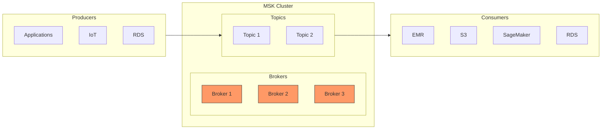
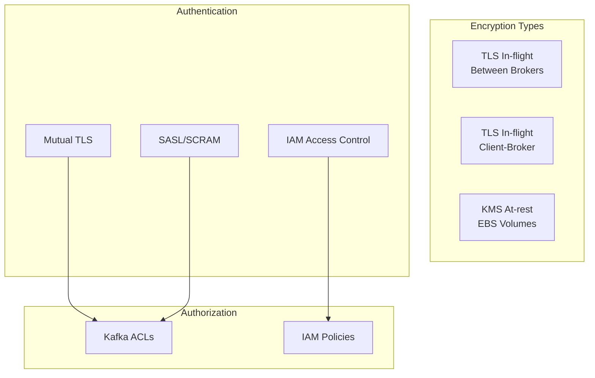

# Amazon MSK (Managed Streaming for Apache Kafka)

## Mục lục
- [Tổng quan](#tổng-quan)
- [Kiến trúc](#kiến-trúc)
- [Bảo mật](#bảo-mật)
- [Monitoring](#monitoring)

## Tổng quan

### Đặc điểm chính
- Fully managed Apache Kafka service
- Quản lý Kafka brokers và Zookeeper nodes
- Triển khai trong VPC
- Multi-AZ (tối đa 3 AZ)
- Auto recovery từ common failures
- Data stored trên EBS volumes

### Differences vs Kinesis
- Có thể custom configuration
- Message size có thể lên tới 10MB (vs 1MB của Kinesis)
- Triển khai private trong VPC
- Flexible retention period (dựa vào EBS volume size)

## Kiến trúc

### Cluster Configuration
1. **Availability Zones**:
   - Recommended: 2-3 AZ
   - Một Zookeeper/AZ
   - Một hoặc nhiều Kafka broker/AZ

2. **Networking**:
   - VPC selection
   - Subnet configuration
   - Private cluster setup

3. **Resources**:
   - Broker instance type (e.g., m5.large)
   - EBS volume size (1GB-16TB)
   - Number of brokers per AZ

## Bảo mật

### Encryption

### Authentication Methods
1. **Mutual TLS (AuthN)**
   - Uses TLS certificates
   - Requires Kafka ACLs for authorization
   - Cannot be managed through IAM

2. **SASL/SCRAM**
   - Username/password authentication
   - Requires Kafka ACLs for authorization
   - Cannot be managed through IAM

3. **IAM Access Control**
   - Authentication và authorization qua IAM
   - Tương tự Kinesis model
   - Managed through AWS

## Monitoring

### CloudWatch Integration
1. **Basic Monitoring**:
   - Cluster-level metrics
   - Broker-level metrics

2. **Enhanced Monitoring**:
   - Additional broker metrics
   - Topic-level monitoring
   - Enhanced topic metrics

### Prometheus Integration
- JMX Exporter support
- Node Exporter support
- Open-source monitoring capability

### Log Delivery Options
- CloudWatch Logs
- Amazon S3
- Kinesis Data Streams

## Best Practices

### 1. Configuration
- Sử dụng multi-AZ cho high availability
- Size EBS volumes phù hợp với retention needs
- Configure appropriate instance types

### 2. Security
- Enable encryption in-flight
- Implement proper authentication
- Use security groups cho network security
- Configure appropriate authorization

### 3. Monitoring
- Set up appropriate monitoring level
- Configure log delivery
- Monitor cluster health
- Track performance metrics

## Lưu ý cho Exam
1. **Architecture**:
   - Multi-AZ deployment
   - Broker/Zookeeper setup
   - EBS storage

2. **Security**:
   - Authentication methods
   - Authorization mechanisms
   - Encryption options

3. **Monitoring**:
   - CloudWatch integration
   - Prometheus support
   - Log delivery options

4. **VS Kinesis**:
   - Configurable message size
   - Private deployment
   - Custom configurations