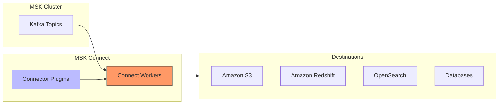
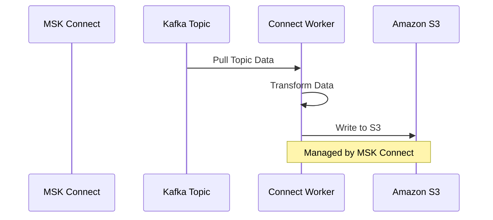

# Amazon MSK Connect

## Mục lục
- [Tổng quan](#tổng-quan)
- [Kiến trúc](#kiến-trúc)
- [Connector Types](#connector-types)
- [Pricing](#pricing)

## Tổng quan

### Đặc điểm chính
- Managed Kafka Connect framework trên AWS
- Auto-scaling capabilities
- Plugin-based architecture
- Fully managed infrastructure

### Use Cases
- Data integration
- ETL processes
- Real-time data movement
- Database synchronization

## Kiến trúc

### Components
1. **Connect Workers**
   - Managed by AWS
   - Auto-scaling
   - High availability
   - Fault tolerant

2. **Connector Plugins**
   - S3 Connector
   - Redshift Connector
   - OpenSearch Connector
   - Debezium
   - Custom connectors

## Connector Types

### Source Connectors
- Đọc data từ external systems
- Write vào Kafka topics
- Database CDC connectors

### Sink Connectors
1. **AWS Services**
   - Amazon S3
   - Amazon Redshift
   - Amazon OpenSearch

2. **Third-party Systems**
   - Databases
   - Data warehouses
   - Analytics platforms

### Example: S3 Sink Connector Flow

## Pricing

### Cost Structure
- $0.11 per worker per hour
- Scale based on data volume
- Pay for used resources

### Scaling Considerations
1. **Workers**
   - Auto-scales based on load
   - Configure min/max workers
   - Monitor utilization

2. **Cost Optimization**
   - Right-size workers
   - Monitor usage patterns
   - Optimize data flow

## Implementation Best Practices

### 1. Setup & Configuration
- Choose appropriate connector
- Configure proper scaling
- Set up monitoring
- Handle errors appropriately

### 2. Monitoring
- Track worker health
- Monitor throughput
- Watch for bottlenecks
- Set up alerts

### 3. Performance
- Optimize batch sizes
- Configure proper partitioning
- Monitor latency
- Balance resources

## Lưu ý cho Exam

### Key Points
1. **Managed Service**
   - Fully managed Kafka Connect
   - Auto-scaling capability
   - Plugin-based architecture

2. **Integration**
   - AWS services integration
   - Third-party connectors
   - Custom plugins support

3. **Operations**
   - No infrastructure management
   - Configuration-based setup
   - Pay-per-use pricing