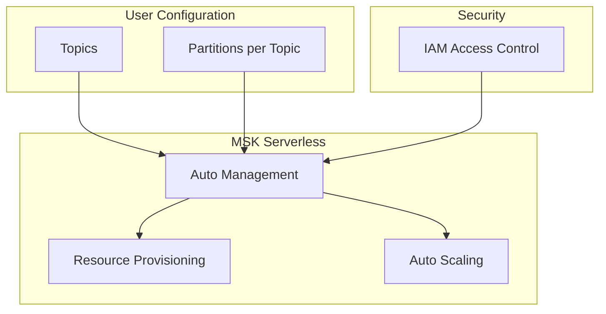

# Amazon MSK Serverless

## Mục lục
- [Tổng quan](#tổng-quan)
- [Architecture](#architecture)
- [Pricing Model](#pricing-model)
- [So sánh với MSK Standard](#so-sánh-với-msk-standard)

## Tổng quan

### Đặc điểm chính
- Fully serverless Apache Kafka
- Automatic resource provisioning
- Auto-scaling compute và storage
- IAM Access Control cho tất cả clusters

### User Requirements
- Chỉ cần định nghĩa topics
- Xác định số lượng partitions/topic
- Không cần quản lý capacity

## Architecture



## Pricing Model

### Cost Components
1. **Cluster Base Price**
   - $0.75/cluster/hour
   - ~$558/cluster/month

2. **Partition Cost**
   - ~$1/partition/month

3. **Additional Costs**
   - Storage usage
   - Data ingress
   - Data egress

### Pricing Calculator Example
```plaintext
Monthly Cost = 
    (Cluster hours × $0.75) +
    (Number of partitions × $1) +
    Storage cost +
    Data transfer cost
```

## So sánh với MSK Standard

| Feature | MSK Standard | MSK Serverless |
|---------|--------------|----------------|
| Capacity Management | Manual | Automatic |
| Scaling | Manual | Automatic |
| Pricing Model | Per broker hour | Per cluster + partition |
| Configuration | Detailed | Minimal |
| Security | Multiple options | IAM only |

## Best Practices

### 1. Partition Planning
- Optimize số lượng partitions
- Balance cost vs performance
- Monitor partition usage

### 2. Cost Management
- Monitor usage patterns
- Track partition counts
- Optimize data transfer

### 3. Security
- Implement proper IAM policies
- Regular security audits
- Monitor access patterns

## Lưu ý cho Exam

### Key Points
1. **Serverless Nature**
   - No capacity management
   - Automatic scaling
   - Resource provisioning

2. **Simplicity**
   - Minimal configuration
   - Focus on topics và partitions
   - IAM-based security

3. **Cost Model**
   - Base cluster cost
   - Per-partition pricing
   - Additional resource costs

### When to Choose MSK Serverless
- Không muốn quản lý capacity
- Cần auto-scaling
- Ưu tiên ease of management
- Variable workloads