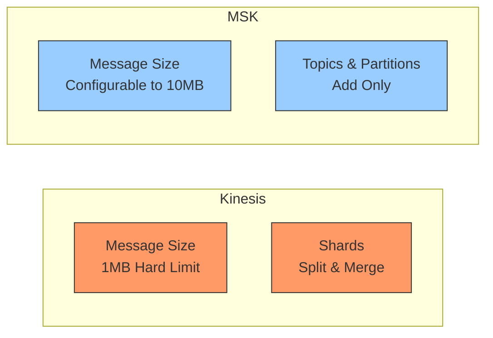
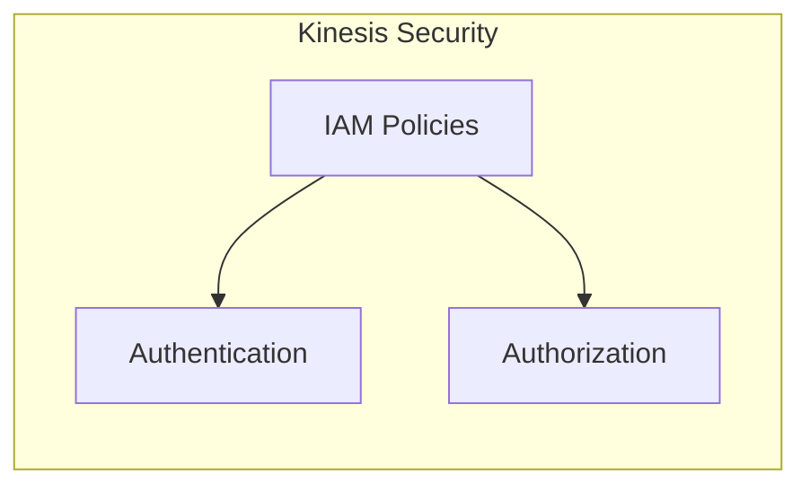
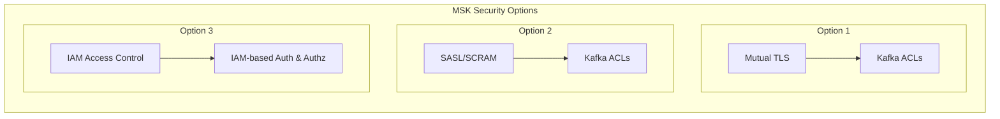

# So sánh Kinesis Data Streams và Amazon MSK

## So sánh chính

### Message Size và Scaling

## Chi tiết so sánh

| Feature | Kinesis Data Streams | Amazon MSK |
|---------|---------------------|------------|
| Message Size | 1MB (hard limit) | 1MB (default), configurable up to 10MB |
| Data Organization | Streams với Shards | Topics với Partitions |
| Scaling | Shard splitting và merging | Chỉ có thể thêm partitions |
| In-flight Encryption | TLS (mandatory) | TLS hoặc PLAINTEXT |
| At-rest Encryption | KMS | KMS |

## Security Model

### Kinesis Data Streams

### Amazon MSK

## Use Case Decision Matrix

### Choose Kinesis When:
- Message size ≤ 1MB
- Cần flexible scaling (up/down)
- Prefer simple IAM-based security
- AWS native integration là priority
- Cần managed service với ít configuration

### Choose MSK When:
- Message size > 1MB
- Cần Kafka-specific features
- Cần custom security configurations
- Đã có existing Kafka expertise
- Cần flexibility trong configuration

## Key Points for Exam

### 1. Message Size
- **Key differentiator**: MSK cho phép message size lớn hơn
- **Exam tip**: Large message requirements → MSK

### 2. Scaling
- **Kinesis**: More flexible (both directions)
- **MSK**: More restrictive (add only)

### 3. Security
- **Kinesis**: Simpler, IAM-based
- **MSK**: More options, more complex

### 4. Default Options
- **Best practice**: Choose Kinesis by default
- **Exception cases**: 
  - Large messages
  - Specific Kafka requirements
  - Custom security needs

## Best Practices

### 1. Selection Criteria
- Evaluate message size requirements first
- Consider scaling needs
- Assess security requirements
- Review existing expertise

### 2. Implementation
- Plan for proper scaling
- Configure appropriate security
- Monitor performance metrics
- Set up proper logging

### 3. Cost Consideration
- Evaluate pricing models
- Consider operational costs
- Factor in maintenance overhead