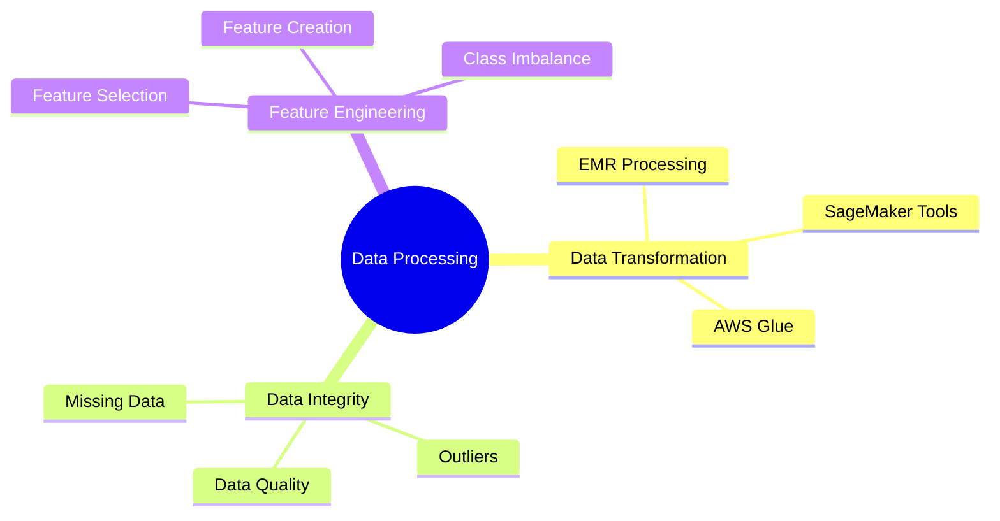
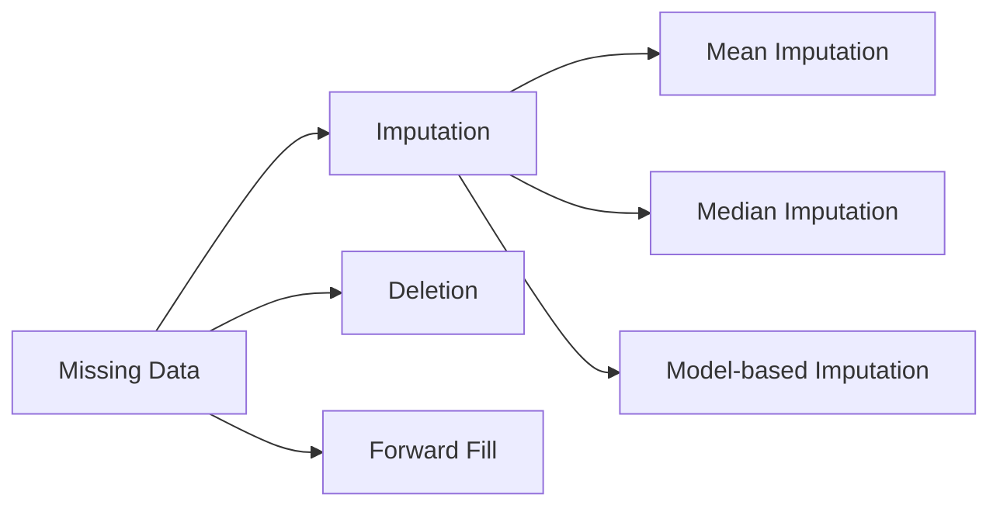

# Data Transformation, Integrity và Feature Engineering trong AWS

## Mục lục
- [Tổng quan](#tổng-quan)
- [Các công cụ chính](#các-công-cụ-chính)
- [Thách thức phổ biến](#thách-thức-phổ-biến)
- [Best Practices & Lưu ý](#best-practices--lưu-ý)

## Tổng quan

### Nội dung chính

### Các lĩnh vực trọng tâm
1. **Data Transformation**
   - Large-scale data processing
   - ETL operations
   - Data formatting và cleaning

2. **Data Integrity**
   - Handling missing data
   - Outlier detection
   - Data validation

3. **Feature Engineering**
   - Feature selection
   - Class imbalance handling
   - Feature importance analysis

## Các công cụ chính

### 1. Amazon EMR
- Large-scale data processing
- Distributed computing
- Custom transformations
- Integration với ML workflows

### 2. Amazon SageMaker
1. **Data Wrangler**
   - Interactive data preparation
   - Visual transformations
   - Data analysis

2. **SageMaker Clarify**
   - Bias detection
   - Feature importance
   - Class imbalance analysis

### 3. AWS Glue
- ETL service
- Schema discovery
- Data catalog
- Job orchestration

## Thách thức phổ biến

### 1. Missing Data

### 2. Outliers
- Detection methods
- Treatment strategies
- Impact analysis

### 3. Unbalanced Data
- Sampling techniques
- Class weighting
- Synthetic data generation

## Best Practices & Lưu ý

### Data Processing
1. **Performance**
   - Scale resources appropriately
   - Optimize transformations
   - Monitor costs

2. **Quality**
   - Validate transformations
   - Check data integrity
   - Document processes

### Cost Management
1. **Resource Control**
   - Set up billing alarms
   - Delete unused resources
   - Monitor usage

2. **Optimization**
   - Choose right service size
   - Use cost-effective tools
   - Schedule resources properly

### Security
1. **Data Protection**
   - Encrypt sensitive data
   - Implement access controls
   - Monitor data access

2. **Compliance**
   - Follow data regulations
   - Maintain audit trails
   - Document procedures

## Implementation Guidelines

### 1. Project Setup
- Define clear objectives
- Choose appropriate tools
- Plan resource usage
- Set up monitoring

### 2. Development Process
1. **Data Analysis**
   - Understand data characteristics
   - Identify problems
   - Plan transformations

2. **Implementation**
   - Start small, scale up
   - Test thoroughly
   - Document everything

3. **Monitoring**
   - Track performance
   - Monitor costs
   - Validate results

### 3. Production Deployment
- Implement proper error handling
- Set up automated monitoring
- Plan for scaling
- Maintain documentation

## Lưu ý quan trọng
1. **Cost Control**
   - Set up billing alarms
   - Monitor resource usage
   - Clean up unused resources
   - Use cost-effective services

2. **Best Practices**
   - Test thoroughly
   - Start small
   - Document everything
   - Monitor continuously

3. **Tool Selection**
   - Choose based on requirements
   - Consider scale needs
   - Factor in expertise
   - Evaluate costs