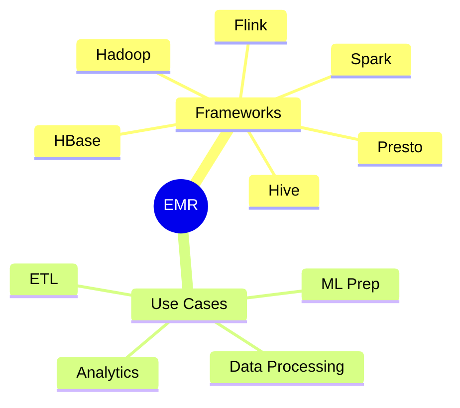
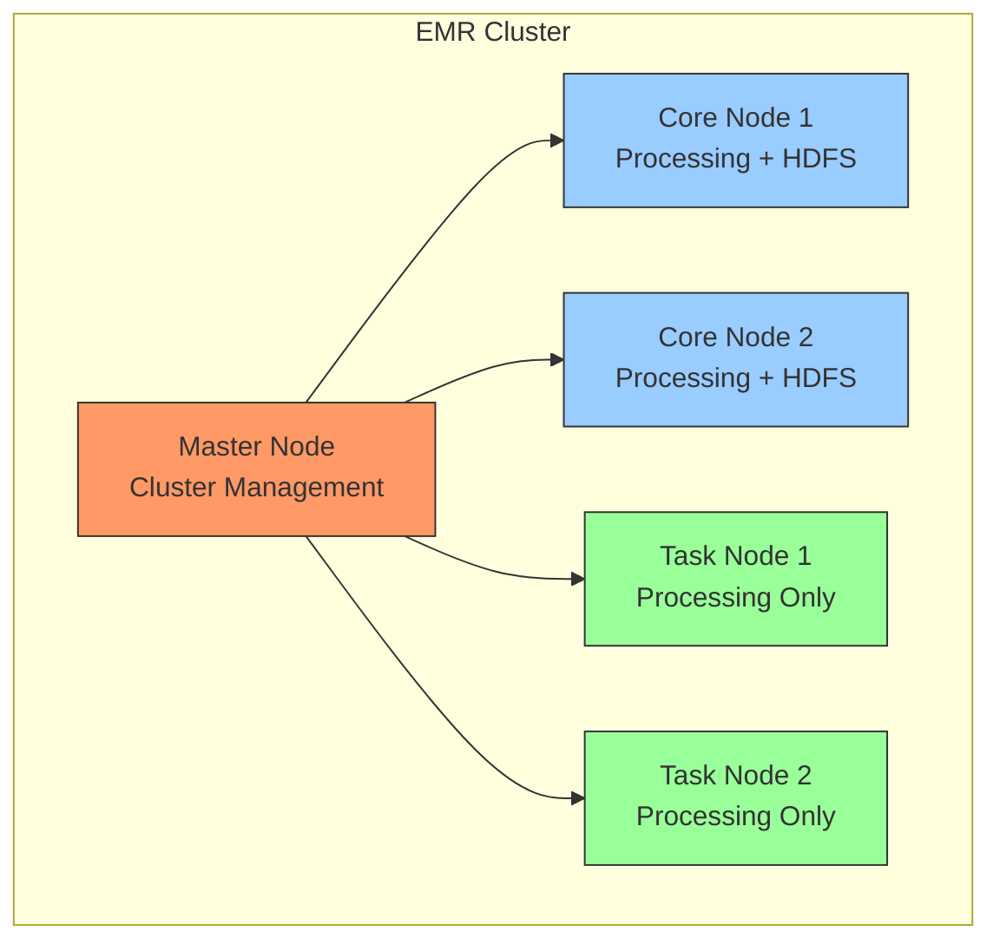
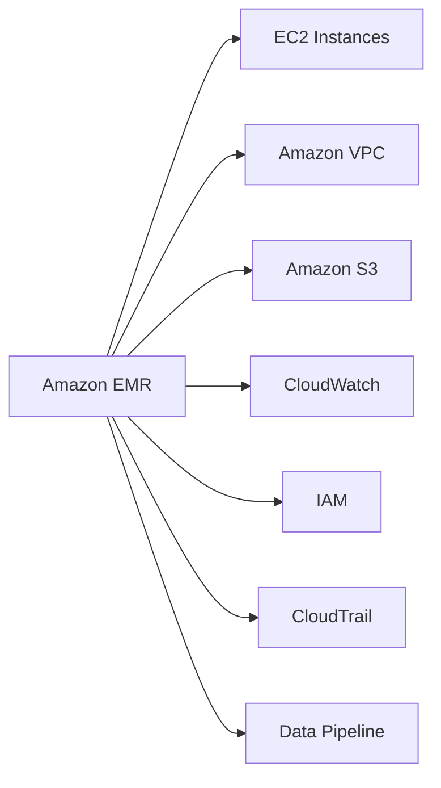

# Amazon EMR (Elastic MapReduce)

## Mục lục
- [Tổng quan](#tổng-quan) 
- [Kiến trúc Cluster](#kiến-trúc-cluster)
- [Storage Options](#storage-options)
- [Loại Clusters](#loại-clusters)
- [AWS Integration](#aws-integration)
- [Pricing và Management](#pricing-và-management)

## Tổng quan

### Đặc điểm chính
- Managed Hadoop framework trên EC2
- Hỗ trợ nhiều frameworks: Spark, HBase, Presto, Flink, Hive
- EMR Notebooks (tương tự Jupyter)
- Xử lý dữ liệu phân tán cho ML

## Kiến trúc Cluster

### Node Types

1. **Master Node (Leader)**
   - Quản lý cluster
   - Điều phối tasks
   - Health monitoring
   - Required trong mọi cluster

2. **Core Nodes**
   - Chạy tasks
   - Lưu trữ HDFS
   - Ít nhất 1 node trong multi-node clusters

3. **Task Nodes**
   - Chỉ chạy tasks
   - Không lưu HDFS
   - Optional
   - Thích hợp cho spot instances

## Storage Options

### 1. HDFS (Hadoop Distributed File System)
- Default storage solution
- Distributed across cluster
- Block size: 128MB
- Ephemeral storage
- High performance

### 2. EMR File System (EMRFS)
- S3 integration
- Persistent storage
- Optional consistency view
- DynamoDB tracking

### 3. Local File System
- Ephemeral storage
- Single node only
- Staging data

### Storage Comparison
| Feature | HDFS | EMRFS | Local |
|---------|------|--------|--------|
| Persistence | No | Yes | No |
| Distribution | Yes | Yes | No |
| Performance | Highest | Good | High |
| Cost | Included | S3 Costs | Included |

## Loại Clusters

### 1. Transient Clusters
- Auto-termination sau khi hoàn thành tasks
- Predefined steps
- Cost-effective
- Use cases: ETL jobs, batch processing

### 2. Long-running Clusters
- Manual termination
- Interactive use
- Ad-hoc queries
- Experimentation

## AWS Integration

1. **Core Services**
   - EC2: Compute instances
   - VPC: Network isolation
   - S3: Data storage

2. **Management Services**
   - CloudWatch: Monitoring
   - IAM: Access control
   - CloudTrail: Audit logging
   - Data Pipeline: Orchestration

## Pricing và Management

### Cost Components
1. **EMR Charges**
   - Hourly rate
   - Framework costs

2. **EC2 Charges**
   - Instance costs
   - EBS volumes

### Management Features
1. **Auto Recovery**
   - Automatic node replacement
   - Core node failure handling

2. **Scaling**
   - Add/remove task nodes
   - Resize core nodes
   - Spot instance support

### Best Practices
1. **Cost Optimization**
   - Use spot instances for task nodes
   - Right-size clusters
   - Use transient clusters when possible

2. **Performance**
   - Balance storage options
   - Monitor cluster health
   - Optimize data locality

3. **Security**
   - VPC configuration
   - IAM roles
   - Encryption