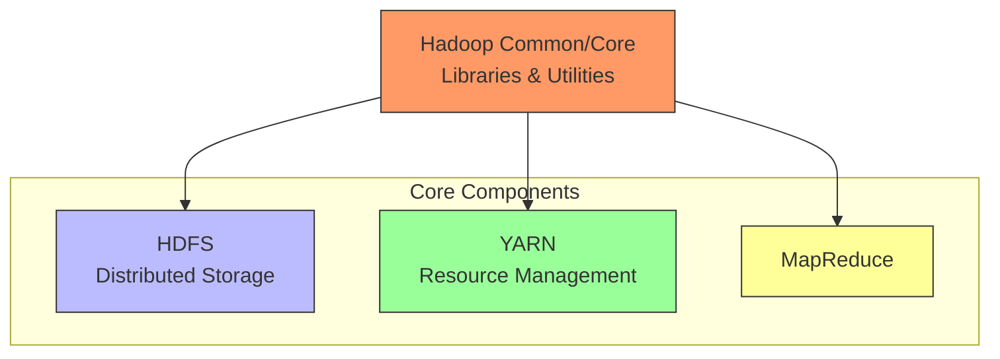
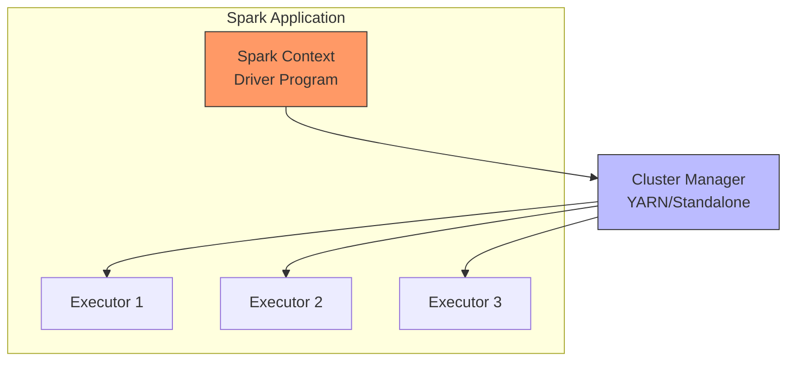
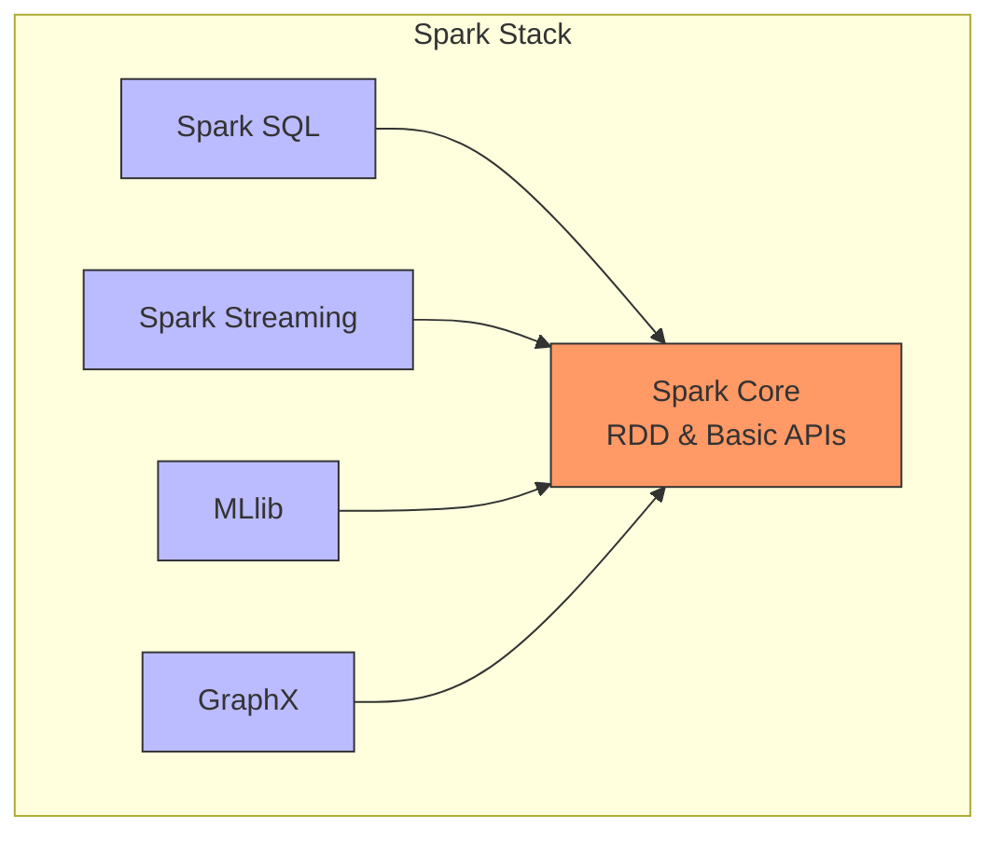
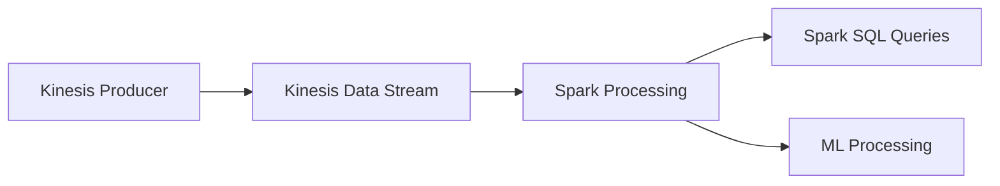

# Hadoop Ecosystem và Apache Spark trong EMR

## Mục lục
- [Hadoop Core Components](#hadoop-core-components)
- [Apache Spark Overview](#apache-spark-overview)
- [Spark Components](#spark-components)
- [Machine Learning với Spark](#machine-learning-với-spark)

## Hadoop Core Components

### Kiến trúc Hadoop


### 1. Hadoop Common/Core
- Libraries và utilities cơ bản
- File system abstraction
- OS level abstraction
- Java archives và scripts

### 2. HDFS
- Distributed file system
- Multiple data copies
- Block size: 128MB
- Fault tolerance
- High throughput

### 3. YARN (Yet Another Resource Negotiator)
- Resource management
- Job scheduling
- Cluster resource optimization
- Multi-tenant processing

### 4. MapReduce
- Parallel processing framework
- Map functions: Transform/Extract
- Reduce functions: Aggregate
- Fault tolerant processing

## Apache Spark Overview

### Architecture


### Key Features
1. **Processing Model**
   - In-memory caching
   - DAG optimization
   - Multiple APIs (Java, Scala, Python, R)

2. **Use Cases**
   - Interactive queries
   - Real-time analytics
   - Machine learning
   - Graph processing

## Spark Components

### Component Stack


### 1. Spark Core
- Resource management
- Task scheduling
- Memory management
- RDD APIs

### 2. Spark SQL
- DataFrame/Dataset APIs
- Cost-based optimizer
- Multiple data sources
- SQL interface

### 3. Spark Streaming
- Real-time processing
- Mini-batch processing
- Integration với:
  - Kinesis
  - Kafka
  - Flume
  - HDFS

### 4. GraphX
- Graph processing
- ETL operations
- Iterative graph computation
- Network analysis

## Machine Learning với Spark

### MLlib Features

1. **Algorithms**
```plaintext
Classification:
- Logistic Regression
- Naive Bayes
- Decision Trees

Regression:
- Linear Regression
- Decision Trees
- Random Forests

Clustering:
- K-means
- Topic Modeling (LDA)
```

2. **Features & Utilities**
- Feature transformations
- Pipeline APIs
- Model persistence
- Distributed statistics

### Integration với Kinesis



### Zeppelin Notebooks
1. **Interactive Development**
   - SQL queries
   - Code execution
   - Visualization

2. **Features**
   - Multiple interpreters
   - Collaboration support
   - Rich visualization
   - Integration với Spark

## Best Practices

### 1. Performance
- Use in-memory caching
- Optimize partitioning
- Monitor resource usage
- Choose appropriate algorithms

### 2. Development
- Use DataFrame API
- Implement proper error handling
- Monitor job progress
- Test on sample data

### 3. Production
- Configure auto-scaling
- Set up monitoring
- Implement security
- Plan for failures

### Lưu ý quan trọng
1. Spark thay thế MapReduce cho nhiều use cases
2. MLlib algorithms được thiết kế cho distributed processing
3. Spark Streaming hoạt động với mini-batches
4. Zeppelin cung cấp interactive development environment