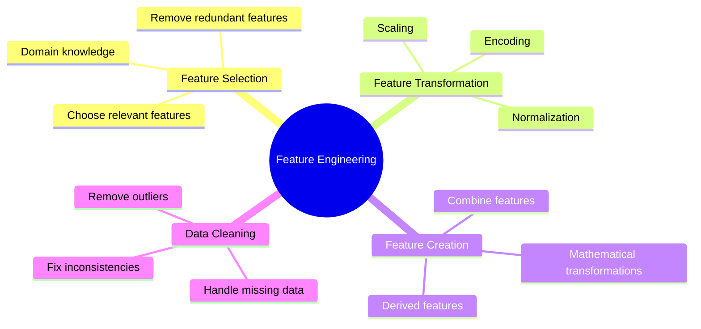
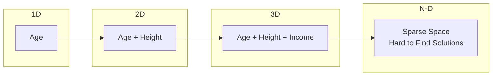

# Feature Engineering trong Machine Learning

## Mục lục
- [Tổng quan](#tổng-quan)
- [Curse of Dimensionality](#curse-of-dimensionality)
- [Kỹ thuật Feature Engineering](#kỹ-thuật-feature-engineering)
- [Best Practices](#best-practices)

## Tổng quan

### Feature Engineering là gì?


### Tầm quan trọng
1. **Data Quality**
   - Better input = Better output
   - Reduce noise
   - Enhance signal

2. **Model Performance**
   - Improved accuracy
   - Faster training
   - Better generalization

## Curse of Dimensionality

### Visualization of Dimensionality


### Vấn đề
1. **Sparse Data**
   - Không đủ data points
   - Empty space
   - Poor model generalization

2. **Performance Impact**
   - Larger model architecture
   - Longer training time
   - More computational resources

3. **Model Complexity**
   - Harder to converge
   - Risk of overfitting
   - More parameters to tune

## Kỹ thuật Feature Engineering

### 1. Feature Selection
- Remove irrelevant features
- Keep most important predictors
- Use domain knowledge

### 2. Dimensionality Reduction
1. **Principal Component Analysis (PCA)**
   - Unsupervised technique
   - Linear transformation
   - Information preservation

2. **K-means Clustering**
   - Group similar features
   - Reduce dimensions
   - Pattern discovery

### 3. Feature Transformation
```python
# Examples of transformations
# Log transformation
feature_log = np.log(feature)

# Square transformation
feature_squared = np.square(feature)

# Normalization
feature_normalized = (feature - mean) / std
```

## Best Practices

### 1. Systematic Approach
1. **Exploration**
   - Understand data distribution
   - Identify patterns
   - Check correlations

2. **Experimentation**
   - Try different transformations
   - Test feature combinations
   - Validate results

3. **Iteration**
   - Monitor performance
   - Refine features
   - Document improvements

### 2. Domain Knowledge
1. **Business Understanding**
   - Relevant features
   - Important relationships
   - Expected patterns

2. **Data Context**
   - Data collection process
   - Data quality issues
   - Business constraints

### 3. Technical Considerations
1. **Scalability**
   - Processing large datasets
   - Computational efficiency
   - Resource constraints

2. **Maintainability**
   - Documentation
   - Reproducibility
   - Version control

## Guidelines cho ML Certification

### Key Points
1. **Experience Focus**
   - Practical knowledge
   - Real-world scenarios
   - Problem-solving ability

2. **Technical Skills**
   - Feature selection methods
   - Transformation techniques
   - Dimensionality reduction

3. **Best Practices**
   - Systematic approach
   - Domain expertise
   - Performance optimization

### Common Pitfalls
1. **Over-engineering**
   - Too many features
   - Unnecessary complexity
   - Performance degradation

2. **Under-engineering**
   - Missing important features
   - Insufficient transformations
   - Poor model performance

3. **Poor Documentation**
   - Lack of process documentation
   - Missing rationale
   - Unclear decisions

## Tools và Techniques

### 1. Statistical Analysis
- Correlation analysis
- Feature importance
- Distribution analysis

### 2. Visualization
- Scatter plots
- Correlation matrices
- Distribution plots

### 3. Automated Tools
- Feature selection algorithms
- Dimensionality reduction
- AutoML platforms