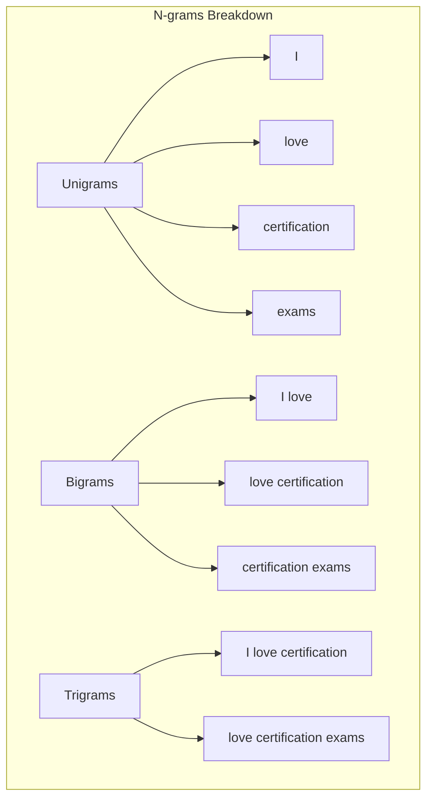
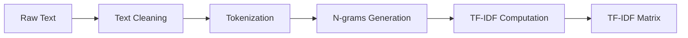
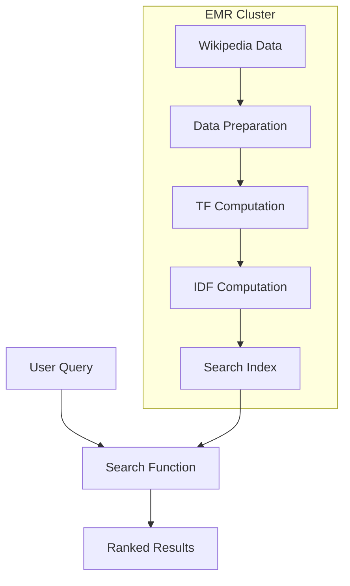

# TF-IDF và Large-Scale Text Processing

## Mục lục
- [TF-IDF Overview](#tf-idf-overview)
- [N-grams Processing](#n-grams-processing)
- [Implementation với Spark](#implementation-với-spark)
- [Ví dụ thực tế](#ví-dụ-thực-tế)

## TF-IDF Overview

### Công thức và Khái niệm
```mermaid
flowchart LR
    TF[Term Frequency<br/>Word count in document] --> TFIDF[TF-IDF Score]
    IDF[Inverse Document Frequency<br/>Log(Total docs/Docs with term)] --> TFIDF
```

### Components
1. **Term Frequency (TF)**
   - Số lần từ xuất hiện trong document
   - Đo lường tầm quan trọng local
   - Raw frequency count

2. **Document Frequency (DF)**
   - Số documents chứa từ
   - Đo lường phổ biến của từ
   - Inverse để giảm weight của common words

3. **TF-IDF Score**
```python
tf_idf = tf * log(N/df)
where:
- tf = term frequency in document
- N = total number of documents
- df = number of documents containing term
```

## N-grams Processing

### Ví dụ
Document: "I love certification exams"



### TF-IDF Matrix Example
Corpus:
- Doc1: "I love certification exams"
- Doc2: "I love puppies"

| Document | I | love | certification | exams | puppies | I love | love certification | love puppies | certification exams |
|----------|---|------|---------------|-------|---------|--------|-------------------|--------------|-------------------|
| Doc1     | tf-idf | tf-idf | tf-idf | tf-idf | 0 | tf-idf | tf-idf | 0 | tf-idf |
| Doc2     | tf-idf | tf-idf | 0 | 0 | tf-idf | tf-idf | 0 | tf-idf | 0 |

## Implementation với Spark

### Processing Pipeline


### Key Steps
1. **Text Preprocessing**
   - Lowercase conversion
   - Punctuation removal
   - Stop words removal
   - Tokenization

2. **N-grams Generation**
   ```python
   # Spark example
   from pyspark.ml.feature import NGram
   
   ngram = NGram(n=2, inputCol="words", outputCol="bigrams")
   ```

3. **TF-IDF Computation**
   ```python
   from pyspark.ml.feature import HashingTF, IDF
   
   hashingTF = HashingTF(inputCol="tokens", outputCol="rawFeatures")
   idf = IDF(inputCol="rawFeatures", outputCol="features")
   ```

## Ví dụ thực tế: Wikipedia Search

### Architecture


### Implementation Steps
1. **Data Loading**
   - Load Wikipedia dump
   - Parse XML format
   - Extract text content

2. **Text Processing**
   ```python
   def preprocess_text(text):
       # Lowercase
       text = text.lower()
       # Remove punctuation
       text = remove_punctuation(text)
       # Tokenize
       tokens = tokenize(text)
       return tokens
   ```

3. **TF-IDF Computation**
   - Calculate term frequencies
   - Compute document frequencies
   - Generate TF-IDF matrix

4. **Search Function**
   - Process search query
   - Calculate relevance scores
   - Rank documents

### Best Practices
1. **Performance**
   - Partition data appropriately
   - Cache intermediate results
   - Monitor resource usage

2. **Scalability**
   - Use appropriate cluster size
   - Optimize storage format
   - Balance parallelism

3. **Quality**
   - Handle edge cases
   - Implement error handling
   - Validate results

### Limitations
1. **TF-IDF Limitations**
   - Bag of words approach
   - No semantic understanding
   - Synonym handling
   - Misspellings

2. **Scalability Challenges**
   - Large vocabulary size
   - Memory constraints
   - Processing time

3. **Quality Considerations**
   - Language specifics
   - Special characters
   - Document length normalization