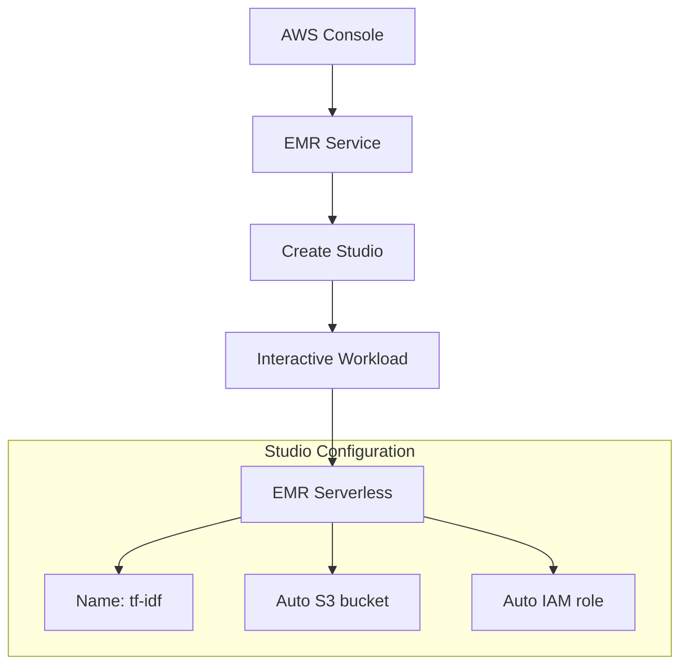
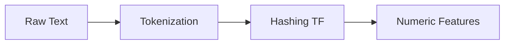
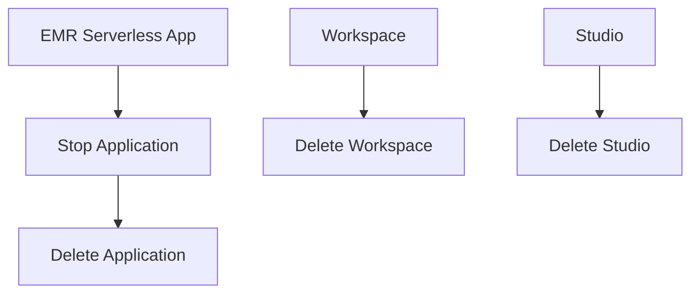

# Xây dựng Wikipedia Search với TF-IDF trên EMR

## Mục lục
- [Setup môi trường](#setup-môi-trường)
- [Data Processing](#data-processing) 
- [TF-IDF Implementation](#tf-idf-implementation)
- [Clean up Resources](#clean-up-resources)

## Setup môi trường

### 1. Tạo EMR Studio


### Lưu ý quan trọng
1. **IAM User**:
   - KHÔNG dùng root account
   - Tạo IAM user mới nếu cần
   - Cần permissions phù hợp

2. **Workspace Settings**:
   - Đặt tên workspace
   - Sử dụng EMR serverless
   - Default application settings

## Data Processing

### 1. Setup Notebook
```python
# Load data từ S3
df = spark.read.csv("s3://your-bucket/subset_small.tsv", 
                   sep="\t")

# Add column names
df = df.toDF("id", "title", "time", "document")
```

### 2. Data Cleaning
```python
# Check null documents
null_count = df.filter(df.document.isNull()).count()

# Remove nulls
cleaned_df = df.filter(df.document.isNotNull())

# Verify cleaning
null_count_after = cleaned_df.filter(
    cleaned_df.document.isNull()
).count()
```

## TF-IDF Implementation

### 1. Tokenization & Hashing


### Code Flow
```python
# Tokenization
tokenizer = Tokenizer(inputCol="document", 
                     outputCol="words")

# Hashing TF
hashingTF = HashingTF(inputCol="words", 
                      outputCol="rawFeatures")

# IDF
idf = IDF(inputCol="rawFeatures", 
          outputCol="features")
```

### 2. Search Implementation
```python
# Get hash value for search term
term_hash = get_term_hash("Gettysburg")

# Extract TF-IDF scores
scores = extract_tfidf_scores(df, term_hash)

# Sort results
results = scores.orderBy("score", ascending=False)
```

## Clean up Resources

### 1. EMR Resources


### Cleanup Steps
1. **EMR Serverless Application**
   - Stop application
   - Delete application
   - Verify termination

2. **Workspace**
   - Find workspace
   - Delete workspace
   - Confirm deletion

3. **Studio**
   - Navigate to Studios
   - Select studio
   - Delete studio

4. **Additional Resources** (Optional)
   - S3 buckets
   - IAM roles
   - VPC resources

## Best Practices

### 1. Resource Management
- Regularly monitor resources
- Clean up unused resources
- Verify termination

### 2. Cost Control
- Use appropriate instance sizes
- Monitor running time
- Clean up completely

### 3. Security
- Use IAM users (not root)
- Manage permissions carefully
- Follow least privilege

## Troubleshooting Tips

### Common Issues
1. **Permission Errors**
   - Check IAM user
   - Verify roles
   - Check policies

2. **Performance Issues**
   - Retry failed operations
   - Monitor resource usage
   - Check cluster size

3. **Connection Issues**
   - Check VPC settings
   - Verify endpoints
   - Check security groups

### Best Practices
1. **Development**
   - Test on small datasets
   - Monitor execution
   - Handle errors gracefully

2. **Production**
   - Scale appropriately
   - Monitor costs
   - Implement logging

3. **Security**
   - Follow AWS best practices
   - Regular audits
   - Document configurations