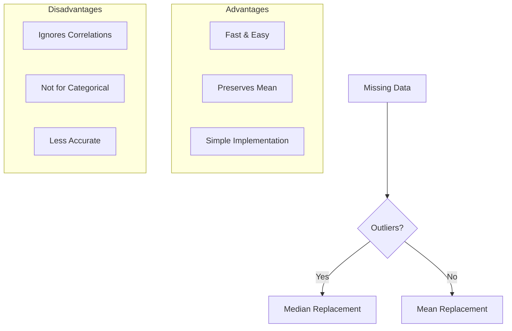
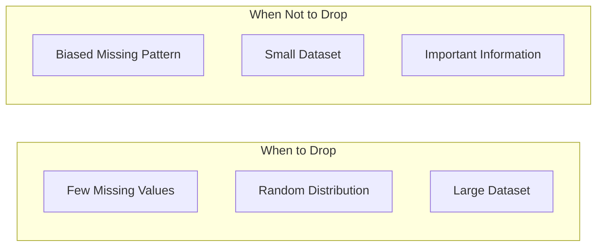
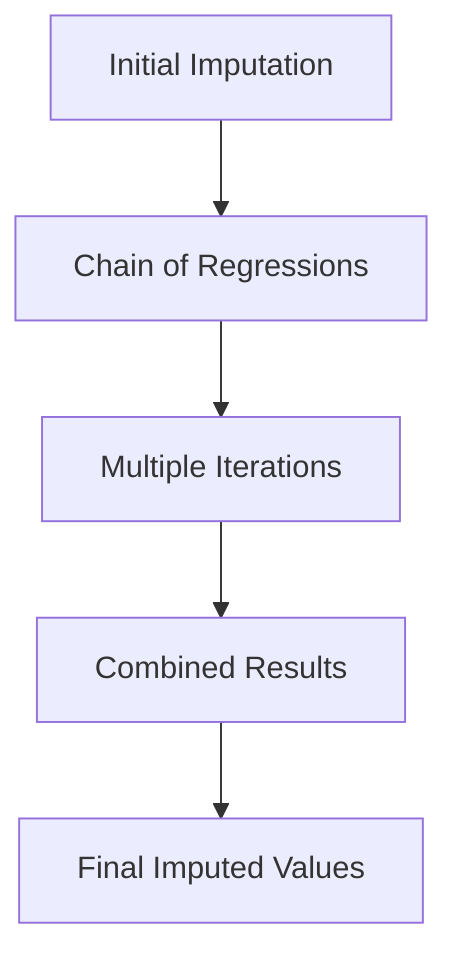
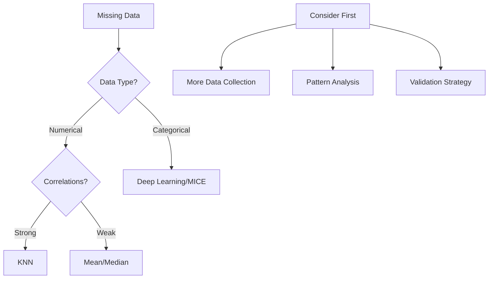

# Xử lý Missing Data trong Feature Engineering

## Mục lục
- [Phương pháp cơ bản](#phương-pháp-cơ-bản)
- [Machine Learning Based Imputation](#machine-learning-based-imputation)
- [Best Practices](#best-practices)

## Phương pháp cơ bản

### Mean/Median Replacement



#### Ưu điểm
1. **Fast & Easy**
   - Simple implementation
   - Quick results
   - No complex computation

2. **Statistical Properties**
   - Preserves mean
   - Maintains sample size
   - Straightforward interpretation

#### Nhược điểm
1. **Accuracy Issues**
   - Ignores feature correlations
   - May introduce bias
   - Not suitable for categorical data

2. **Data Relationships**
   - Loses feature interactions
   - May create unrealistic values
   - Oversimplifies data structure

### Dropping Data

#### Considerations


## Machine Learning Based Imputation

### 1. KNN (K-Nearest Neighbors)

#### Process
1. **Find Similar Rows**
   - Calculate distances
   - Identify K nearest neighbors
   - Weight by similarity

2. **Value Imputation**
   ```python
   # Example KNN imputation
   from sklearn.impute import KNNImputer
   
   imputer = KNNImputer(n_neighbors=5)
   imputed_data = imputer.fit_transform(data)
   ```

#### Best For
- Numerical data
- Strong feature correlations
- Moderate dataset size

### 2. Deep Learning

#### Characteristics
1. **Advantages**
   - Handles complex patterns
   - Great for categorical data
   - Captures non-linear relationships

2. **Disadvantages**
   - Computationally intensive
   - Requires large datasets
   - Complex implementation

### 3. MICE (Multiple Imputation by Chained Equations)



#### Key Features
- State-of-the-art approach
- Handles mixed data types
- Preserves relationships
- Multiple imputations

## Best Practices

### 1. Data Collection
```python
# Priority order for handling missing data
priorities = {
    1: "Collect more data",
    2: "Understand missing patterns",
    3: "Choose appropriate method",
    4: "Validate results"
}
```

### 2. Method Selection
1. **Simple Cases**
   - Few missing values -> Consider dropping
   - Clear patterns -> Simple imputation
   - Large dataset -> Mean/median

2. **Complex Cases**
   - Mixed data types -> MICE
   - Categorical data -> Deep Learning
   - Strong correlations -> KNN

### 3. Validation
- Check imputation bias
- Cross-validate results
- Monitor performance impact

## Lưu ý cho Exam

### Key Points
1. **Best Approaches**
   - MICE often best choice
   - Avoid simple dropping
   - Consider data relationships

2. **Method Selection**
   - Based on data type
   - Consider computational cost
   - Consider accuracy needs

3. **Common Pitfalls**
   - Ignoring data patterns
   - Oversimplifying imputation
   - Not validating results

### Decision Framework
