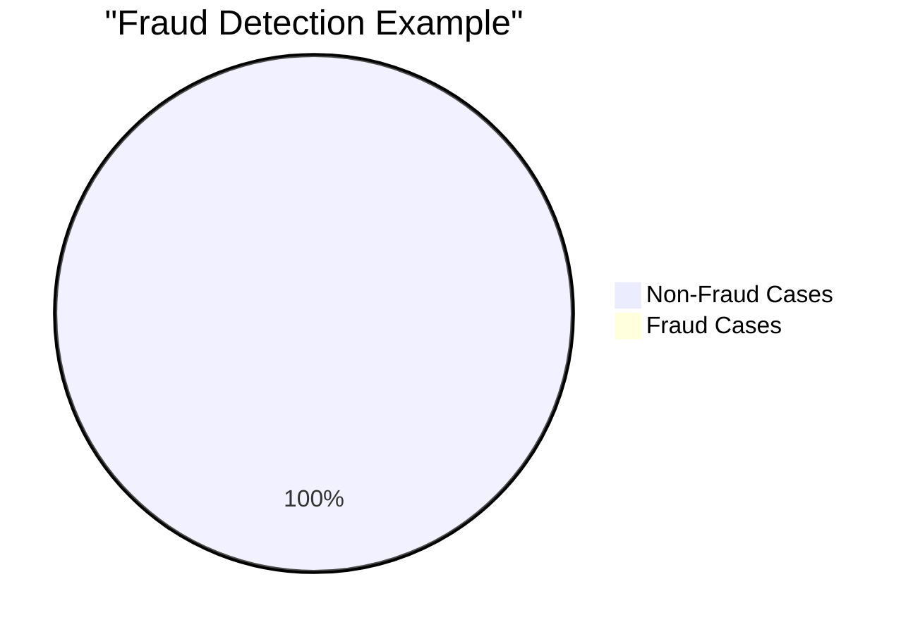
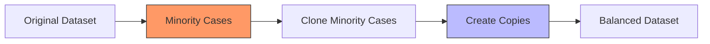
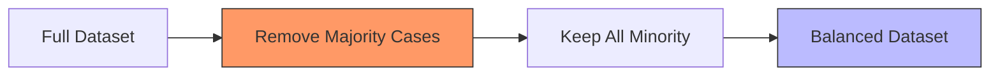
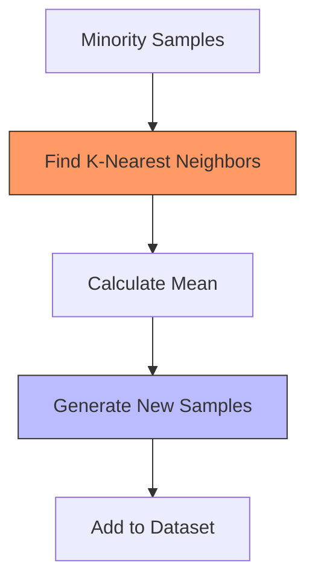
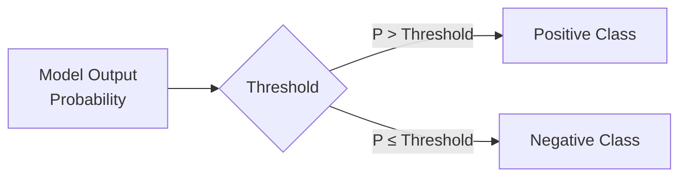

# Xử lý Imbalanced Data trong Machine Learning

## Mục lục
- [Tổng quan về Imbalanced Data](#tổng-quan-về-imbalanced-data)
- [Các phương pháp xử lý](#các-phương-pháp-xử-lý)
- [Threshold Adjustment](#threshold-adjustment)
- [Best Practices](#best-practices)

## Tổng quan về Imbalanced Data

### Định nghĩa và Vấn đề


### Thuật ngữ quan trọng
1. **Positive Case**
   - Sự kiện cần phát hiện
   - VD: Fraud trong fraud detection
   - KHÔNG liên quan đến good/bad

2. **Negative Case**
   - Các trường hợp còn lại
   - VD: Non-fraud transactions
   - KHÔNG liên quan đến good/bad

## Các phương pháp xử lý

### 1. Oversampling


#### Ưu điểm
- Dễ implement
- Không mất data
- Hiệu quả với neural networks

#### Nhược điểm
- Risk of overfitting
- Duplicate data
- Không tạo insight mới

### 2. Undersampling

#### Process Flow


#### Khi nào sử dụng
- Resource constraints
- Hardware limitations
- Quick prototyping

### 3. SMOTE (Synthetic Minority Oversampling TEchnique)

#### Cách hoạt động


#### Ưu điểm của SMOTE
- Creates realistic new samples
- Based on actual data patterns
- Better than simple oversampling
- Reduces overfitting risk

## Threshold Adjustment

### Concept


### Impact Analysis
```python
# Threshold effects
if threshold_increases:
    false_positives_decrease = True
    false_negatives_increase = True
else:  # threshold decreases
    false_positives_increase = True
    false_negatives_decrease = True
```

### Cost Considerations
1. **False Positives**
   - Customer inconvenience
   - Operational costs
   - Trust impact

2. **False Negatives**
   - Missed fraud cases
   - Financial losses
   - Security risks

## Best Practices

### 1. Method Selection
```python
def choose_balancing_method(context):
    if context.has_computational_constraints:
        return "Undersampling"
    elif context.needs_quality_samples:
        return "SMOTE"
    elif context.is_neural_network:
        return "Oversampling"
    else:
        return "Threshold Adjustment"
```

### 2. Evaluation Metrics
- Beyond accuracy
- Precision & Recall
- F1 Score
- ROC Curve

### 3. Implementation Steps
1. **Data Analysis**
   - Measure imbalance ratio
   - Analyze patterns
   - Identify constraints

2. **Method Application**
   - Test multiple approaches
   - Cross-validate results
   - Monitor performance

3. **Threshold Tuning**
   - Start with default
   - Adjust based on costs
   - Validate changes

## Lưu ý quan trọng

### Exam Tips
1. **SMOTE**:
   - Best practice solution
   - Understand how it works
   - Know when to use it

2. **Threshold Adjustment**:
   - Business context important
   - Cost-benefit analysis
   - Trade-off understanding

3. **Method Selection**:
   - Resource considerations
   - Data characteristics
   - Problem requirements