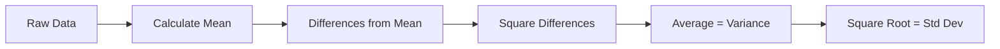
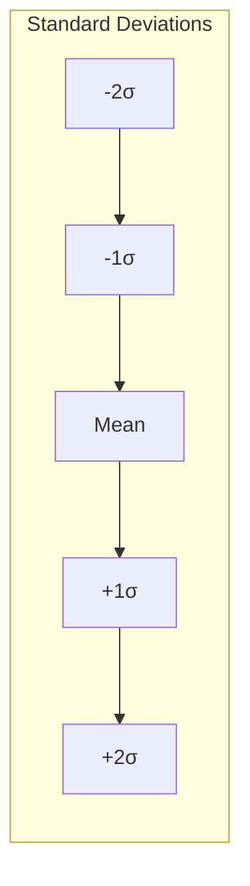
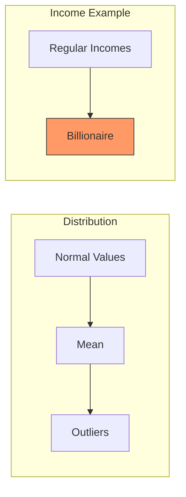
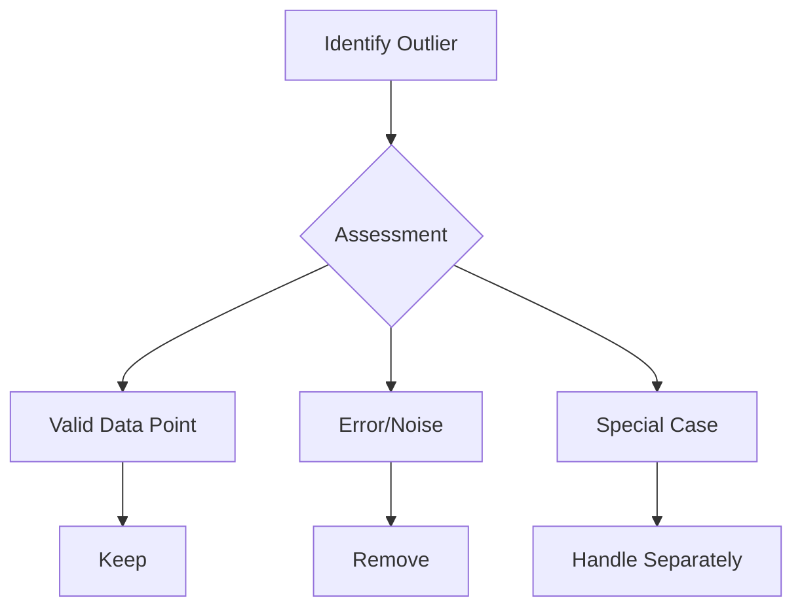

# Xử lý Outliers trong Feature Engineering

## Mục lục
- [Cơ sở toán học](#cơ-sở-toán-học)
- [Phát hiện Outliers](#phát-hiện-outliers)
- [Phương pháp xử lý](#phương-pháp-xử-lý)
- [AWS Random Cut Forest](#aws-random-cut-forest)

## Cơ sở toán học

### Variance và Standard Deviation



#### Ví dụ tính toán
Data: [1, 4, 5, 4, 8]

1. **Mean** = 4.4
2. **Differences**: [-3.4, -0.4, 0.6, -0.4, 3.6]
3. **Squared Differences**: [11.6, 0.16, 0.36, 0.16, 12.96]
4. **Variance** = 5.04
5. **Standard Deviation** = 2.24

### Phân phối dữ liệu


## Phát hiện Outliers

### Phương pháp
1. **Standard Deviation**
   ```python
   def is_outlier(value, mean, std_dev, threshold=2):
       z_score = abs((value - mean) / std_dev)
       return z_score > threshold
   ```

2. **Box and Whisker**
   - IQR = Q3 - Q1
   - Outlier if: value < (Q1 - 1.5*IQR) or value > (Q3 + 1.5*IQR)

### Visualization Example


## Phương pháp xử lý

### Decision Framework


### Use Cases
1. **Remove Outliers**
   - Data errors
   - Malicious traffic
   - Non-representative samples

2. **Keep Outliers**
   - Important data points
   - Real phenomena
   - Required for accuracy

## AWS Random Cut Forest

### Integration Points
1. **Amazon Services**
   - QuickSight
   - Kinesis Analytics
   - SageMaker

### Characteristics
```python
# Pseudocode example
class RandomCutForest:
    def detect_outliers(self, data):
        # Calculate anomaly scores
        scores = calculate_scores(data)
        
        # Identify outliers based on score threshold
        outliers = scores > threshold
        
        return outliers
```

## Best Practices

### 1. Analysis Steps
1. **Understand Data**
   - Distribution
   - Business context
   - Expected ranges

2. **Choose Method**
   - Standard deviation
   - IQR
   - Random Cut Forest

3. **Validate Results**
   - Cross-validation
   - Domain expertise
   - Impact analysis

### 2. Implementation Guidelines
```python
def handle_outliers(data, context):
    if context.is_error_detection:
        return remove_outliers(data)
    elif context.is_fraud_detection:
        return flag_outliers(data)
    else:
        return analyze_impact(data)
```

### 3. Documentation
- Record decisions
- Justify thresholds
- Track impact

## Lưu ý cho Exam

### Key Points
1. **Mathematical Understanding**
   - Variance vs Standard Deviation
   - Distribution concepts
   - Threshold selection

2. **AWS Services**
   - Random Cut Forest
   - Service integration
   - Use cases

3. **Decision Making**
   - Context matters
   - Business impact
   - Validation methods

### Common Scenarios
1. **Fraud Detection**
   - Unusual patterns
   - Transaction amounts
   - Frequency analysis

2. **Data Quality**
   - Measurement errors
   - System anomalies
   - Data corruption

3. **Business Metrics**
   - Performance outliers
   - Customer behavior
   - Market trends