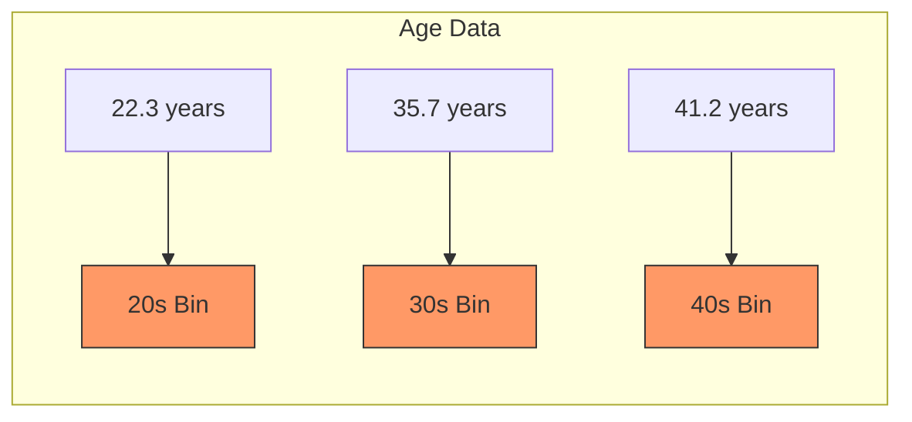
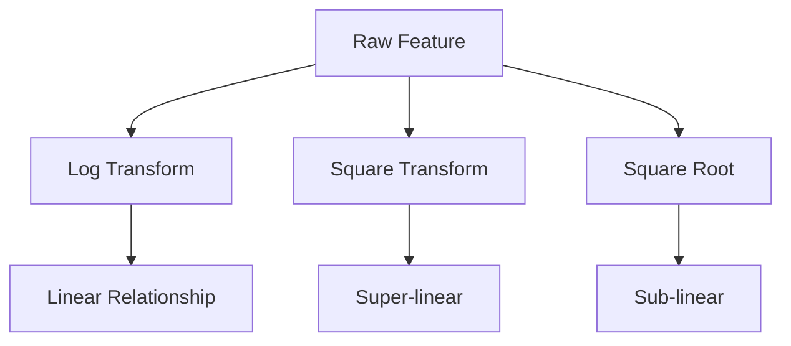
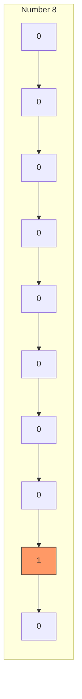
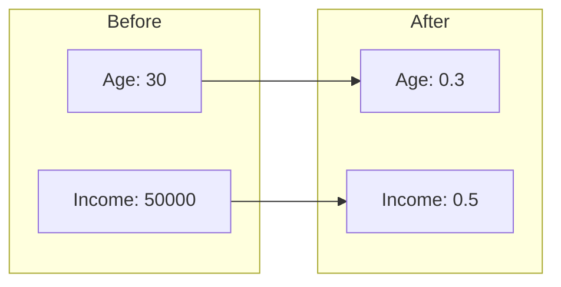
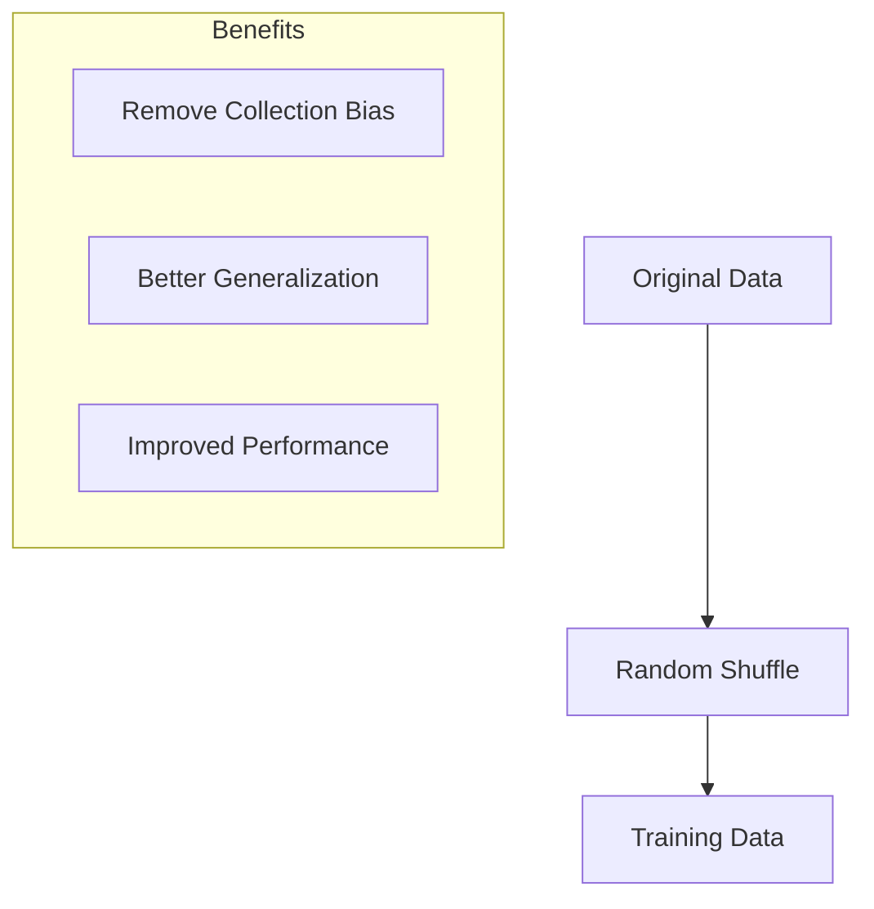

# Các kỹ thuật Feature Engineering

## Mục lục
- [Binning](#binning)
- [Data Transformation](#data-transformation)
- [Encoding](#encoding)
- [Scaling & Normalization](#scaling--normalization)
- [Shuffling](#shuffling)

## Binning

### Cách thức hoạt động


### Loại Binning
1. **Regular Binning**
   - Fixed-width bins
   - Based on value ranges
   - Simple implementation

2. **Quantile Binning**
   - Equal number of samples per bin
   - Based on distribution
   - Better data balance

### Use Cases
- Measurement uncertainty
- Categorical model requirements
- Data discretization

## Data Transformation

### Common Transformations


### YouTube Example
```python
# Feature transformations
features = {
    'x': raw_value,
    'x_squared': raw_value ** 2,
    'x_sqrt': sqrt(raw_value)
}
```

### Benefits
- Handle non-linear relationships
- Improve model performance
- Capture different patterns

## Encoding

### One-Hot Encoding


### Implementation
```python
# One-hot encoding example
def one_hot_encode(value, num_categories):
    encoding = [0] * num_categories
    encoding[value] = 1
    return encoding
```

### Use Cases
- Deep learning inputs
- Categorical variables
- Classification tasks

## Scaling & Normalization

### Techniques
1. **Min-Max Scaling**
   ```python
   scaled_value = (x - min) / (max - min)
   ```

2. **Standardization**
   ```python
   standardized = (x - mean) / std_dev
   ```

3. **Normalization Example**


### Importance
- Equal feature importance
- Model stability
- Better convergence

## Shuffling

### Process


### Implementation
```python
def shuffle_data(X, y):
    indices = np.random.permutation(len(X))
    return X[indices], y[indices]
```

## Best Practices

### 1. Selection Guide
```python
def choose_technique(context):
    if context.has_measurement_uncertainty:
        return "Binning"
    elif context.has_nonlinear_relationships:
        return "Transformation"
    elif context.needs_categorical:
        return "Encoding"
    elif context.needs_scaling:
        return "Normalization"
```

### 2. Implementation Tips
1. **Binning**
   - Consider data distribution
   - Validate bin sizes
   - Document boundaries

2. **Transformation**
   - Test multiple functions
   - Validate improvements
   - Keep original features

3. **Encoding**
   - Handle missing values
   - Consider dimensionality
   - Preserve relationships

4. **Scaling**
   - Save scaling parameters
   - Scale test data properly
   - Reverse when needed

### 3. Validation
- Cross-validation
- Performance metrics
- Business impact

## Lưu ý cho Exam

### Key Points
1. **Binning**
   - Regular vs Quantile
   - When to use
   - Impact on data

2. **Transformation**
   - Common functions
   - YouTube example
   - Non-linear relationships

3. **Encoding**
   - One-hot encoding
   - Deep learning requirements
   - Implementation details

4. **Scaling**
   - Different techniques
   - Why it's important
   - Proper application