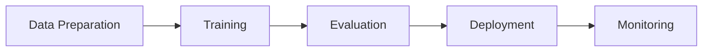
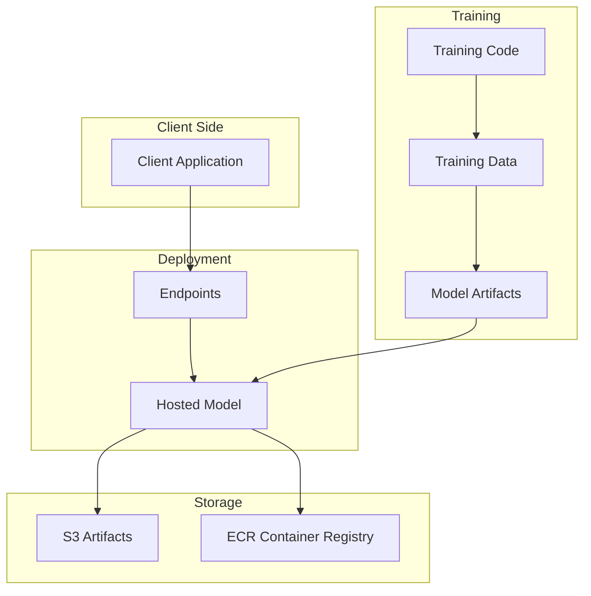
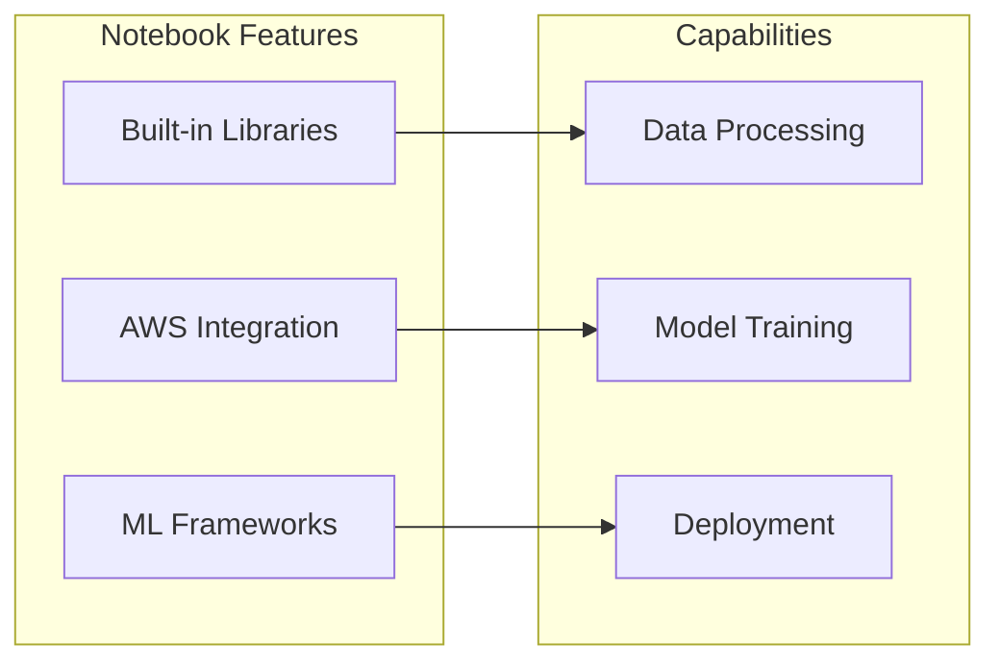
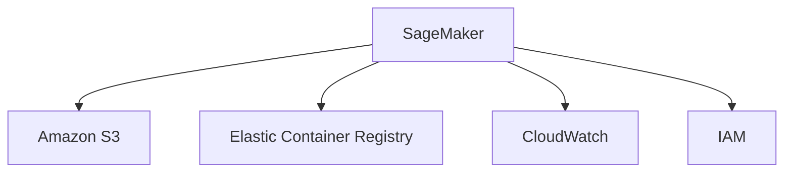

# Amazon SageMaker: Nền tảng Machine Learning toàn diện

## Mục lục
- [Tổng quan](#tổng-quan)
- [Kiến trúc](#kiến-trúc)
- [Development Options](#development-options)
- [Workflow](#workflow)

## Tổng quan

### Đặc điểm chính
- Nền tảng ML end-to-end
- Hỗ trợ toàn bộ ML lifecycle
- Bao gồm traditional ML và deep learning
- Tích hợp với AWS services

### ML Lifecycle Coverage


## Kiến trúc

### Training và Deployment Flow


### Components
1. **Storage Layer**
   - S3 for artifacts và data
   - ECR for container images

2. **Compute Layer**
   - Training instances
   - Deployment endpoints
   - Notebook instances

3. **Interface Layer**
   - APIs
   - Console
   - Notebooks

## Development Options

### 1. SageMaker Notebooks


#### Built-in Tools
- Scikit-learn
- Spark
- TensorFlow
- PyTorch

### 2. Console Interface
1. **Training Setup**
   - Algorithm selection
   - Data configuration
   - Resource allocation

2. **Deployment**
   - Endpoint configuration
   - Scaling options
   - Monitoring setup

## Workflow

### 1. Data Preparation
```python
# Example using SageMaker Python SDK
import sagemaker
from sagemaker.processing import ProcessingInput, ProcessingOutput

processor = sagemaker.processing.Processor(
    role=role,
    instance_count=1,
    instance_type='ml.m5.xlarge'
)
```

### 2. Model Training
```python
# Training configuration
estimator = sagemaker.estimator.Estimator(
    image_uri=training_image,
    role=role,
    instance_count=1,
    instance_type='ml.m5.xlarge',
    output_path=s3_output
)
```

### 3. Deployment
```python
# Deploy model to endpoint
predictor = estimator.deploy(
    initial_instance_count=1,
    instance_type='ml.m5.xlarge'
)
```

## Best Practices

### 1. Development
- Use notebooks for experimentation
- Leverage built-in algorithms
- Implement proper error handling

### 2. Training
- Choose appropriate instance types
- Monitor training metrics
- Implement cross-validation

### 3. Deployment
- Consider auto-scaling
- Monitor endpoint performance
- Implement A/B testing

## Integration Points

### AWS Services


### Features
1. **Storage**
   - S3 for data và artifacts
   - ECR for containers
   - EFS/EBS for notebooks

2. **Monitoring**
   - CloudWatch metrics
   - CloudWatch logs
   - Model monitoring

3. **Security**
   - IAM roles
   - VPC configuration
   - KMS encryption

## Lưu ý cho Exam

### Key Points
1. **Architecture**
   - Understand components
   - Know workflow
   - Integration points

2. **Development**
   - Code vs Console options
   - Built-in capabilities
   - Resource management

3. **Best Practices**
   - Security considerations
   - Performance optimization
   - Cost management