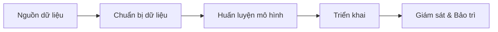
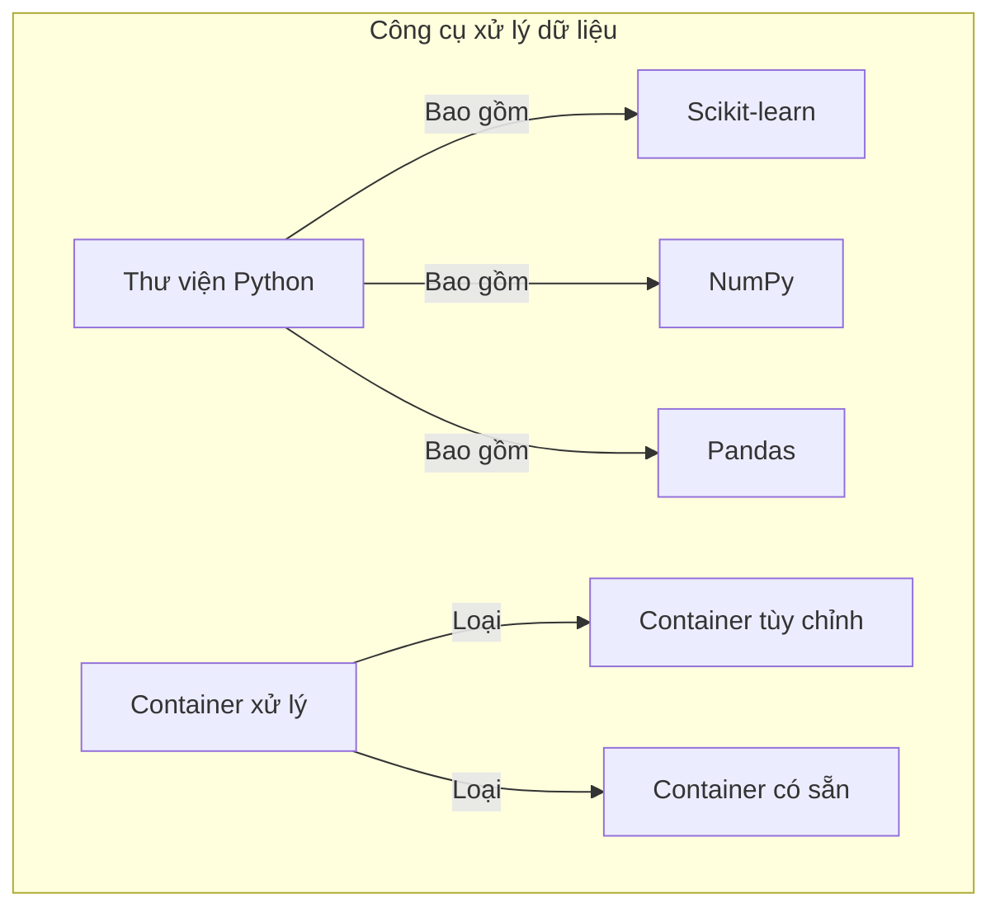
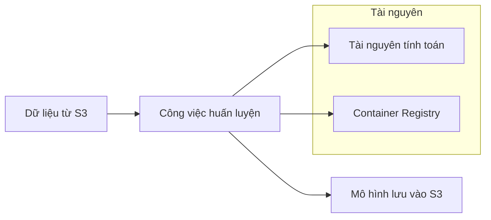
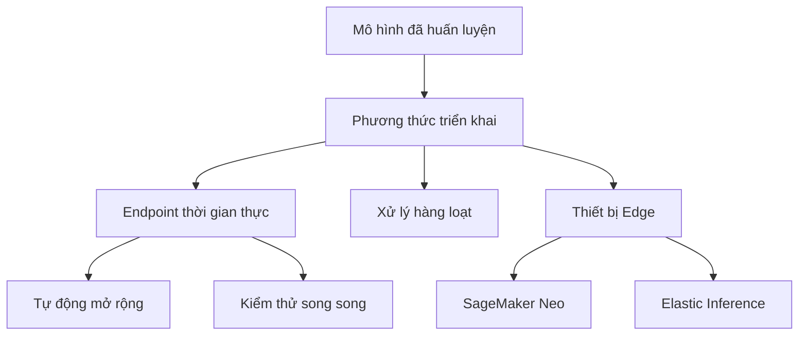

# Quy trình End-to-End trong Amazon SageMaker

## Sơ đồ tổng quan quy trình

## 1. Chuẩn bị dữ liệu

### Nguồn dữ liệu
- **Amazon S3** (nguồn chính)
- **FSX for Lustre** (cho dữ liệu quy mô lớn)
- **Nguồn cơ sở dữ liệu**:
  - Amazon Athena
  - Amazon Redshift (kho dữ liệu)
  - Amazon Keyspaces
  - Elastic MapReduce (EMR)
  - Apache Spark

### Định dạng dữ liệu
- Record IO
- Protobuf
- Định dạng cột (columnar format)
- Tùy chỉnh theo yêu cầu của từng thuật toán

### Công cụ xử lý

## 2. Huấn luyện mô hình

### Quy trình huấn luyện

### Framework và thuật toán
1. **Deep Learning**
   - TensorFlow
   - PyTorch
   - MXNet

2. **Machine Learning**
   - Scikit-learn
   - XGBoost
   - Hugging Face
   - Chainer

3. **Tùy chỉnh**
   - Docker image riêng
   - Spark ML
   - Học tăng cường (RL)

## 3. Triển khai mô hình

### Phương thức triển khai

### Tính năng triển khai
1. **Endpoint thời gian thực**
   - Dự đoán theo yêu cầu
   - Khả năng mở rộng linh hoạt
   - Tối ưu độ trễ

2. **Xử lý hàng loạt**
   - Xử lý dữ liệu lớn
   - Không cần endpoint liên tục
   - Tiết kiệm chi phí

3. **Triển khai Edge**
   - Hoạt động offline
   - Giảm độ trễ
   - Tối ưu cho thiết bị Edge

4. **Tính năng nâng cao**
   - Pipeline suy luận
   - Elastic Inference
   - Tự động mở rộng
   - Kiểm thử song song
   - Quay lại phiên bản cũ nhanh chóng

## Thực hành tốt nhất

### 1. Tối ưu chi phí
- Chọn phần cứng phù hợp cho huấn luyện
- Sử dụng xử lý hàng loạt khi có thể
- Tận dụng tự động mở rộng

### 2. Đảm bảo hiệu năng
- Chọn định dạng dữ liệu phù hợp
- Sử dụng FSX for Lustre cho dữ liệu lớn
- Tối ưu pipeline xử lý

### 3. Giám sát và bảo trì
- Theo dõi metrics
- Kiểm thử song song mô hình mới
- Duy trì quy trình quay lại phiên bản cũ
