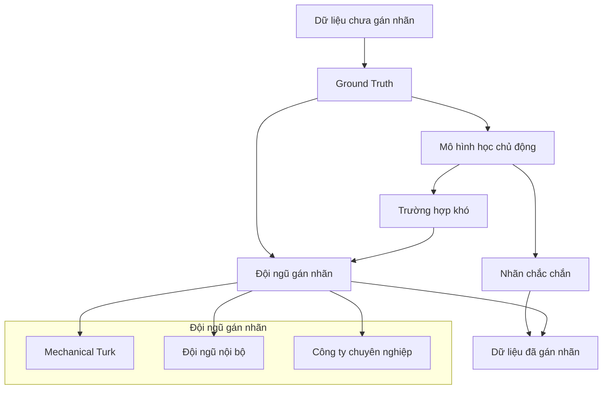
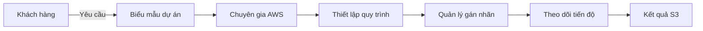

# Amazon SageMaker Ground Truth

## Tổng quan
SageMaker Ground Truth là dịch vụ gán nhãn dữ liệu thông qua con người của Amazon, được thiết kế để giải quyết vấn đề dữ liệu thiếu nhãn trong machine learning.

## Cách thức hoạt động

### 1. Mô hình học chủ động
- Xây dựng mô hình trong quá trình nhận nhãn từ con người
- Tự động học và cải thiện theo thời gian
- Chỉ gửi các trường hợp khó cho con người xử lý
- Giảm chi phí gán nhãn tới 70%

### 2. Lựa chọn đội ngũ gán nhãn

#### Amazon Mechanical Turk
- Lực lượng lao động toàn cầu
- Chi phí thấp
- Phù hợp với dữ liệu không nhạy cảm
- Xử lý được khối lượng lớn

#### Đội ngũ nội bộ
- Kiểm soát chất lượng tốt hơn
- Phù hợp với dữ liệu nhạy cảm
- Đảm bảo bảo mật thông tin
- Hiểu rõ về lĩnh vực chuyên môn

#### Công ty gán nhãn chuyên nghiệp
- Chuyên môn cao
- Chất lượng đảm bảo
- Chi phí cao hơn
- Phù hợp với dự án đòi hỏi độ chính xác cao

## Ứng dụng

### 1. Phân loại hình ảnh
- Nhận diện đối tượng trong ảnh
- Phân loại thể thao, động vật, vật thể
- Tạo tập dữ liệu huấn luyện chất lượng

### 2. Các giải pháp thay thế

#### AWS Recognition
- Dịch vụ nhận diện hình ảnh tự động
- Sử dụng mô hình đã được huấn luyện sẵn
- Phù hợp với nhận diện đối tượng phổ biến
- Tạo nhãn và đặc trưng tự động

#### AWS Comprehend
- Phân tích văn bản tự động
- Trích xuất chủ đề và cảm xúc
- Tạo đặc trưng cho mô hình
- Hỗ trợ xử lý ngôn ngữ tự nhiên

## Ground Truth Plus

### Dịch vụ quản lý toàn diện

### Tính năng chính
1. **Giải pháp trọn gói**
   - Thiết lập hoàn chỉnh
   - Quản lý quy trình
   - Theo dõi tiến độ
   - Báo cáo kết quả

2. **Quy trình đơn giản**
   - Điền thông tin dự án
   - Trao đổi chi tiết với chuyên gia
   - Nhận báo giá
   - Theo dõi qua cổng thông tin

3. **Ưu điểm**
   - Không cần kiến thức kỹ thuật
   - Tiết kiệm thời gian
   - Chất lượng đảm bảo
   - Hỗ trợ chuyên nghiệp

## Lưu ý thực tế
1. **Chọn phương pháp phù hợp**
   - Cân nhắc độ nhạy cảm của dữ liệu
   - Xem xét ngân sách dự án
   - Đánh giá yêu cầu chất lượng
   - Tính đến thời gian thực hiện

2. **Tối ưu chi phí**
   - Tận dụng mô hình học chủ động
   - Kết hợp với dịch vụ AWS khác
   - Chọn đội ngũ gán nhãn phù hợp
   - Theo dõi và điều chỉnh quy trình
