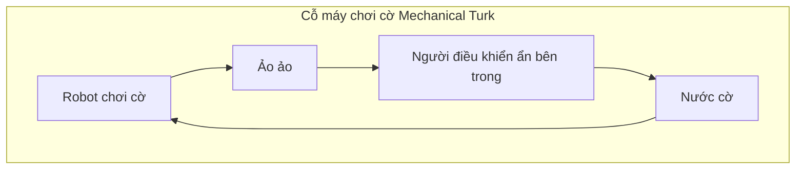
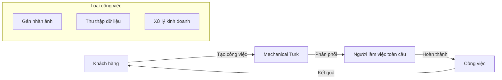
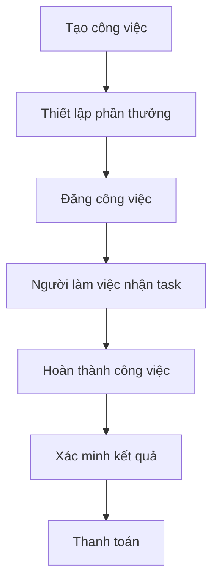

# Amazon Mechanical Turk: Từ Lịch Sử đến Ứng Dụng Hiện Đại

## Nguồn Gốc Lịch Sử

### The Mechanical Turk Nguyên Bản (1770)

- Được phát minh vào năm 1770
- Là một "robot" có khả năng chơi cờ vua
- Thực chất là một ảo ảnh: có người điều khiển ẩn bên trong
- Trở thành nguồn cảm hứng cho tên gọi dịch vụ của Amazon

## Amazon Mechanical Turk Hiện Đại

### Tổng Quan

### Đặc điểm chính
1. **Thị trường crowdsourcing**
   - Lực lượng lao động ảo phân tán
   - Thực hiện các công việc đơn giản
   - Chi phí linh hoạt theo công việc
   - Phạm vi toàn cầu

2. **Cách thức hoạt động**
   - Người dùng tạo công việc
   - Thiết lập phần thưởng cho mỗi tác vụ
   - Người làm việc chọn và thực hiện
   - Thanh toán theo hoàn thành

### Ứng dụng trong AI
1. **Gán nhãn dữ liệu**
   - Phân loại hình ảnh
   - Nhận dạng đối tượng
   - Xác định nội dung

2. **Tích hợp với dịch vụ AWS**
   - Amazon A2I
   - SageMaker Ground Truth
   - Các dịch vụ AI khác

### Quy trình làm việc

## Hướng dẫn sử dụng

### 1. Tạo công việc
- Xác định yêu cầu công việc rõ ràng
- Chia nhỏ thành các tác vụ đơn giản
- Thiết lập tiêu chí chất lượng
- Chuẩn bị hướng dẫn chi tiết

### 2. Định giá công việc
- Tính toán chi phí hợp lý
- Cân nhắc độ phức tạp
- Xem xét thời gian thực hiện
- So sánh với thị trường

### 3. Quản lý và giám sát
- Theo dõi tiến độ công việc
- Kiểm tra chất lượng kết quả
- Xử lý phản hồi từ người làm
- Điều chỉnh yêu cầu nếu cần

## Ví dụ thực tế

### Dự án gán nhãn 10,000 ảnh
1. **Thiết lập**
   - Công việc: Gán nhãn ảnh
   - Phần thưởng: $0.10/ảnh
   - Tổng chi phí: $1,000
   - Thời gian dự kiến: Tùy số lượng người tham gia

2. **Quy trình**
   - Tải lên bộ ảnh
   - Tạo hướng dẫn gán nhãn
   - Thiết lập tiêu chí chất lượng
   - Theo dõi và xác minh kết quả

## Lưu ý quan trọng
1. **Tối ưu chi phí**
   - Thiết lập giá hợp lý
   - Chia nhỏ công việc phù hợp
   - Tận dụng tính năng tự động

2. **Đảm bảo chất lượng**
   - Hướng dẫn rõ ràng
   - Kiểm tra ngẫu nhiên
   - Thu thập phản hồi
   - Điều chỉnh kịp thời
