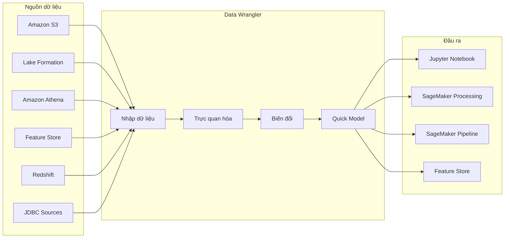
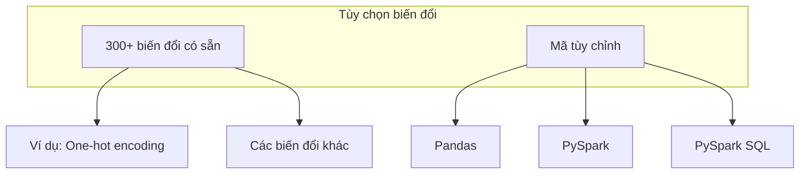
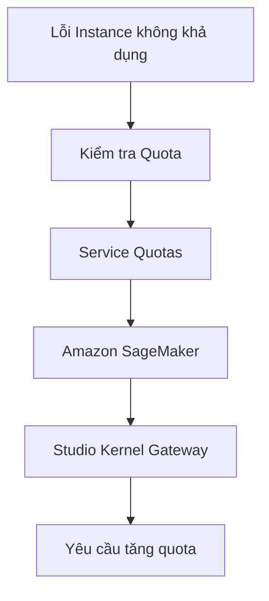

# SageMaker Data Wrangler

## Tổng quan
Data Wrangler là công cụ ETL tích hợp trong SageMaker Studio, được thiết kế đặc biệt cho các pipeline học máy. Nó cung cấp giao diện trực quan để nhập, phân tích và biến đổi dữ liệu.

## Tính năng chính

### 1. Nhập dữ liệu
- Amazon S3 (CSV, JSON, ...)
- Lake Formation
- Amazon Athena
- SageMaker Feature Store
- Amazon Redshift
- Kết nối JDBC (Salesforce, Databricks)

### 2. Trực quan hóa dữ liệu
- Xem phân phối dữ liệu
- Phát hiện dữ liệu ngoại lệ
- Kiểm tra kiểu dữ liệu
- Đổi tên cột thân thiện

### 3. Biến đổi dữ liệu

### 4. Quick Model
- Thử nghiệm mô hình nhanh
- Đánh giá hiệu quả biến đổi
- Tối ưu hóa pipeline
- Phản hồi nhanh về chất lượng dữ liệu

## Quy trình sử dụng

### 1. Nhập dữ liệu
- Chọn nguồn dữ liệu
- Xem trước dữ liệu
- Kiểm tra kiểu dữ liệu
- Điều chỉnh tên cột

### 2. Phân tích dữ liệu
- Xem phân phối
- Kiểm tra dữ liệu ngoại lệ
- Đánh giá chất lượng
- Xác định vấn đề

### 3. Biến đổi dữ liệu
- Chọn phương pháp biến đổi
- Áp dụng biến đổi
- Kiểm tra kết quả
- Thử nghiệm Quick Model

### 4. Xuất kết quả
- Tạo Jupyter Notebook
- Tích hợp với Pipeline
- Lưu vào Feature Store
- Sử dụng cho huấn luyện

## Xử lý sự cố

### 1. Vấn đề quyền truy cập
- Kiểm tra IAM role cho người dùng Studio
- Đảm bảo quyền truy cập nguồn dữ liệu
- Cấu hình "SageMaker Full Access"

### 2. Giới hạn tài nguyên

### Thực hành tốt nhất

1. **Chuẩn bị dữ liệu**
   - Kiểm tra định dạng
   - Đảm bảo chất lượng
   - Xử lý dữ liệu thiếu

2. **Tối ưu biến đổi**
   - Sử dụng Quick Model
   - Thử nghiệm các phương pháp
   - Đánh giá hiệu quả

3. **Quản lý tài nguyên**
   - Theo dõi quota
   - Tối ưu sử dụng
   - Lập kế hoạch mở rộng
