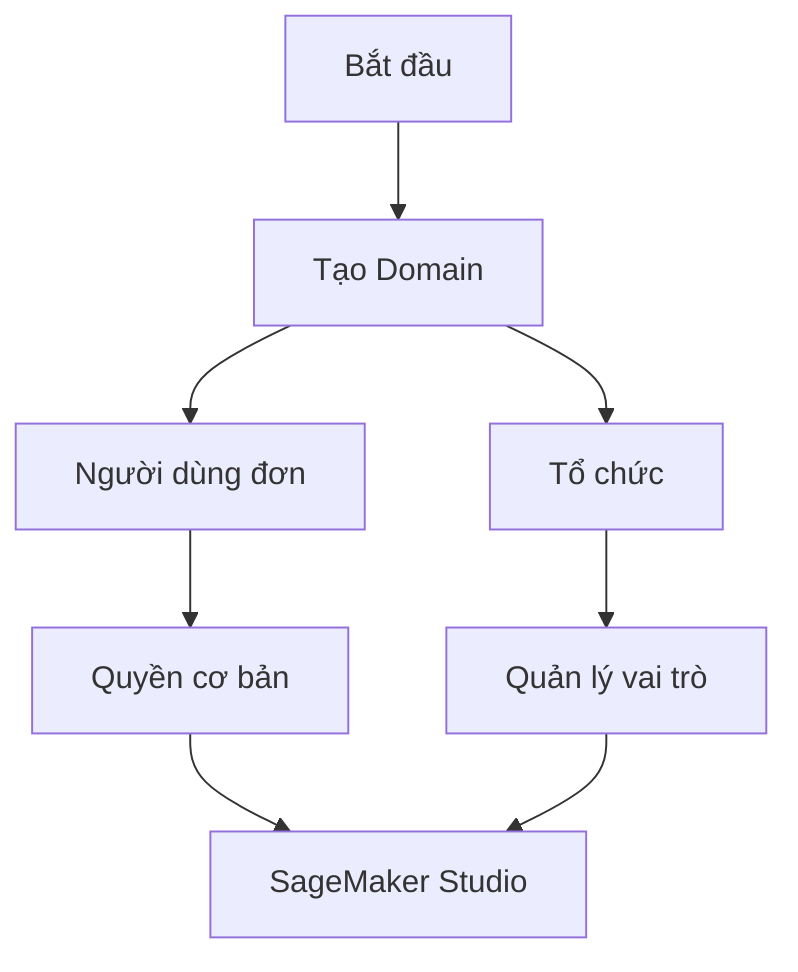
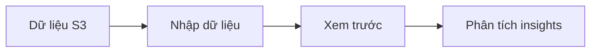
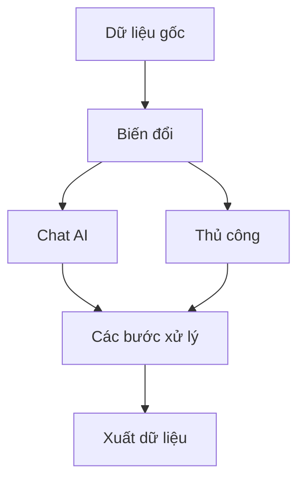

# Hướng dẫn thực hành SageMaker Studio và Canvas

## Thiết lập ban đầu

### Tạo Domain
- Yêu cầu bắt buộc để sử dụng Studio
- Thiết lập quyền truy cập
- Hai loại:
  - Người dùng đơn: Thiết lập cơ bản
  - Tổ chức: Cần định nghĩa vai trò và trách nhiệm

## SageMaker Studio

### Tính năng chính
1. **Ứng dụng tích hợp**
   - JupyterLab (Python)
   - RStudio (R)
   - Canvas (No-code)

2. **Chức năng**
   - Quản lý dữ liệu
   - ML tự động
   - Thiết lập thí nghiệm
   - Quản lý huấn luyện
   - Pipeline tự động
   - Jumpstart (mô hình huấn luyện sẵn)

## Quy trình thực hành với Canvas

### 1. Nhập và chuẩn bị dữ liệu

### 2. Phân tích dữ liệu tự động
- Kiểm tra dữ liệu thiếu
- Phát hiện trùng lặp
- Xác định outliers
- Đánh giá sức mạnh dự đoán
- Phân tích phân phối

### 3. Biến đổi dữ liệu

### 4. Tạo và huấn luyện mô hình
1. **Thiết lập mô hình**
   - Chọn loại bài toán
   - Xác định cột mục tiêu
   - Chọn kiểu mô hình

2. **Tùy chọn huấn luyện**
   - Quick build (2-15 phút)
   - Standard build (chính xác hơn)

### 5. Dự đoán và triển khai
1. **Loại dự đoán**
   - Dự đoán đơn lẻ
   - Dự đoán hàng loạt

2. **Xuất kết quả**
   - Tải về máy
   - Lưu vào S3
   - Tích hợp QuickSight
   - Tạo endpoint suy luận

## Các tính năng sẵn có

### 1. Dịch vụ AI tích hợp
- Amazon Rekognition (hình ảnh)
- Amazon Comprehend (văn bản)
- Amazon Textract (trích xuất văn bản)

### 2. Giao diện Gen AI
- Tích hợp chatbot
- Lựa chọn mô hình nền
- Hỗ trợ xử lý dữ liệu

## Lưu ý quan trọng

### 1. Quản lý chi phí
- Đóng các endpoint không sử dụng
- Đăng xuất khi không dùng
- Theo dõi tài nguyên đang chạy

### 2. Thực hành tốt nhất
- Đánh giá kích thước dữ liệu
- Chọn cấu hình phù hợp
- Kiểm tra kết quả tự động
- Xác thực mã sinh từ AI

### 3. Bảo mật
- Quản lý quyền truy cập
- Kiểm soát dữ liệu nhạy cảm
- Theo dõi hoạt động người dùng
