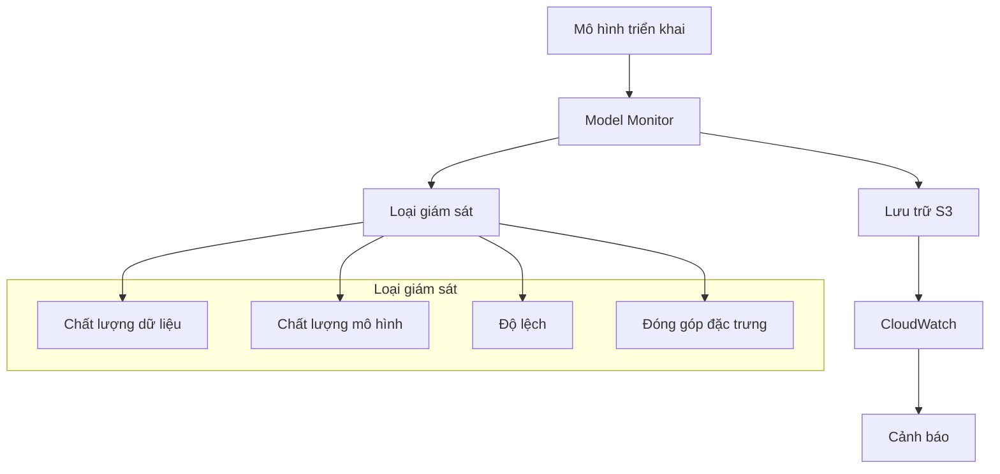
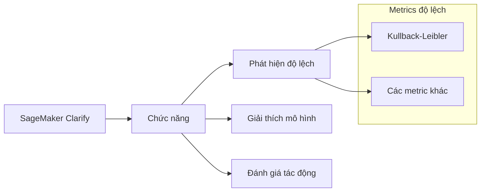
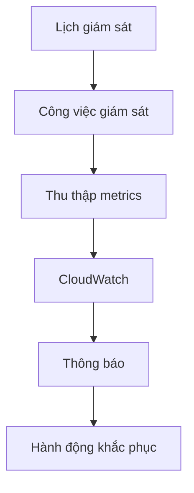

# SageMaker Model Monitor: Giám sát mô hình trong sản phẩm

## Tổng quan

## Tính năng chính

### 1. Giám sát tự động
- Phát hiện thay đổi chất lượng
- Theo dõi độ trôi dữ liệu
- Cảnh báo qua CloudWatch
- Không cần viết mã

### 2. Phân tích dữ liệu
- Phát hiện anomaly và outlier
- Theo dõi đặc trưng mới
- Đánh giá chất lượng dữ liệu
- Phân tích phân phối

### 3. Tích hợp SageMaker Clarify

## Cách thức hoạt động

### 1. Lưu trữ và bảo mật
- Dữ liệu lưu trong S3
- Bảo mật tích hợp
- Quản lý quyền truy cập
- Mã hóa dữ liệu

### 2. Lập lịch giám sát

### 3. Tích hợp hiển thị
- SageMaker Studio
- TensorBoard
- Amazon QuickSight
- Tableau

## Loại giám sát chi tiết

### 1. Độ trôi chất lượng dữ liệu
- Thiết lập baseline
- Đo lường thống kê
- Theo dõi thay đổi
- Cảnh báo vượt ngưỡng

### 2. Độ trôi chất lượng mô hình
- So sánh với baseline
- Đánh giá độ chính xác
- Tích hợp ground truth
- Phân tích sai lệch

### 3. Độ trôi độ lệch
- Phát hiện mất cân bằng
- Phân tích nhóm
- Đánh giá công bằng
- Cảnh báo độ lệch

### 4. Độ trôi đóng góp đặc trưng
- Theo dõi tầm quan trọng
- Phân tích thay đổi
- Đánh giá tác động
- Cập nhật mô hình

## Thực hành tốt nhất

### 1. Thiết lập giám sát
- Xác định metrics quan trọng
- Thiết lập ngưỡng phù hợp
- Lập lịch hợp lý
- Kiểm tra định kỳ

### 2. Xử lý cảnh báo
- Quy trình phản ứng
- Đánh giá nguyên nhân
- Hành động khắc phục
- Ghi nhận bài học

### 3. Bảo trì và cập nhật
- Đánh giá hiệu quả
- Cập nhật baseline
- Tinh chỉnh ngưỡng
- Tối ưu quy trình
