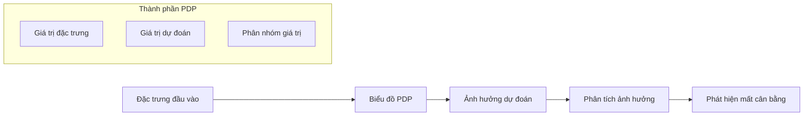
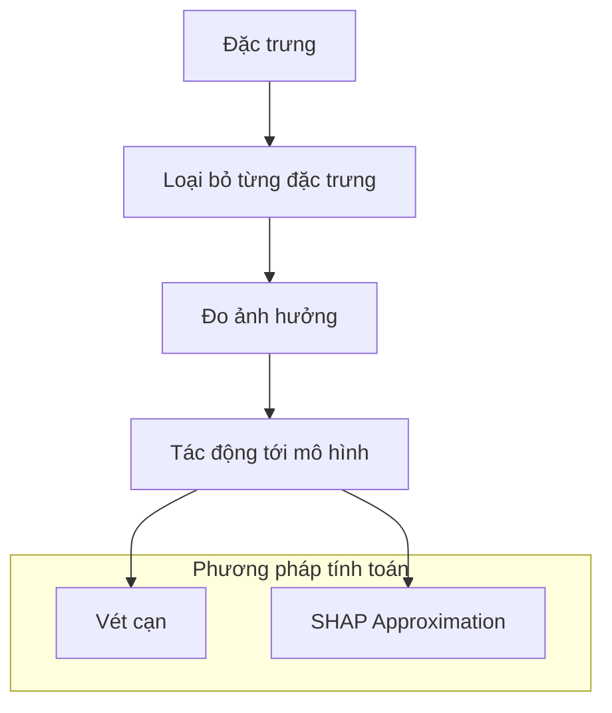
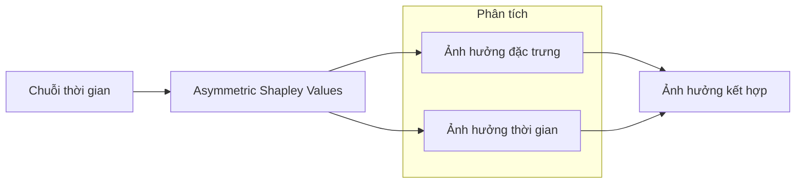

# SageMaker Clarify: Giải thích và Phân tích Mô hình

## Biểu đồ phụ thuộc từng phần (PDP)

### Khái niệm

### Ví dụ phân tích tuổi
1. **Trục X**: Các khoảng giá trị tuổi
2. **Trục Y**: Giá trị dự đoán của mô hình
3. **Quan sát**:
   - Điểm chuyển ở tuổi 50
   - Dự đoán ổn định sau tuổi 50
   - Có thể chỉ ra mất cân bằng dữ liệu

### Phân phối dữ liệu
- Thống kê cho mỗi nhóm giá trị
- Dữ liệu thô cho phân tích
- Phát hiện mất cân bằng lớp

## Giá trị Shapley

### Nguyên lý cơ bản

### SHAP (Shapley Additive Explanations)
1. **Mục đích**:
   - Xấp xỉ giá trị Shapley
   - Tăng hiệu quả tính toán
   - Giữ độ chính xác cao

2. **Ưu điểm**:
   - Tính toán nhanh hơn
   - Mở rộng được
   - Kết quả tin cậy

### Asymmetric Shapley cho dữ liệu chuỗi thời gian

1. **Đặc điểm**:
   - Phân tích theo thời gian
   - Kết hợp nhiều đặc trưng
   - Dự đoán phức tạp hơn

2. **Ứng dụng**:
   - Dự báo chuỗi thời gian
   - Phân tích xu hướng
   - Dự đoán tương lai

## Ứng dụng thực tế

### 1. Phân tích độ lệch
- Phát hiện mất cân bằng dữ liệu
- Đánh giá công bằng mô hình
- Điều chỉnh dữ liệu huấn luyện

### 2. Giải thích mô hình
- Hiểu ảnh hưởng đặc trưng
- Tối ưu hóa mô hình
- Tăng tính minh bạch

### 3. Giám sát và bảo trì
- Theo dõi thay đổi
- Phát hiện vấn đề
- Cập nhật mô hình

## Thực hành tốt nhất

### 1. Phân tích dữ liệu
- Kiểm tra phân phối
- Đánh giá mất cân bằng
- Xử lý dữ liệu ngoại lệ

### 2. Tối ưu mô hình
- Sử dụng kết quả Shapley
- Điều chỉnh đặc trưng
- Cân bằng dữ liệu

### 3. Triển khai và giám sát
- Tích hợp Model Monitor
- Theo dõi độ lệch
- Cập nhật định kỳ
