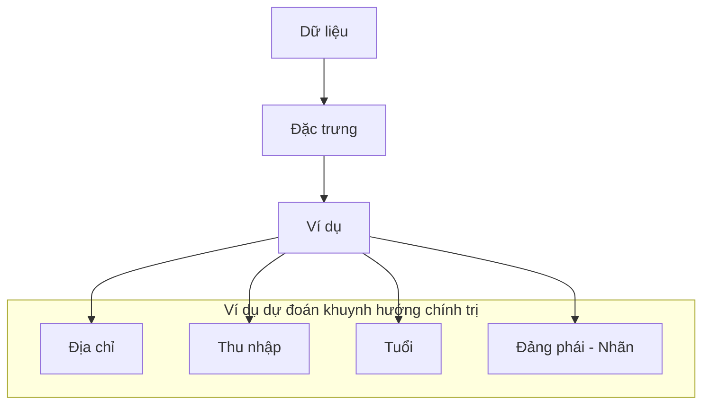
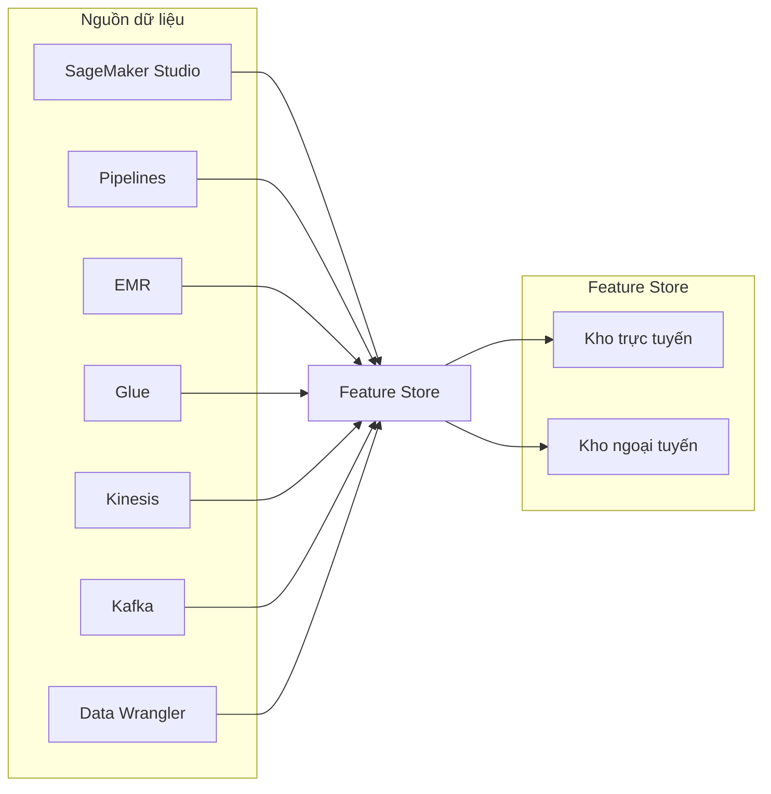
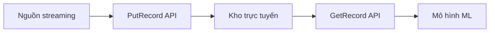
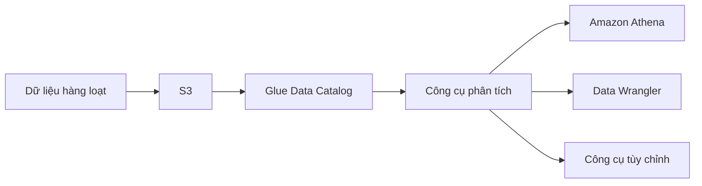

# SageMaker Feature Store: Quản lý đặc trưng cho học máy

## Khái niệm cơ bản

### Đặc trưng (Feature) là gì?

### Tổ chức dữ liệu
1. **Feature Store**:
   - Kho lưu trữ trung tâm
   - Quản lý và chia sẻ đặc trưng
   - Truy cập nhanh và bảo mật

2. **Feature Groups**:
   - Nhóm đặc trưng liên quan
   - Định danh bản ghi
   - Tên đặc trưng
   - Thời gian sự kiện

## Kiến trúc hệ thống

### Nguồn dữ liệu

### Mô hình lưu trữ song song

#### 1. Kho trực tuyến
- Xử lý dữ liệu streaming
- API PutRecord để nhập
- API GetRecord để truy xuất
- Độ trễ thấp

#### 2. Kho ngoại tuyến (S3)
- Lưu trữ dài hạn
- Tích hợp Glue Data Catalog
- Hỗ trợ truy vấn Athena
- Xử lý hàng loạt

## Luồng dữ liệu

### 1. Streaming

### 2. Xử lý hàng loạt

## Bảo mật

### 1. Mã hóa
- Mã hóa khi lưu trữ
- Mã hóa khi truyền tải
- Hỗ trợ KMS customer master key

### 2. Kiểm soát truy cập
- IAM chi tiết
- AWS PrivateLink
- VPC Endpoint

## Thực hành tốt nhất

### 1. Tổ chức đặc trưng
- Nhóm đặc trưng logic
- Đặt tên có ý nghĩa
- Ghi chú và tài liệu đầy đủ

### 2. Tối ưu hiệu năng
- Chọn kiểu lưu trữ phù hợp
- Cân nhắc độ trễ yêu cầu
- Quản lý tài nguyên hiệu quả

### 3. Quản lý dữ liệu
- Theo dõi phiên bản
- Dọn dẹp dữ liệu cũ
- Kiểm tra tính nhất quán
