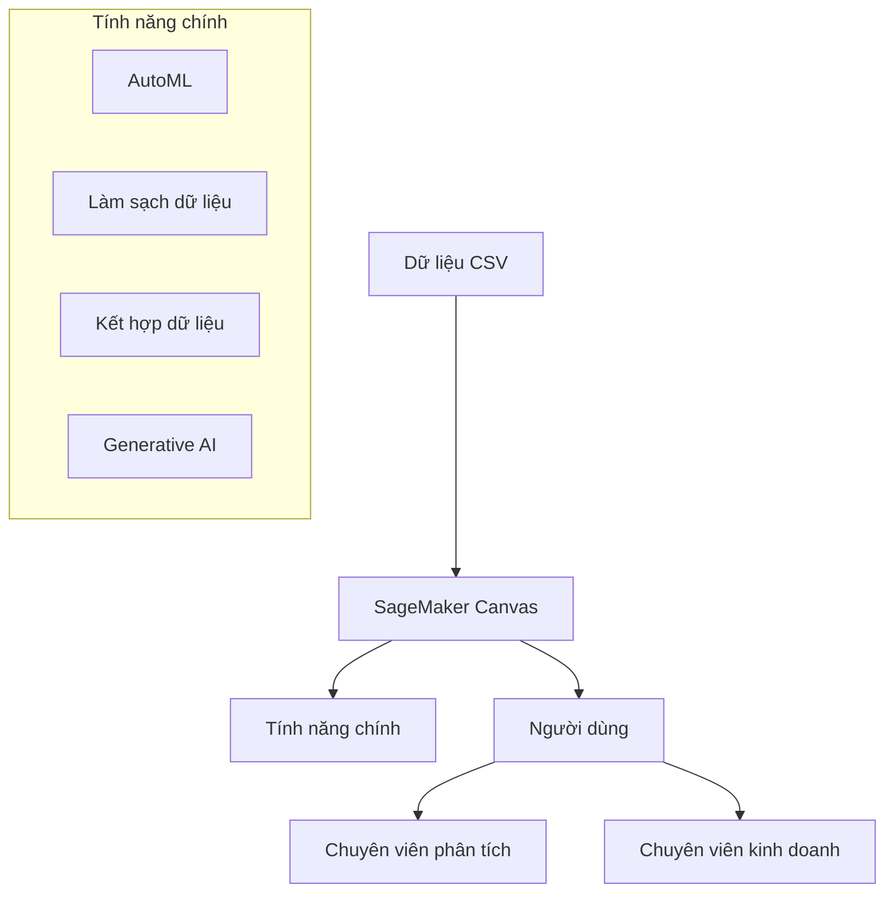
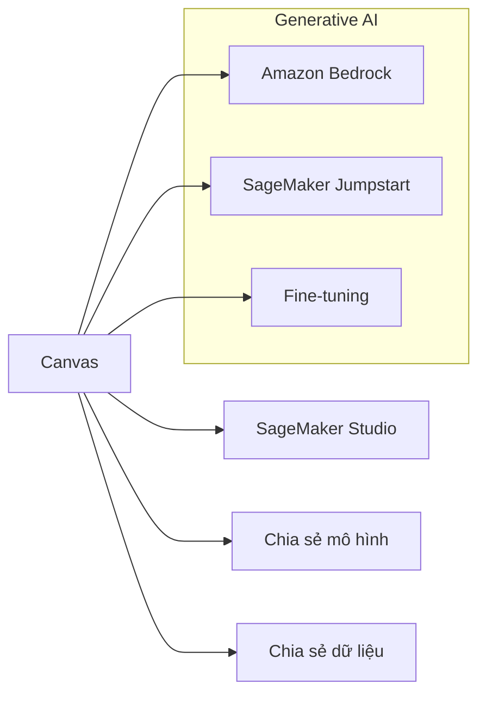

# SageMaker Canvas: ML không cần code cho mọi người

## Tổng quan

## Tính năng nổi bật

### 1. AutoML tự động
- Xây dựng mô hình tự động
- Phân loại và hồi quy
- Tối ưu hóa mô hình
- Dự đoán kết quả

### 2. Xử lý dữ liệu thông minh
- Phát hiện giá trị thiếu
- Xử lý dữ liệu ngoại lai
- Loại bỏ dữ liệu trùng lặp
- Làm sạch tự động

### 3. Tích hợp linh hoạt

## Ưu điểm

### 1. Dễ sử dụng
- Không cần viết code
- Giao diện trực quan
- Quy trình đơn giản
- Phù hợp người mới

### 2. Tự động hóa cao
- Xử lý dữ liệu tự động
- Chọn mô hình tối ưu
- Điều chỉnh tham số
- Đánh giá kết quả

### 3. Tích hợp AI hiện đại
- Mô hình nền tảng
- Fine-tuning dễ dàng
- Ứng dụng Generative AI
- Cập nhật liên tục

## Đối tượng sử dụng

### 1. Chuyên viên phân tích
- Phân tích dữ liệu
- Tạo mô hình dự đoán
- Trực quan hóa kết quả
- Chia sẻ insight

### 2. Chuyên viên kinh doanh
- Dự báo xu hướng
- Phân tích khách hàng
- Ra quyết định dựa trên dữ liệu
- Tối ưu hóa quy trình
