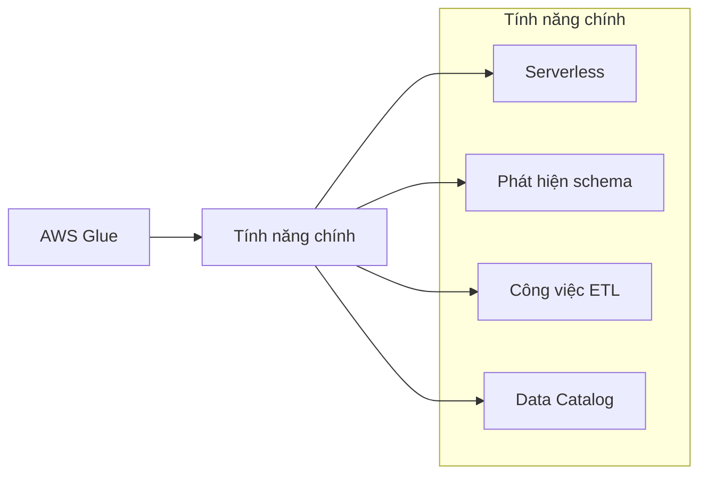
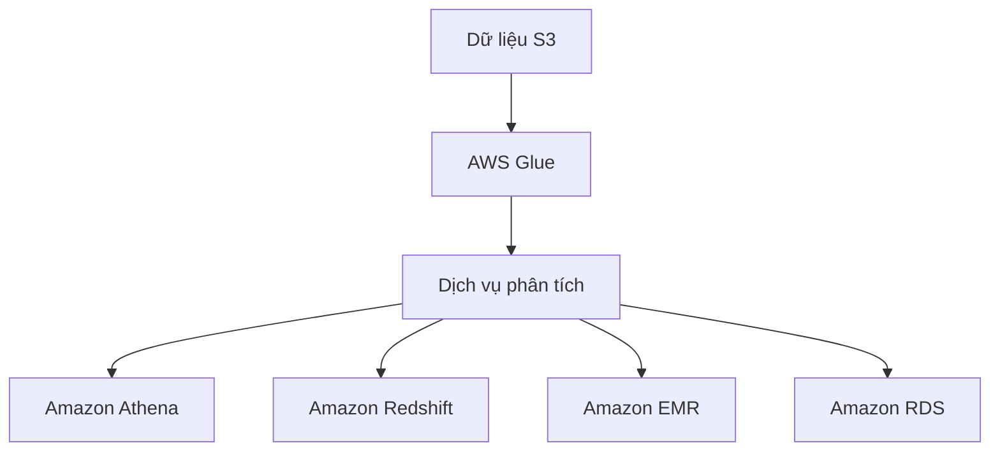
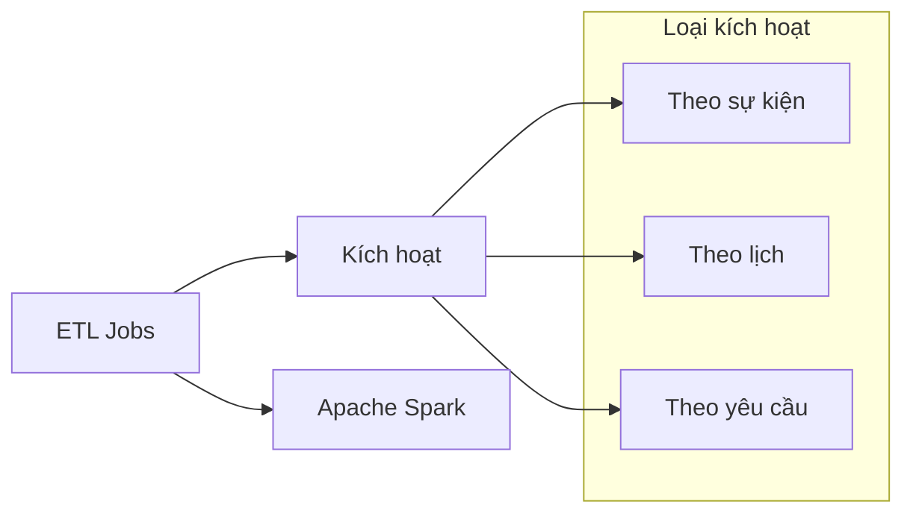
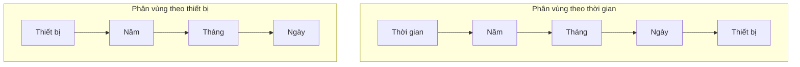

# AWS Glue: Dịch vụ ETL Serverless

## Tổng quan

### Đặc điểm chính

### Vai trò trong hệ sinh thái AWS

## Thành phần chính

### 1. Glue Crawler
- Quét dữ liệu trong S3
- Tự động suy luận schema
- Lập lịch quét định kỳ
- Hỗ trợ gợi ý cấu trúc

### 2. Data Catalog
- Kho lưu trữ metadata trung tâm
- Định nghĩa bảng và schema
- Kết nối dữ liệu phi cấu trúc với công cụ SQL
- Không sao chép dữ liệu gốc

### 3. ETL Jobs

## Tổ chức dữ liệu S3

### Chiến lược phân vùng

### 1. Phân vùng theo thời gian
- Tối ưu cho truy vấn theo khoảng thời gian
- Cấu trúc: Năm/Tháng/Ngày/Thiết bị
- Hiệu quả cho phân tích theo thời gian
- Dễ dàng lọc dữ liệu theo ngày

### 2. Phân vùng theo thiết bị
- Tối ưu cho truy vấn theo thiết bị
- Cấu trúc: Thiết bị/Năm/Tháng/Ngày
- Hiệu quả cho theo dõi thiết bị
- Truy cập nhanh dữ liệu thiết bị cụ thể

## Thực hành tốt nhất

### 1. Thiết kế schema
- Xác định mẫu truy vấn phổ biến
- Chọn chiến lược phân vùng phù hợp
- Tổ chức dữ liệu hiệu quả
- Tối ưu hóa hiệu suất

### 2. Quản lý ETL
- Lập lịch crawler hợp lý
- Theo dõi công việc ETL
- Xử lý lỗi và ngoại lệ
- Tối ưu hóa chi phí

### 3. Tích hợp dịch vụ
- Kết nối với công cụ phân tích
- Đảm bảo quyền truy cập
- Quản lý metadata hiệu quả
- Duy trì tính nhất quán
