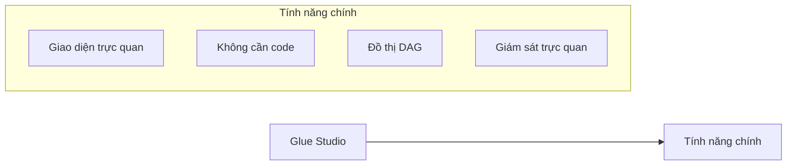
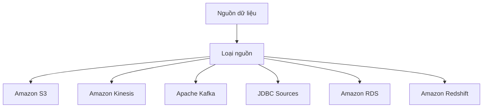
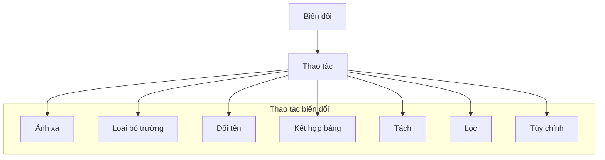
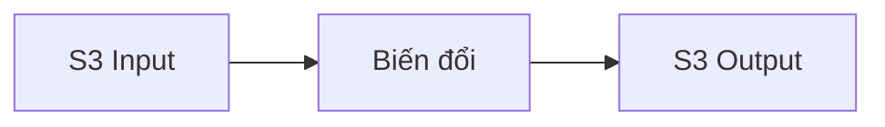
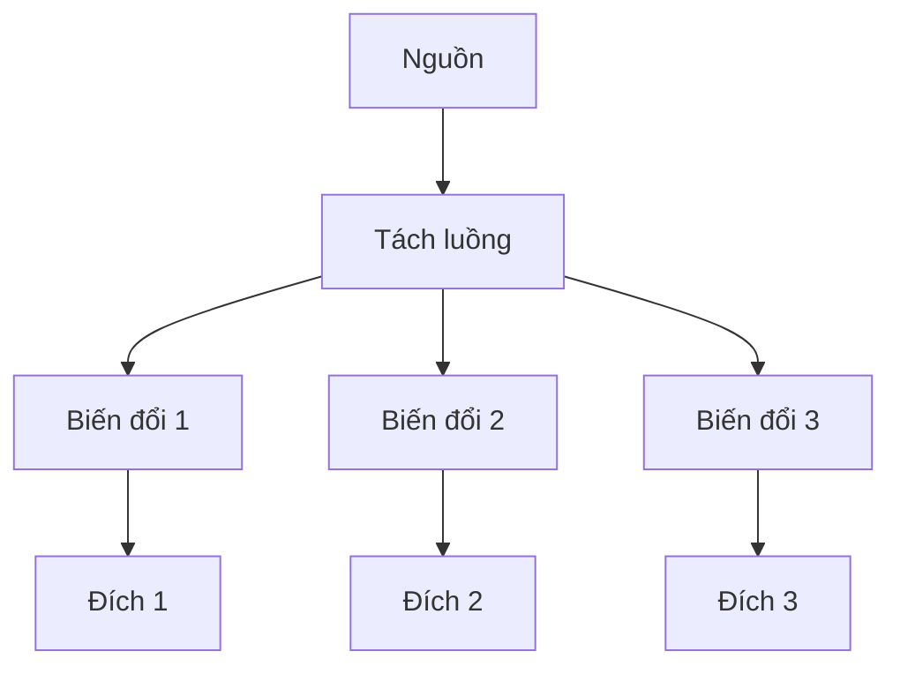

# AWS Glue Studio: Giao diện trực quan cho ETL

## Tổng quan

### Đặc điểm chính

## Quy trình làm việc

### 1. Nguồn dữ liệu

### 2. Biến đổi dữ liệu

### 3. Đích đến
- Amazon S3
- Glue Data Catalog
- Hỗ trợ phân vùng tự động

## Tính năng giám sát

### Bảng điều khiển công việc
1. **Thống kê**
   - Số lượng công việc đang chạy
   - Tỷ lệ thành công/thất bại
   - Sử dụng tài nguyên
   - Dòng thời gian

2. **Theo dõi**
   - Trạng thái công việc
   - Thời gian thực thi
   - Lỗi và cảnh báo
   - Hiệu suất

## Ví dụ quy trình

### 1. Tạo công việc cơ bản

### 2. Quy trình phức tạp

## Thực hành tốt nhất

### 1. Thiết kế quy trình
- Xác định luồng dữ liệu
- Tối ưu biến đổi
- Tận dụng xử lý song song
- Quản lý tài nguyên hiệu quả

### 2. Giám sát và bảo trì
- Theo dõi hiệu suất
- Xử lý lỗi kịp thời
- Tối ưu hóa thời gian chạy
- Cập nhật quy trình

### 3. Quản lý chi phí
- Lập lịch hợp lý
- Tối ưu tài nguyên
- Theo dõi sử dụng
- Kiểm soát quy mô
