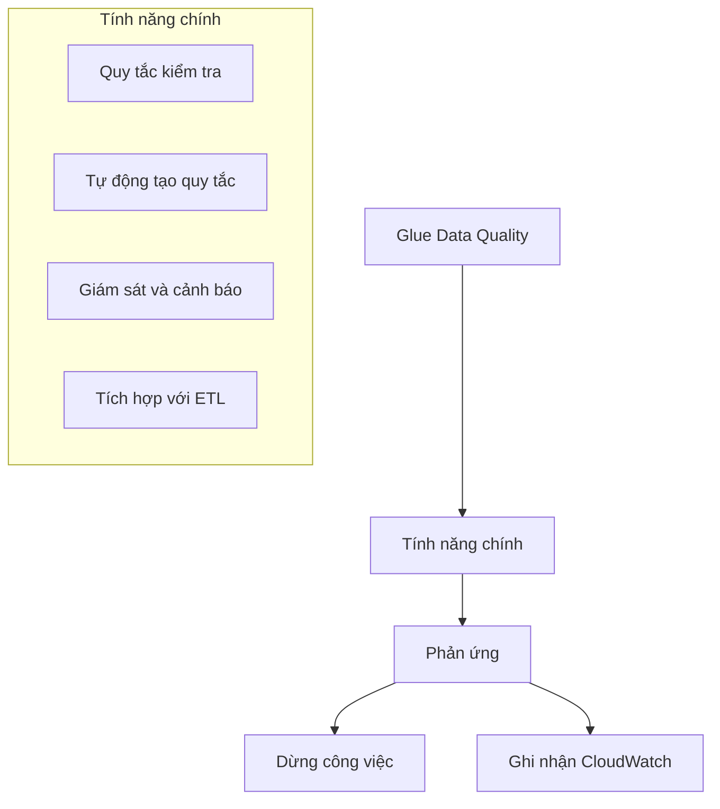
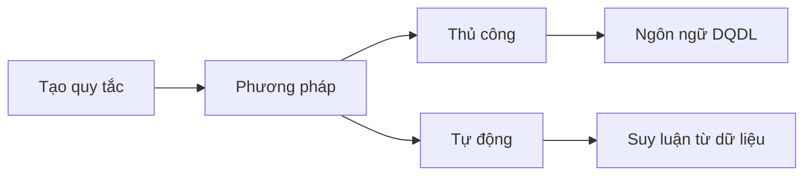
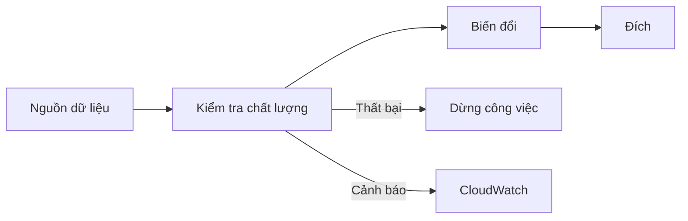
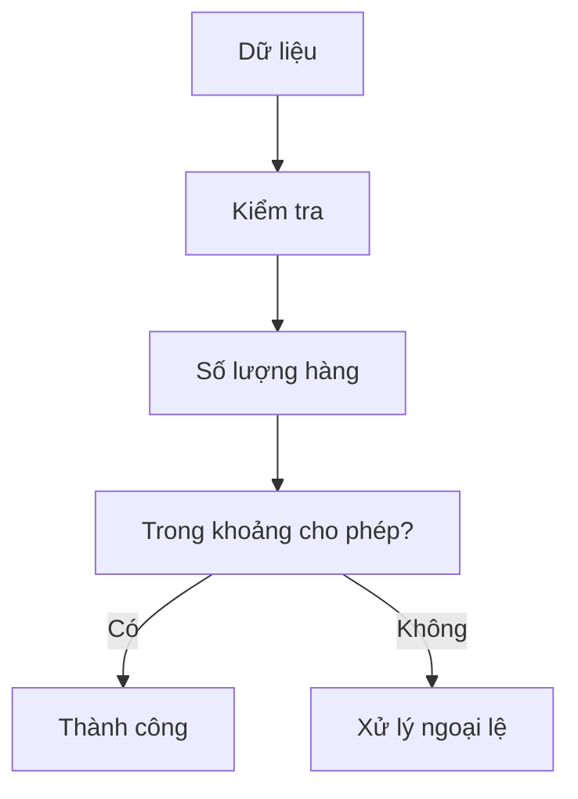

# AWS Glue Data Quality: Đảm bảo chất lượng dữ liệu tự động

## Tổng quan

### Mục đích và tính năng


## Quy tắc chất lượng dữ liệu

### 1. Tạo quy tắc


### 2. Ngôn ngữ DQDL (Data Quality Definition Language)
```sql
-- Ví dụ quy tắc DQDL
-- Kiểm tra số lượng hàng
TableRule rowCount: row_count BETWEEN 1000 AND 5000

-- Kiểm tra dữ liệu đầy đủ
ColumnRule completeness: "column_name" IS COMPLETE

-- Kiểm tra độ dài
ColumnRule length: LENGTH("column_name") BETWEEN 5 AND 50

-- Kiểm tra độ lệch chuẩn
ColumnRule stdDev: STDDEV("column_name") BETWEEN 1.0 AND 10.0
```

## Tích hợp trong quy trình ETL

### 1. Thêm bước kiểm tra chất lượng


### 2. Phản ứng với vấn đề
1. **Dừng công việc**
   - Ngăn chặn dữ liệu xấu
   - Yêu cầu can thiệp
   - Đảm bảo chất lượng tuyệt đối

2. **Ghi nhận CloudWatch**
   - Theo dõi vấn đề
   - Phân tích xu hướng
   - Can thiệp khi cần

## Ví dụ thực tế

### 1. Kiểm tra số lượng


### 2. Kiểm tra độ lệch
- Giá trị nằm trong phạm vi
- Độ lệch chuẩn hợp lý
- Phát hiện ngoại lai
- Đảm bảo tính nhất quán

## Thực hành tốt nhất

### 1. Thiết lập quy tắc
- Phân tích dữ liệu mẫu
- Xác định ngưỡng phù hợp
- Cân nhắc ngoại lệ
- Cập nhật định kỳ

### 2. Xử lý vấn đề
- Quy trình phản ứng rõ ràng
- Phân loại mức độ nghiêm trọng
- Thông báo đúng đối tượng
- Lưu trữ lịch sử

### 3. Tối ưu hóa
- Điều chỉnh ngưỡng phù hợp
- Giảm cảnh báo sai
- Tự động hóa xử lý
- Theo dõi hiệu quả
