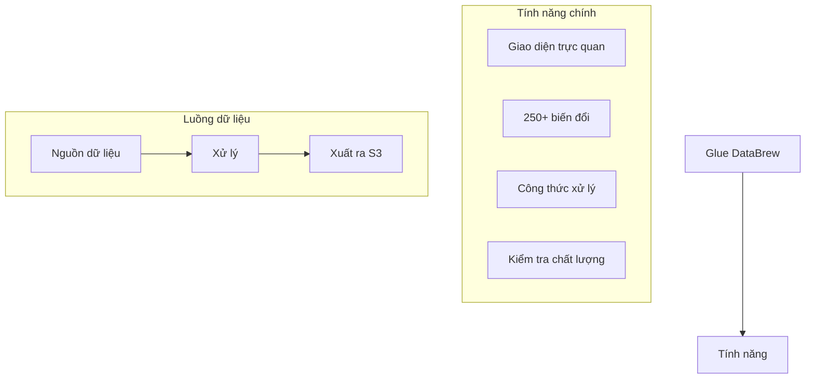
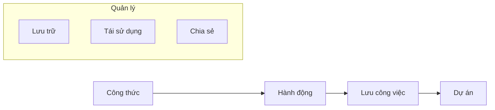
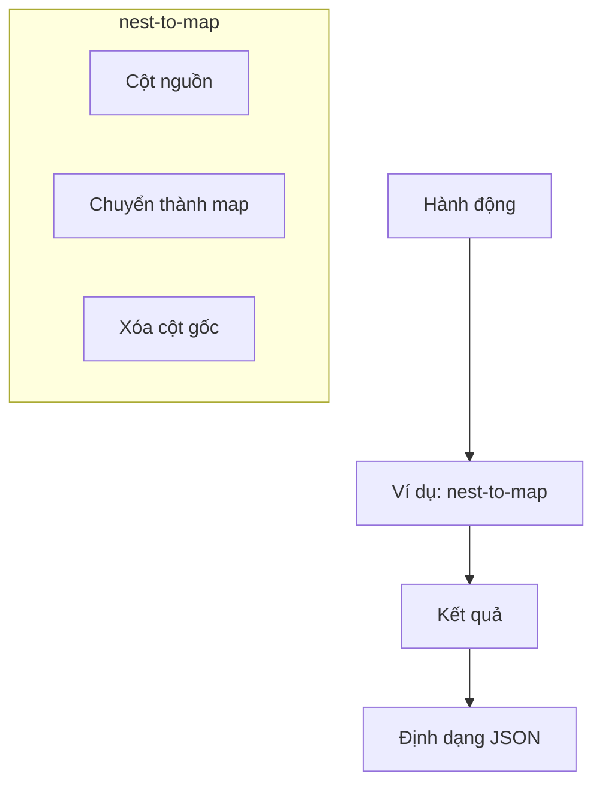
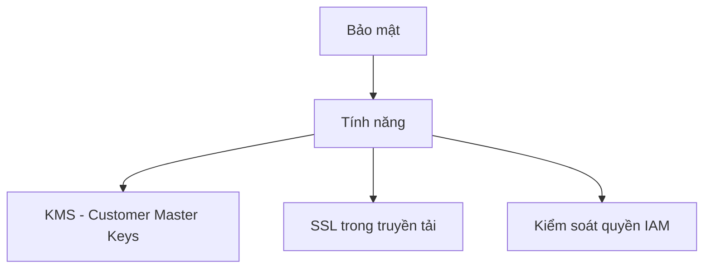

# AWS Glue DataBrew: Công cụ chuẩn bị dữ liệu trực quan

## Tổng quan

### Đặc điểm chính


## Nguồn và đích dữ liệu

### 1. Nguồn dữ liệu
- Amazon S3
- Kho dữ liệu
- Cơ sở dữ liệu
- SQL tùy chỉnh từ Redshift/Snowflake

### 2. Đích dữ liệu
- Chỉ lưu vào Amazon S3

## Công thức và hành động

### 1. Công thức (Recipe)


### 2. Hành động (Recipe Action)


### Ví dụ nest-to-map
```json
{
    "source_columns": ["age", "weight_kilogram", "height_centimeter"],
    "new_column": "metrics_map",
    "remove_source": true
}

// Kết quả:
{
    "metrics_map": {
        "age": 53,
        "weight_kilogram": 70,
        "height_centimeter": 175
    }
}
```

## Bảo mật và tích hợp

### 1. Bảo mật


### 2. Tích hợp dịch vụ
- Amazon CloudWatch
- AWS CloudTrail
- AWS KMS
- AWS IAM

## Thực hành tốt nhất

### 1. Thiết kế công thức
- Tổ chức hành động logic
- Tái sử dụng công thức
- Tối ưu thứ tự biến đổi
- Kiểm tra kết quả

### 2. Quản lý dự án
- Phân loại công việc
- Theo dõi tiến độ
- Lưu trữ phiên bản
- Chia sẻ tài nguyên

### 3. Đảm bảo chất lượng
- Thiết lập quy tắc
- Kiểm tra dữ liệu
- Xử lý ngoại lệ
- Ghi nhận vấn đề

### 4. Tối ưu chi phí
- Quản lý tài nguyên
- Lập lịch hợp lý
- Theo dõi sử dụng
- Tối ưu quy trình
