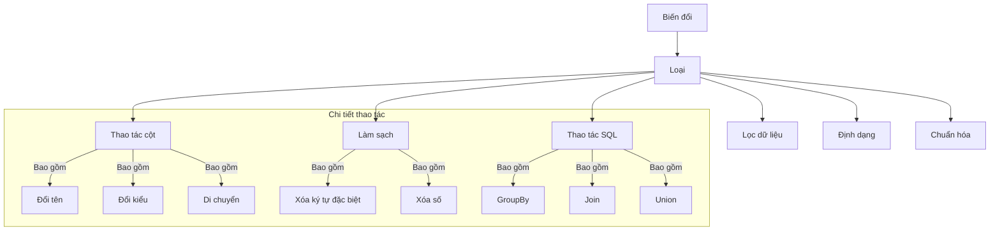
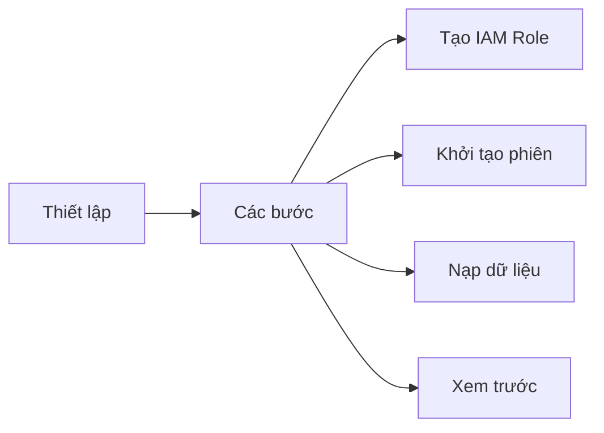
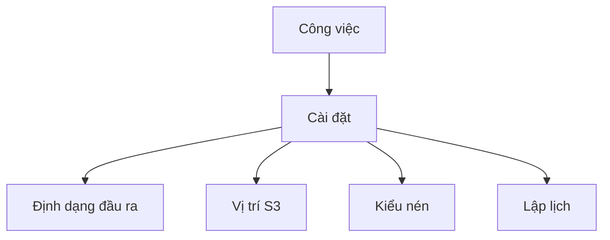

# AWS Glue DataBrew: Hướng dẫn chi tiết với ví dụ thực tế

## Biến đổi dữ liệu

### 1. Loại biến đổi


### 2. Xử lý dữ liệu đặc biệt

#### Dữ liệu thiếu
- Điền giá trị null
- Xóa hàng
- Điền giá trị phổ biến nhất

#### Dữ liệu không hợp lệ
- Lọc
- Thay thế
- Chuyển đổi

#### Dữ liệu trùng lặp
- Xóa
- Gộp
- Đánh dấu

## Quy trình làm việc

### 1. Thiết lập dự án


### 2. Tạo và thực thi công thức
1. **Tạo công thức mới**
   - Chọn biến đổi
   - Cấu hình tham số
   - Xem trước kết quả
   - Áp dụng biến đổi

2. **Ví dụ: Lọc tên bắt đầu bằng 'L'**
```sql
FILTER name STARTS_WITH 'L'
```

### 3. Xuất dữ liệu
- **Định dạng hỗ trợ**:
  - CSV
  - Glue
  - Parquet
  - Avro
  - ORC
  - XML
  - JSON

- **Nén**:
  - Snappy
  - Gzip
  - Bzip2
  - Deflate
  - Brotli

## Tạo và quản lý công việc

### 1. Thiết lập công việc


### 2. Lập lịch
- Chạy theo yêu cầu
- Lập lịch định kỳ
- Cú pháp Cron
- Theo dõi tiến độ

## Chi phí và tài nguyên

### 1. Cấu trúc giá
- **Phiên tương tác**: $1/phiên
- **Xử lý công việc**: $0.48/node-giờ

### 2. Tối ưu chi phí
- Lập lịch hiệu quả
- Tận dụng phiên tương tác
- Theo dõi sử dụng
- Dùng bộ tính chi phí

## So sánh với Glue ETL

### 1. Ưu điểm
- Không cần code
- Giao diện trực quan
- Dễ sử dụng
- Xem trước kết quả

### 2. Hạn chế
- Ít linh hoạt hơn
- Định dạng đầu ra giới hạn
- Chi phí theo phiên
- Phụ thuộc giao diện
