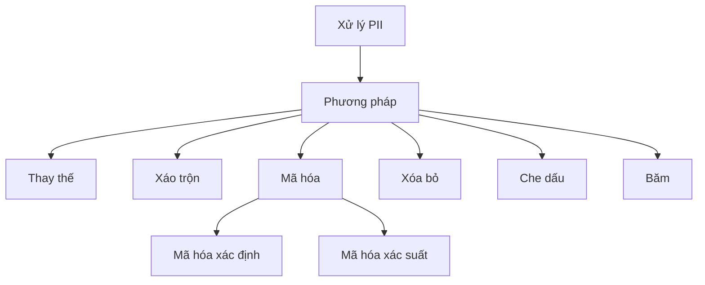
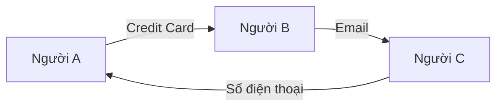
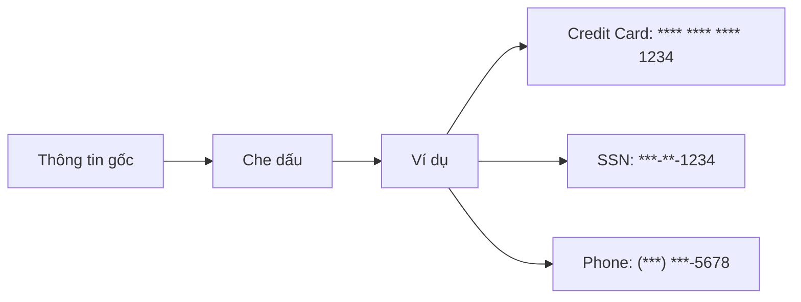
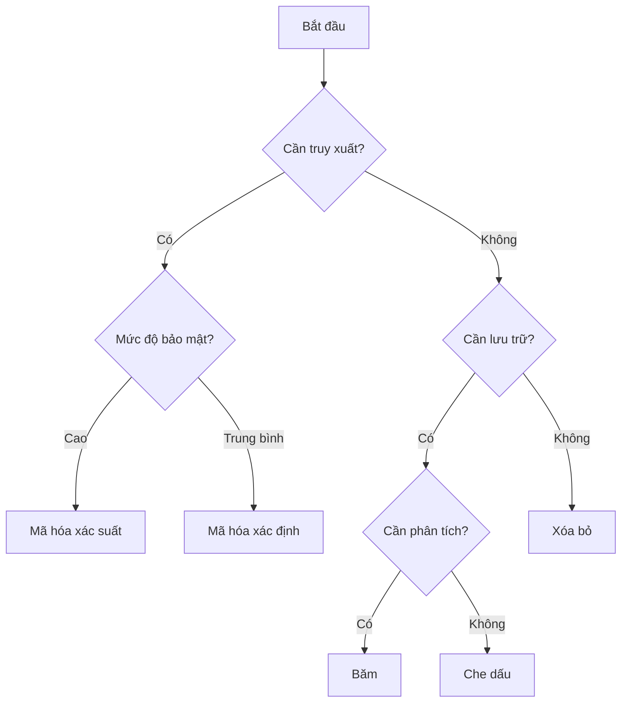

# Xử lý thông tin cá nhân (PII) trong DataBrew

## Các phương pháp xử lý

### 1. Tổng quan các kỹ thuật


### 2. Chi tiết từng phương pháp

#### Thay thế (Substitution)
- Thay thế PII bằng số ngẫu nhiên
- Bảo toàn cấu trúc dữ liệu
- Không thể khôi phục thông tin gốc
- Ví dụ: Thay số CMND bằng ID ngẫu nhiên

#### Xáo trộn (Shuffling)


#### Mã hóa (Encryption)

1. **Mã hóa xác định**
- Cùng giá trị vào = cùng giá trị ra
- Có thể giải mã
- Phù hợp khi cần truy xuất
```python
# Ví dụ
"John Doe" -> "xK9#mP2$"  # luôn cho cùng kết quả
```

2. **Mã hóa xác suất**
- Cùng giá trị vào = nhiều giá trị ra có thể
- Tăng tính bảo mật
- Khó theo dõi mẫu
```python
# Ví dụ
"John Doe" -> "xK9#mP2$" hoặc "yL8$nQ3@"
```

#### Xóa bỏ (Deletion)
- Loại bỏ hoàn toàn PII
- Biện pháp an toàn nhất
- Không thể khôi phục
- Phù hợp khi không cần PII

#### Che dấu (Masking)


#### Băm (Hashing)
- Áp dụng hàm băm mật mã
- Không thể đảo ngược
- Nhiều giá trị có thể cùng kết quả
- Cung cấp tính ẩn danh

## Hướng dẫn sử dụng

### 1. Chọn phương pháp phù hợp


### 2. Thực hành tốt nhất
1. **Đánh giá dữ liệu**
   - Xác định PII
   - Phân loại mức độ nhạy cảm
   - Xác định yêu cầu sử dụng

2. **Triển khai giải pháp**
   - Chọn phương pháp phù hợp
   - Kiểm tra kết quả
   - Đảm bảo tính nhất quán

3. **Giám sát và duy trì**
   - Kiểm tra định kỳ
   - Cập nhật quy trình
   - Ghi nhận vấn đề

### 3. Lưu ý quan trọng
- Tuân thủ quy định
- Ghi chép quy trình
- Kiểm tra bảo mật
- Cập nhật thường xuyên
