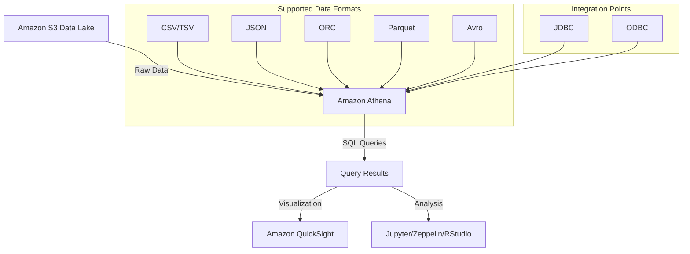

# Amazon Athena - Hướng dẫn toàn diện

## Giới thiệu

Amazon Athena là một dịch vụ truy vấn tương tác không máy chủ được thiết kế để phân tích dữ liệu trực tiếp từ Amazon S3. Dịch vụ này cho phép người dùng truy vấn dữ liệu bằng SQL mà không cần phải tải dữ liệu vào cơ sở dữ liệu trung gian.

## Đặc điểm chính

### 1. Kiến trúc Serverless
- Không cần quản lý máy chủ
- Tự động mở rộng theo nhu cầu
- Chỉ trả tiền cho lượng dữ liệu được quét

### 2. Công nghệ nền tảng
- Được xây dựng trên nền tảng Presto
- Đã phát triển thành một sản phẩm độc lập
- Tích hợp chặt chẽ với hệ sinh thái AWS

### 3. Định dạng dữ liệu được hỗ trợ

#### Định dạng có thể đọc được
- CSV (Comma-Separated Values)
- TSV (Tab-Separated Values)
- JSON (JavaScript Object Notation)

#### Định dạng tối ưu
- ORC (Optimized Row Columnar)
  * Định dạng cột
  * Có thể chia nhỏ
- Parquet
  * Định dạng cột
  * Có thể chia nhỏ
- Avro
  * Chỉ có thể chia nhỏ
  * Không phải định dạng cột

#### Nén dữ liệu hỗ trợ
- Snappy
- ZLIB
- LZ4
- GZIP

## Ứng dụng thực tế

### 1. Phân tích logs
- Web logs
- CloudTrail logs
- CloudFront logs
- VPC logs
- Elastic Load Balancer logs

### 2. ETL và Data Warehouse
- Kiểm tra dữ liệu trước khi tải vào Redshift
- Chuyển đổi dữ liệu
- Làm sạch dữ liệu

### 3. Tích hợp với công cụ phân tích
- Jupyter Notebooks
- Zeppelin
- RStudio
- Amazon QuickSight
- JDBC/ODBC interfaces

## Sơ đồ kiến trúc và luồng dữ liệu

## Lưu ý quan trọng cho kỳ thi

1. **Định dạng file**:
   - ORC & Parquet: Định dạng cột & có thể chia nhỏ
   - Avro: Chỉ có thể chia nhỏ
   - CSV, TSV, JSON: Định dạng có thể đọc được

2. **Khả năng xử lý dữ liệu**:
   - Dữ liệu có cấu trúc
   - Dữ liệu bán cấu trúc
   - Dữ liệu phi cấu trúc

3. **Tích hợp**:
   - Hoạt động trực tiếp với S3
   - Không cần tải dữ liệu vào CSDL trung gian
   - Hỗ trợ nhiều công cụ phân tích

## Ưu điểm nổi bật

1. **Đơn giản hóa**:
   - Không cần quản lý hạ tầng
   - Giao diện SQL quen thuộc
   - Tích hợp dễ dàng

2. **Hiệu quả chi phí**:
   - Chỉ trả tiền cho queries thực tế
   - Không chi phí cố định
   - Tối ưu cho workloads không thường xuyên

3. **Linh hoạt**:
   - Hỗ trợ nhiều định dạng dữ liệu
   - Tích hợp với nhiều công cụ
   - Mở rộng theo nhu cầu