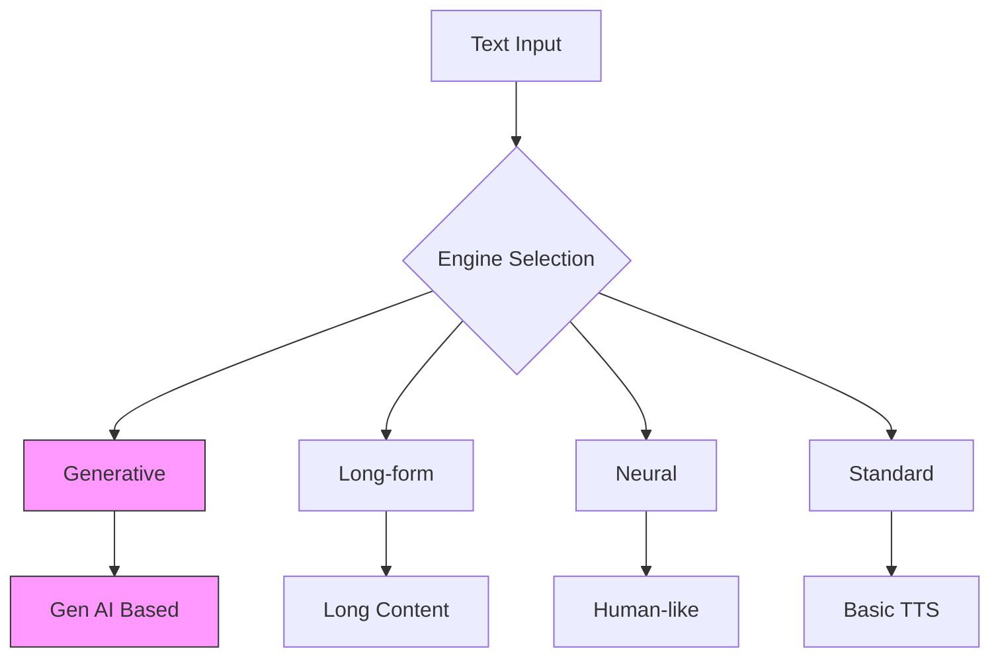
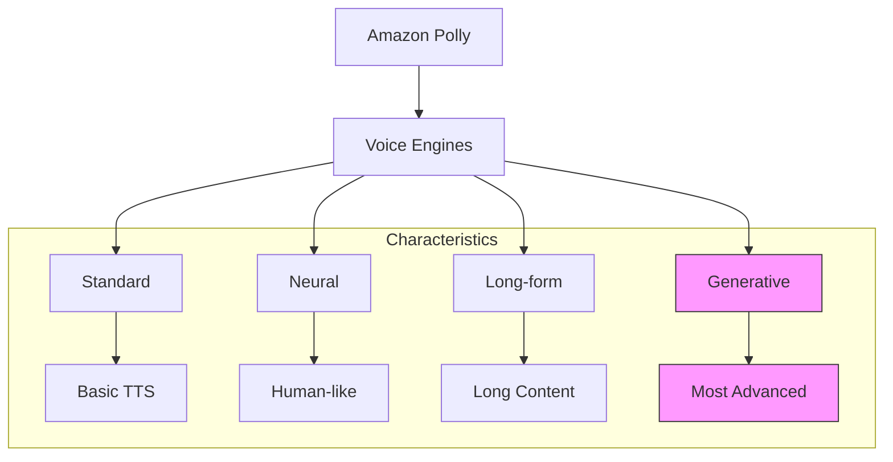

# Amazon Polly - Hướng dẫn thực hành

## Demo thực tế

### 1. Voice Engines Selection



#### Đặc điểm từng Engine
1. **Generative**
   - Expressive speech
   - Adaptive using Gen AI
   - Tự nhiên nhất

2. **Long-form**
   - Tối ưu cho nội dung dài
   - Giọng đọc nhất quán
   - Phù hợp audiobooks

3. **Neural**
   - Giọng người thật
   - Cải thiện so với standard
   - Tốc độ nhanh

4. **Standard**
   - Basic TTS
   - Nhiều voice options
   - Hiệu quả cho text ngắn

### 2. SSML Demo

#### Basic Example
```xml
<speak>
    Hi, I'm Stephane and I'm teaching <break time="1s"/> AWS, it's awesome!
</speak>
```

#### Advanced Usage
```xml
<speak>
    Hi, I'm <prosody rate="slow">Stephane</prosody>
    and I'm teaching 
    <break time="500ms"/>
    <emphasis level="strong">AWS</emphasis>, 
    it's awesome!
</speak>
```

### 3. Voice Customization

#### Voice Selection
- Gender options
- Language variants
- Accent preferences
- Speaking styles

#### Pronunciation Settings
- Custom lexicons
- Name pronunciation
- Technical terms
- Abbreviations

## Step-by-Step Guide

### 1. Text to Speech
1. Enter text
2. Select engine
3. Choose voice
4. Generate speech

### 2. SSML Implementation
1. Switch to SSML mode
2. Add SSML tags
3. Test pronunciation
4. Adjust timing

### 3. Output Configuration
- Format selection
- Quality settings
- Sample rate
- Channel options

## Tips cho Demo

### 1. Voice Selection
- Test nhiều voices
- Chọn phù hợp nội dung
- Xem xét audience
- Kiểm tra pronunciation

### 2. SSML Optimization
- Start với basic tags
- Add pauses hợp lý
- Test expressions
- Validate syntax

### 3. Quality Control
- Preview trước khi dùng
- Check pronunciation
- Verify timing
- Monitor output

## Use Cases thực tế

### 1. Content Creation
- E-learning
- Podcasts
- Video narration
- Audio guides

### 2. User Interface
- Voice responses
- Navigation systems
- Interactive menus
- Notifications

### 3. Accessibility
- Screen readers
- Audio books
- Voice assistants
- Learning aids
Amazon Polly là dịch vụ chuyển đổi văn bản thành giọng nói sử dụng deep learning, tạo ra giọng nói tự nhiên cho các ứng dụng.

## Tính năng nâng cao

### 1. Voice Engines


### 2. Lexicons
- Định nghĩa cách đọc text
- Xử lý abbreviations
- Custom pronunciations

#### Ví dụ
```text
Input: "AWS"
Output: "Amazon Web Services"

Input: "W3C"
Output: "World Wide Web Consortium"
```

### 3. SSML (Speech Synthesis Markup Language)

#### Syntax Examples
```xml
<speak>
    Hello <break time="1s"/> how are you?
    <emphasis level="strong">Important point</emphasis>
    <whisper>This is a secret</whisper>
    <say-as interpret-as="characters">HELLO</say-as>
</speak>
```

#### Controls
- Breaks và pauses
- Emphasis
- Whisper mode
- Pronunciation control
- Character spelling

### 4. Speech Marks

#### Loại Speech Marks
1. Sentence
   - Đánh dấu bắt đầu/kết thúc câu
   - Timing information

2. Word
   - Vị trí từng từ
   - Duration

#### Use Cases
- Lip syncing
- Word highlighting
- Animation syncing
- Interactive applications

## Ứng dụng thực tế

### 1. Content Creation
- Audiobooks
- News articles
- Training materials
- Educational content

### 2. User Interface
- Voice responses
- Interactive menus
- Navigation systems
- Virtual assistants

### 3. Accessibility
- Screen readers
- Assistance devices
- Learning aids
- Document readers

## Best Practices

### 1. Voice Selection
- Match content type
- Consider audience
- Test different voices
- Evaluate naturalness

### 2. SSML Usage
- Proper tags
- Appropriate pauses
- Clear emphasis
- Natural flow

### 3. Lexicon Management
- Regular updates
- Context awareness
- Pronunciation testing
- Quality monitoring

### 4. Performance Optimization
- Cache common phrases
- Batch processing
- Resource management
- Monitor usage

## Security & Integration

### 1. Security Features
- Encryption
- Access control
- Audit logging
- Compliance

### 2. API Integration
- REST API
- SDK support
- Streaming options
- Batch processing