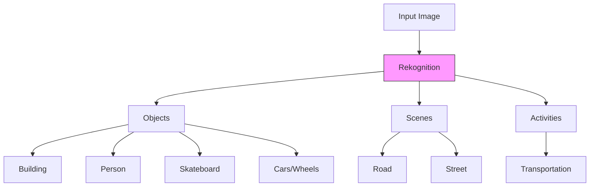
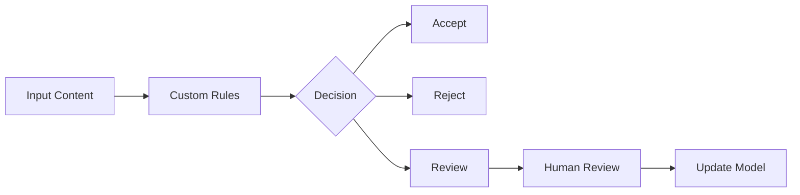
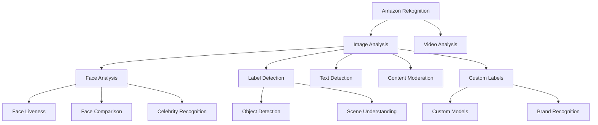
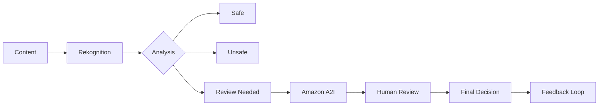

# Amazon Rekognition - Demo và Use Cases

## Demo Capabilities

### 1. Label Detection


#### Confidence Scores
- Mỗi label có confidence score
- Hierarchical detection
- Nested objects (ví dụ: cars > wheels)

### 2. Image Properties
- Dominant colors
- Image quality
- Foreground properties
- Background properties

### 3. Facial Analysis

#### Attributes Detection
- Gender
- Age range
- Expressions (smiling)
- Emotions (happy/sad)
- Face quality

#### Face Comparison
- Similarity scoring
- Multiple face comparison
- Celebrity recognition
  * Jeff Bezos
  * Andy Jassy
  * Và nhiều người khác

### 4. Text Detection
- OCR capabilities
- Text extraction
- Language support
- Orientation detection

### 5. PPE Detection
- Face covers
- Head covers
- Hand covers
- Safety compliance

## Use Cases Example

### 1. Retail & E-commerce
```python
def analyze_product_image(image):
    # Label Detection
    labels = rekognition.detect_labels(
        Image={'Bytes': image}
    )
    
    # Text Detection
    text = rekognition.detect_text(
        Image={'Bytes': image}
    )
    
    return {
        'labels': labels['Labels'],
        'text': text['TextDetections']
    }
```

### 2. Security Applications
```python
def verify_ppe_compliance(image):
    response = rekognition.detect_protective_equipment(
        Image={'Bytes': image},
        SummarizationAttributes={
            'MinConfidence': 80,
            'RequiredEquipmentTypes': ['FACE_COVER', 'HEAD_COVER']
        }
    )
    return analyze_ppe_results(response)
```

## Custom Solutions

### 1. Custom Label Training
1. Collect training images
2. Label specific objects/scenarios
3. Train model
4. Deploy and test
5. Monitor and refine

### 2. Custom Moderation Workflow


## Best Practices

### 1. Image Quality
- Resolution requirements
- Lighting considerations
- Angle and positioning
- Format compatibility

### 2. Performance Optimization
- Batch processing
- Confidence thresholds
- Error handling
- Resource scaling

### 3. Integration Tips
- API rate limits
- Error retry logic
- Response handling
- Monitoring setup
Amazon Rekognition là dịch vụ computer vision sử dụng machine learning để phân tích hình ảnh và video, cho phép phát hiện objects, people, text, và scenes.

## Core Features



### 1. Face Detection & Analysis
- Face liveness detection
- Facial features và attributes
  * Tuổi
  * Giới tính
  * Cảm xúc
  * Mắt mở/đóng
- Face comparison
- Celebrity recognition
- Face search trong databases

### 2. Label Detection
- Object detection
- Scene recognition
- Activity identification
- Brand/logo detection

## Custom Labels

### Process Flow
1. **Data Preparation**
   - Thu thập hình ảnh training (vài trăm)
   - Label images
   - Upload lên S3

2. **Model Training**
   - Train custom model
   - Recognize specific objects/logos
   - Tối ưu cho use case

3. **Deployment**
   - Phân tích hình ảnh mới
   - Brand monitoring
   - Product recognition

## Content Moderation

### 1. Standard Moderation


### 2. Custom Moderation Adapter
- Train với labeled dataset
- Define custom rules
- Enhance accuracy
- Specific use cases

### 3. Integration Example

```python
# Example Content Moderation API Usage
def moderate_image(image):
    response = rekognition.detect_moderation_labels(
        Image={
            'Bytes': image
        }
    )
    return is_safe(response['ModerationLabels'])
```

## Use Cases

### 1. Safety & Security
- Face verification
- Access control
- Live face detection
- Identity verification

### 2. Media Analysis
- Content categorization
- Safe content filtering
- Social media monitoring
- Brand protection

### 3. Sports Analytics
- Player tracking
- Path analysis
- Game statistics
- Performance metrics

## Best Practices

### 1. Custom Labels
- Đủ training data
- Diverse image samples
- Regular model updates
- Performance monitoring

### 2. Content Moderation
- Define clear policies
- Optimize confidence thresholds
- Setup human review workflow
- Monitor accuracy metrics

### 3. Performance Optimization
- Image quality requirements
- Batch processing
- Error handling
- Resource management

## Integration Guidelines

### 1. API Usage
- REST APIs
- SDK support
- Error handling
- Rate limiting

### 2. Security
- IAM roles
- Encryption
- Access controls
- Compliance standards

### 3. Monitoring
- CloudWatch metrics
- Performance tracking
- Cost optimization
- Usage analytics