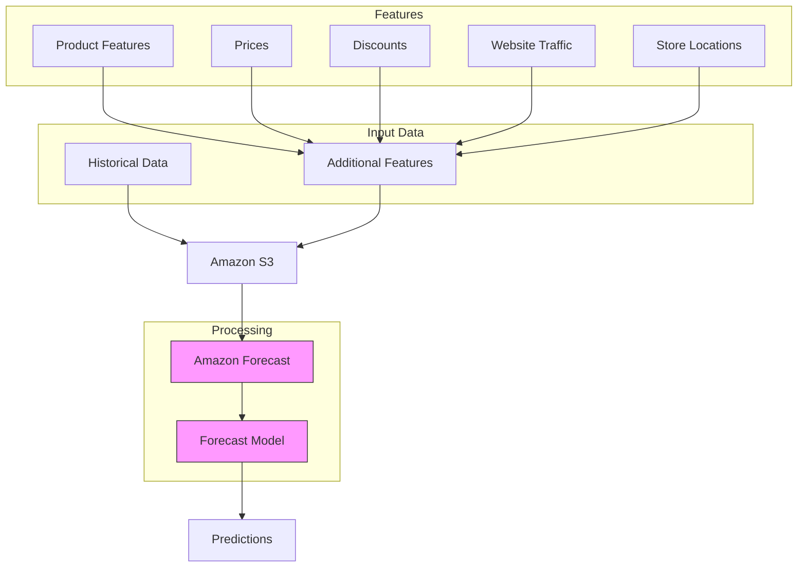

# Amazon Forecast

## Tổng quan
Amazon Forecast là dịch vụ được quản lý hoàn toàn sử dụng machine learning để tạo ra các dự báo có độ chính xác cao, giảm thời gian dự báo từ nhiều tháng xuống còn vài giờ.

## Quy trình hoạt động

## Ưu điểm chính
- Độ chính xác cao hơn 50% so với phân tích thông thường
- Giảm thời gian dự báo đáng kể
- Fully managed service
- Tích hợp dễ dàng với AWS ecosystem

## Use Cases

### 1. Product Demand Planning
- Dự báo nhu cầu sản phẩm
- Quản lý inventory
- Tối ưu supply chain
- Seasonal trends

### 2. Financial Planning
- Revenue forecasting
- Budget planning
- Cash flow prediction
- Resource allocation

### 3. Resource Planning
- Workforce planning
- Equipment needs
- Infrastructure scaling
- Capacity planning

## Data Requirements

### 1. Historical Time-Series Data
- Sales history
- Demand patterns
- Seasonal variations
- Past trends

### 2. Additional Features
- Product attributes
- Pricing information
- Marketing data
- External factors
- Location data

## Implementation Guide

### 1. Data Preparation
1. Collect historical data
2. Gather additional features
3. Clean and format data
4. Upload to S3

### 2. Model Creation
1. Configure Forecast dataset
2. Select algorithm
3. Train model
4. Validate results

### 3. Generate Predictions
1. Input parameters
2. Run forecast
3. Analyze results
4. Make decisions

## Best Practices

### 1. Data Quality
- Consistent formatting
- Complete datasets
- Regular updates
- Clean data

### 2. Feature Selection
- Relevant attributes
- Impactful factors
- Clear correlations
- Domain knowledge

### 3. Model Management
- Regular retraining
- Performance monitoring
- Accuracy tracking
- Version control

## Security & Compliance
- Data encryption
- Access control
- Audit logging
- Compliance standards

## Cost Optimization
- Data volume planning
- Training frequency
- Prediction usage
- Resource management