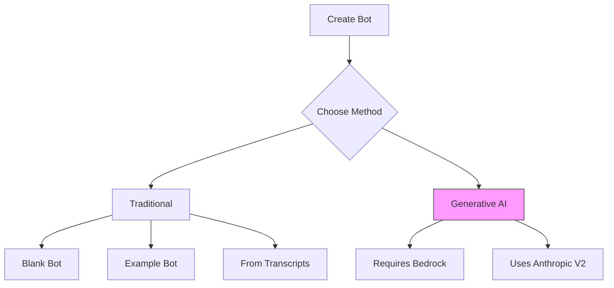
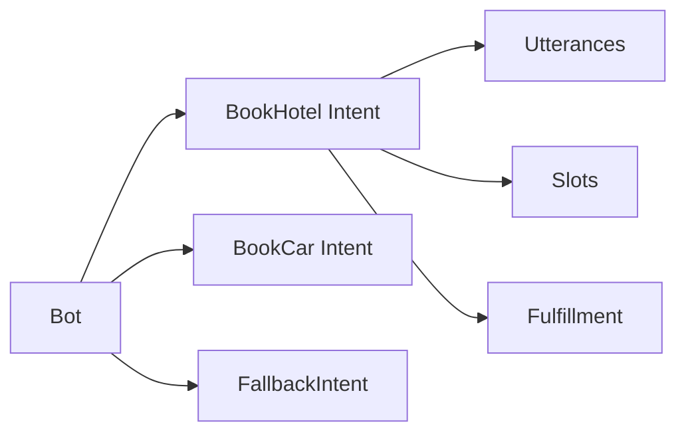
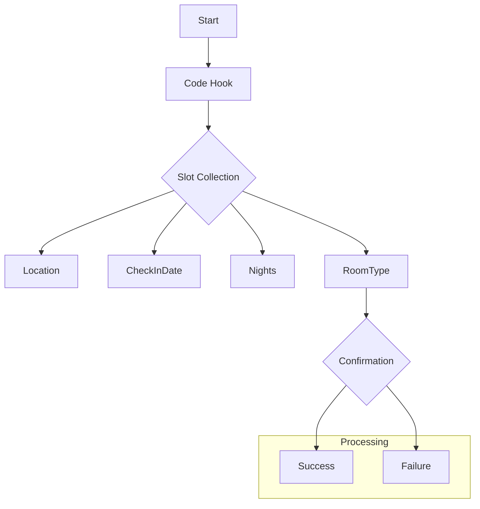
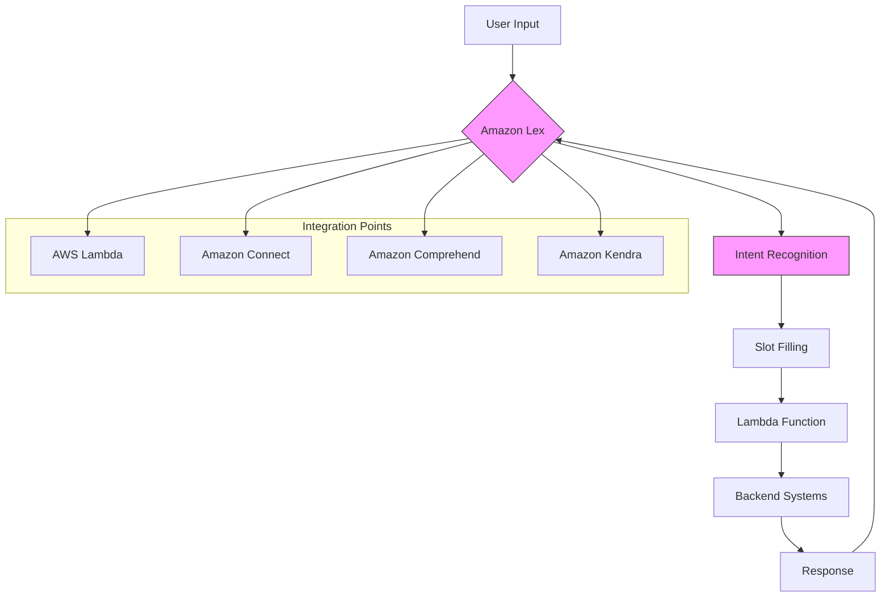
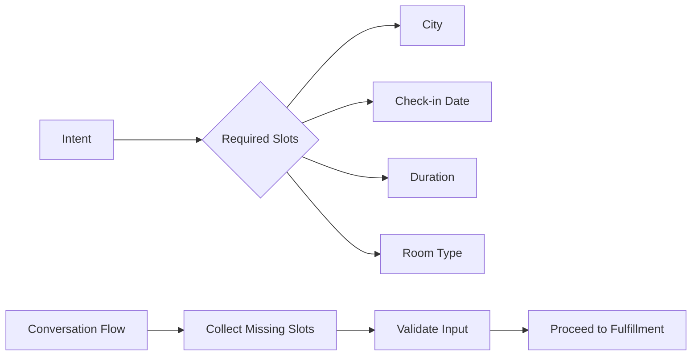

# Amazon Lex - Hướng dẫn xây dựng Bot

## Phương pháp tạo Bot

### 1. Traditional vs Generative AI


### 2. Cấu hình cơ bản Bot
- Bot name
- IAM role
- Language selection
- Voice selection (e.g., Danielle)
- Compliance settings

## Intent Configuration

### 1. Sample Bot Structure


### 2. Utterances Example
```json
{
  "BookHotel": [
    "book a hotel",
    "I want to make hotel reservations",
    "book {Nights} nights in {Location}"
  ]
}
```

### 3. Slots Configuration
- Location
- CheckInDate
- Nights
- RoomType

## Conversation Flow

### 1. Visual Builder


### 2. Bot Response Configuration
- Prompt messages
- Error handling
- Confirmation messages
- Fallback responses

## Lambda Integration

### 1. Fulfillment Configuration
```json
{
  "fulfillmentActivity": {
    "type": "CodeHook",
    "codeHook": {
      "uri": "arn:aws:lambda:region:account:function:name",
      "messageVersion": "1.0"
    }
  }
}
```

### 2. Slot Data Processing
- Parameter validation
- Business logic execution
- Response formatting
- Error handling

## Best Practices

### 1. Intent Design
- Clear utterance patterns
- Comprehensive slot coverage
- Logical conversation flow
- Error recovery paths

### 2. Testing Strategy
- Sample conversations
- Edge cases
- Error scenarios
- Performance testing

### 3. Monitoring
- Conversation logs
- Error rates
- Fulfillment success
- User satisfaction

## Security và Compliance

### 1. IAM Configuration
- Minimum permissions
- Role-based access
- Resource policies
- Audit logging

### 2. Data Protection
- Input validation
- PII handling
- Encryption
- Access controls
Amazon Lex là dịch vụ xây dựng chatbots với khả năng tương tác qua giọng nói và văn bản, sử dụng công nghệ conversational AI và tích hợp sâu với các dịch vụ AWS khác.

## Kiến trúc và Luồng hoạt động



## Core Components

### 1. Intent Recognition
- Xác định mục đích người dùng
- Pattern matching
- Natural language understanding
- Multi-language support

### 2. Slots


### 3. Lambda Integration
- Function triggers
- Business logic execution
- Dynamic responses
- Backend integration

## Ví dụ Hotel Booking Bot

### 1. Conversation Flow
```text
User: "I want to book a hotel"
Bot: "Which city would you like to stay in?"
User: "New York"
Bot: "When would you like to check in?"
User: "Next Friday"
Bot: "How many nights?"
User: "3 nights"
Bot: [Invokes Lambda] "Your booking is confirmed..."
```

### 2. Intent Configuration
```json
{
  "intent": "BookHotel",
  "slots": {
    "city": {
      "type": "AMAZON.City",
      "required": true
    },
    "checkInDate": {
      "type": "AMAZON.DATE",
      "required": true
    },
    "duration": {
      "type": "AMAZON.NUMBER",
      "required": true
    }
  }
}
```

## Use Cases

### 1. Customer Service
- Automated support
- FAQs handling
- Ticket creation
- Status checks

### 2. Booking Systems
- Hotel reservations
- Restaurant bookings
- Appointment scheduling
- Travel planning

### 3. Order Processing
- Food ordering
- Product purchases
- Order tracking
- Return processing

## Integration Best Practices

### 1. Lambda Function Design
- Modular code
- Error handling
- Response formatting
- State management

### 2. Slot Management
- Required vs Optional
- Validation rules
- Default values
- Error messages

### 3. Conversation Flow
- Natural dialog
- Clear prompts
- Error recovery
- Context maintenance

## Performance Optimization

### 1. Intent Recognition
- Clear intent patterns
- Sample utterances
- Slot variations
- Language models

### 2. Response Time
- Lambda optimization
- Cache usage
- Async operations
- Error handling

### 3. User Experience
- Clear messages
- Progressive disclosure
- Context awareness
- Error recovery

## Security Considerations

### 1. Access Control
- IAM roles
- Permission boundaries
- API security
- Data encryption

### 2. Data Protection
- PII handling
- Encryption at rest
- Encryption in transit
- Audit logging