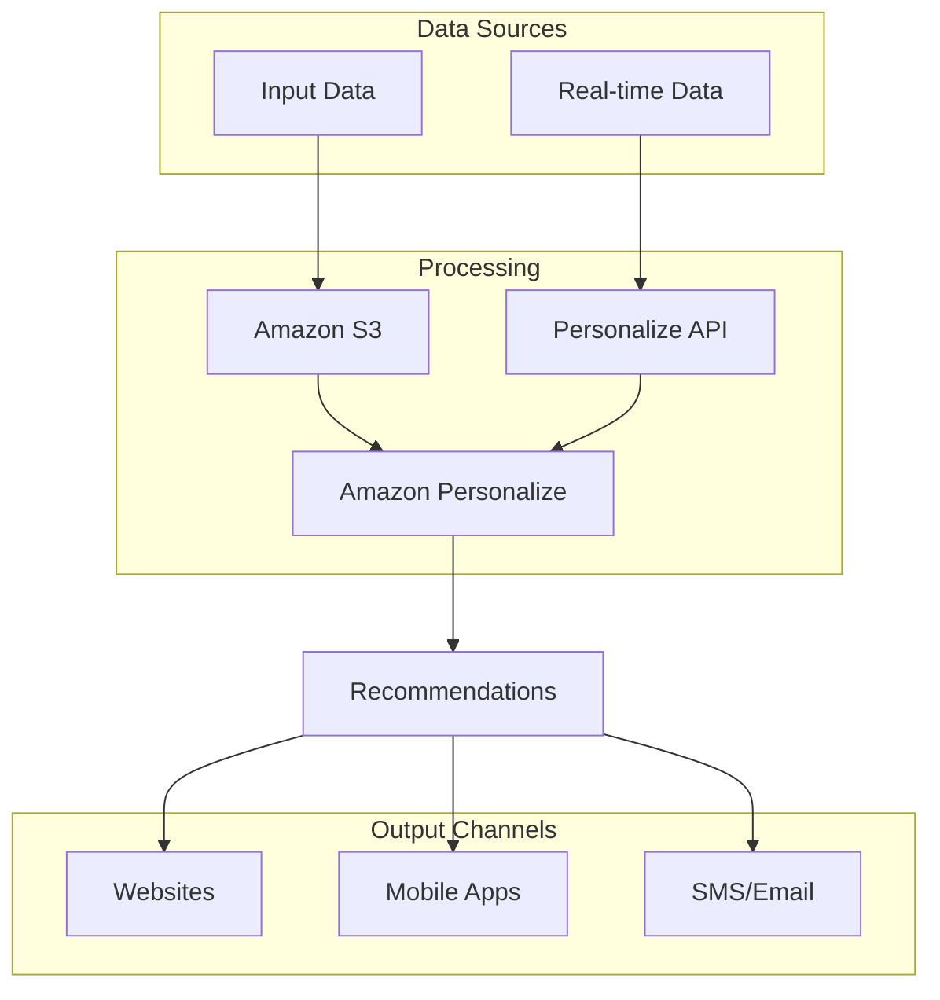
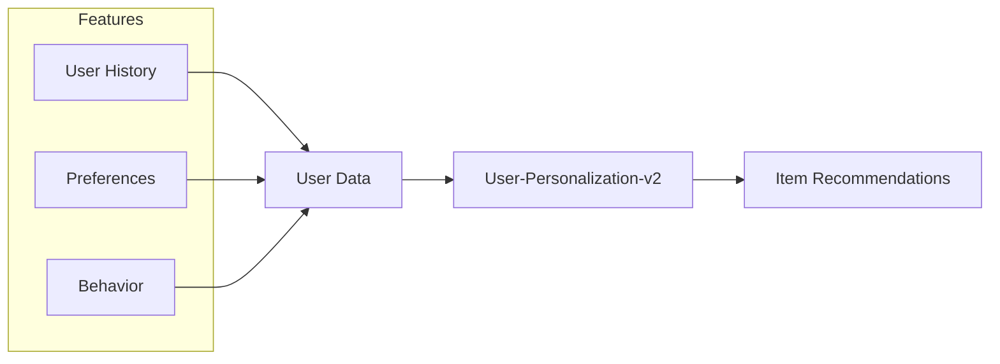

# Amazon Personalize

## Tổng quan
Amazon Personalize là dịch vụ machine learning để xây dựng hệ thống đề xuất real-time được cá nhân hóa, sử dụng công nghệ tương tự như Amazon.com.

## Kiến trúc và Luồng dữ liệu

## Recipes (Algorithms)

### 1. USER_PERSONALIZATION

### 2. Item Ranking và Recommendations
1. **Personalized-Ranking-v2**
   - Xếp hạng items cho user
   - Tối ưu hiển thị
   - Cá nhân hóa thứ tự

2. **Trending-Now**
   - Items đang hot
   - Real-time trends
   - Popular items

3. **Popularity-Count**
   - Đếm phổ biến
   - Overall popularity
   - Historical data

### 3. RELATED_ITEMS
- Similar items recommendation
- Product associations
- Cross-selling
- Up-selling opportunities

### 4. Next Best Action
- Action recommendations
- User journey optimization
- Engagement improvement
- Conversion optimization

### 5. User Segments
- Item-Affinity analysis
- User clustering
- Behavior patterns
- Target marketing

## Implementation Guide

### 1. Data Integration
1. **S3 Integration**
   - Historical data
   - Batch processing
   - Data warehouse integration

2. **Real-time API**
   - Live interactions
   - Immediate updates
   - Real-time personalization

### 2. Model Training
- Days, not months to train
- No ML expertise required
- Automatic optimization
- Continuous learning

## Use Cases

### 1. Retail
- Product recommendations
- Category suggestions
- Shopping cart optimization
- Personalized search results

### 2. Media & Entertainment
- Content recommendations
- Playlist generation
- Viewing suggestions
- Personalized content

### 3. Marketing
- Email campaigns
- SMS marketing
- Direct marketing
- Campaign optimization

## Best Practices

### 1. Data Quality
- Clean data
- Regular updates
- Comprehensive user info
- Interaction history

### 2. Recipe Selection
- Use case matching
- Performance monitoring
- A/B testing
- Optimization

### 3. Implementation
- Real-time integration
- Caching strategy
- Error handling
- Monitoring setup

## Performance Metrics

### 1. Recommendation Quality
- Click-through rates
- Conversion rates
- User engagement
- Revenue impact

### 2. System Performance
- Response time
- Throughput
- Resource usage
- Cost efficiency

## Security & Privacy
- Data encryption
- Access control
- Privacy compliance
- Audit logging