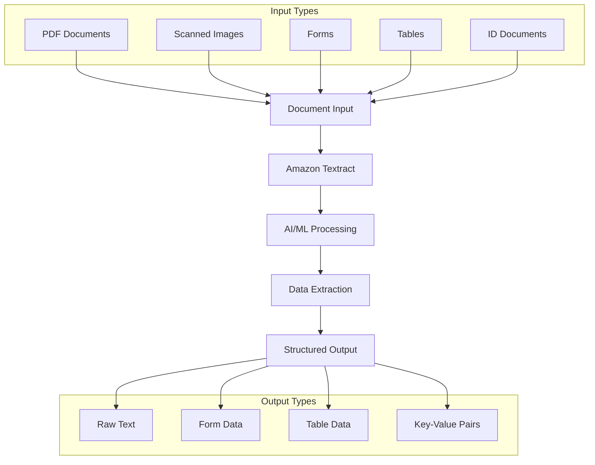
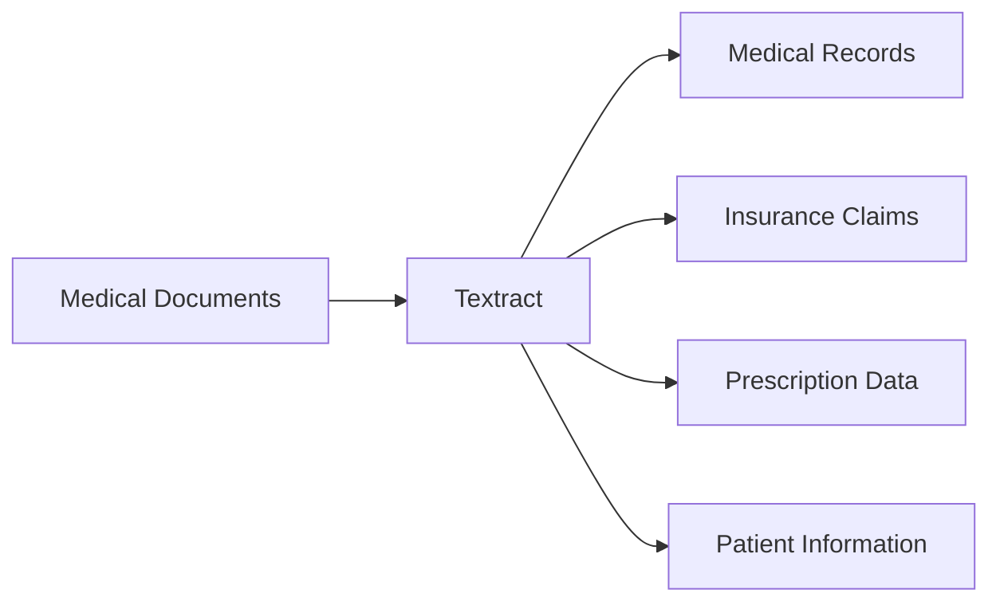

# Amazon Textract

## Tổng quan
Amazon Textract là dịch vụ AI/ML để trích xuất text, chữ viết tay và dữ liệu từ các tài liệu được quét. Dịch vụ này tự động xử lý và chuyển đổi nội dung thành dữ liệu có cấu trúc.

## Quy trình xử lý

## Use Cases

### 1. Financial Services
- Invoice processing
- Financial report analysis
- Receipt extraction
- Payment processing
- Contract analysis

### 2. Healthcare

### 3. Public Sector
- Tax form processing
- ID document verification
- Passport data extraction
- Visa applications
- Government documents

## Tính năng chính

### 1. Text Extraction
- Raw text
- Handwriting recognition
- Multiple languages
- Font variations

### 2. Form Processing
- Key-value pairs
- Form fields
- Checkbox detection
- Signature detection

### 3. Table Extraction
- Table structure
- Cell data
- Headers
- Relationships

### 4. Document Analysis
- Layout analysis
- Document structure
- Page segmentation
- Content organization

## Implementation Guide

### 1. Document Preparation
- Scan quality
- Resolution requirements
- Format compatibility
- Size limitations

### 2. Integration
- API usage
- SDK implementation
- Batch processing
- Real-time analysis

### 3. Output Processing
- JSON parsing
- Data validation
- Error handling
- Data storage

## Best Practices

### 1. Input Quality
- Clear scans
- Good resolution
- Proper alignment
- Clean documents

### 2. Processing Optimization
- Batch processing
- Parallel execution
- Error handling
- Retry logic

### 3. Data Validation
- Output verification
- Quality checks
- Format validation
- Completeness check

## Security & Compliance

### 1. Data Protection
- Encryption in transit
- Encryption at rest
- Access control
- Audit logging

### 2. Compliance Features
- HIPAA compliance
- GDPR considerations
- Data retention
- Privacy controls

## Performance Considerations

### 1. Throughput
- Document volume
- Processing speed
- Resource allocation
- Scaling strategy

### 2. Accuracy
- Recognition confidence
- Error rates
- Quality metrics
- Improvement strategy

### 3. Cost Optimization
- Volume pricing
- Resource usage
- Batch vs Real-time
- Storage management