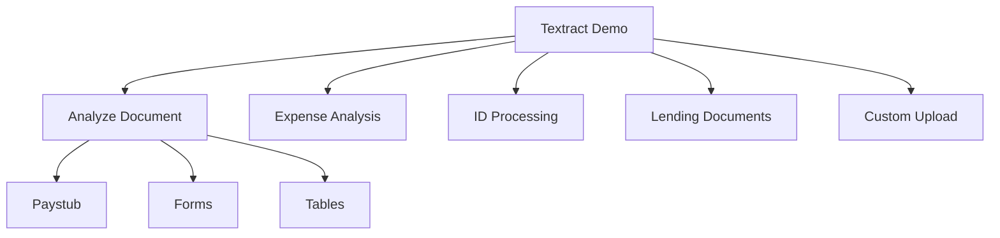
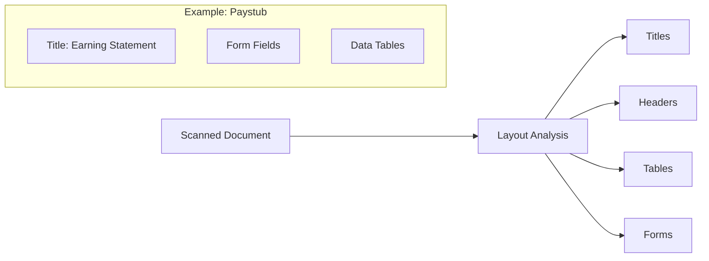
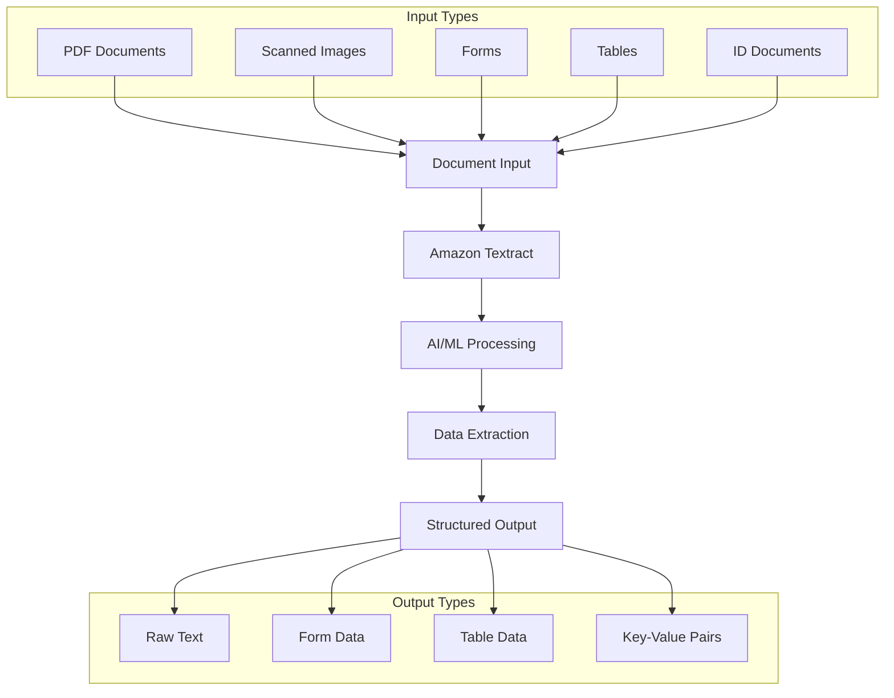
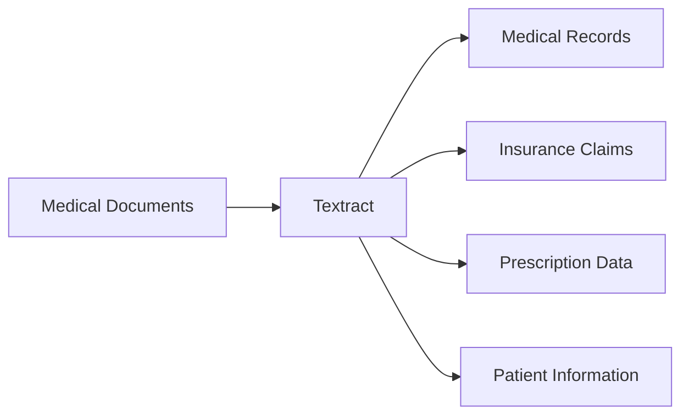

# Amazon Textract - Demo và Features

## Demo Components

### 1. Document Types


## Feature Demonstrations

### 1. Text Extraction
- Raw text từ scanned documents
- Layout recognition
- Section headers
- Structured data extraction

### 2. Document Layout Analysis


### 3. Form Processing
#### Key-Value Pairs Example
```json
{
  "period_ending": "7/18/2008",
  "pay_date": "...",
  "social_security": "...",
  "gross_pay": "..."
}
```

### 4. Table Extraction
#### Examples
1. **Earnings Table**
   - Rate
   - Hours
   - Period
   - Year-to-date

2. **Deductions Table**
   - Item descriptions
   - Amount columns
   - Totals

### 5. Query Capabilities
- Natural language queries
- Data extraction questions
  * "What is the year to date gross pay?"
  * "What is the regular hourly rate?"
- Automated responses

## Specific Use Cases Demo

### 1. Expense Analysis
- Vendor information
- Line items
- Pricing details
- Total calculations

### 2. ID Document Processing
#### Massachusetts ID Example
```json
{
  "first_name": "...",
  "last_name": "...",
  "city": "...",
  "address": "...",
  "document_number": "..."
}
```

## Implementation Tips

### 1. Document Preparation
- Clear scans
- Good image quality
- Proper alignment
- Supported formats

### 2. Processing Options
- Single document
- Batch processing
- Real-time analysis
- Async processing

### 3. Data Extraction
- Text recognition
- Form fields
- Table structure
- Query responses

## Best Practices

### 1. Input Quality
- Resolution requirements
- Format guidelines
- Size limitations
- Clarity standards

### 2. Query Optimization
- Clear questions
- Specific requests
- Data validation
- Error handling

### 3. Integration
- API usage
- Response handling
- Error management
- Data storage
Amazon Textract là dịch vụ AI/ML để trích xuất text, chữ viết tay và dữ liệu từ các tài liệu được quét. Dịch vụ này tự động xử lý và chuyển đổi nội dung thành dữ liệu có cấu trúc.

## Quy trình xử lý



## Use Cases

### 1. Financial Services
- Invoice processing
- Financial report analysis
- Receipt extraction
- Payment processing
- Contract analysis

### 2. Healthcare


### 3. Public Sector
- Tax form processing
- ID document verification
- Passport data extraction
- Visa applications
- Government documents

## Tính năng chính

### 1. Text Extraction
- Raw text
- Handwriting recognition
- Multiple languages
- Font variations

### 2. Form Processing
- Key-value pairs
- Form fields
- Checkbox detection
- Signature detection

### 3. Table Extraction
- Table structure
- Cell data
- Headers
- Relationships

### 4. Document Analysis
- Layout analysis
- Document structure
- Page segmentation
- Content organization

## Implementation Guide

### 1. Document Preparation
- Scan quality
- Resolution requirements
- Format compatibility
- Size limitations

### 2. Integration
- API usage
- SDK implementation
- Batch processing
- Real-time analysis

### 3. Output Processing
- JSON parsing
- Data validation
- Error handling
- Data storage

## Best Practices

### 1. Input Quality
- Clear scans
- Good resolution
- Proper alignment
- Clean documents

### 2. Processing Optimization
- Batch processing
- Parallel execution
- Error handling
- Retry logic

### 3. Data Validation
- Output verification
- Quality checks
- Format validation
- Completeness check

## Security & Compliance

### 1. Data Protection
- Encryption in transit
- Encryption at rest
- Access control
- Audit logging

### 2. Compliance Features
- HIPAA compliance
- GDPR considerations
- Data retention
- Privacy controls

## Performance Considerations

### 1. Throughput
- Document volume
- Processing speed
- Resource allocation
- Scaling strategy

### 2. Accuracy
- Recognition confidence
- Error rates
- Quality metrics
- Improvement strategy

### 3. Cost Optimization
- Volume pricing
- Resource usage
- Batch vs Real-time
- Storage management