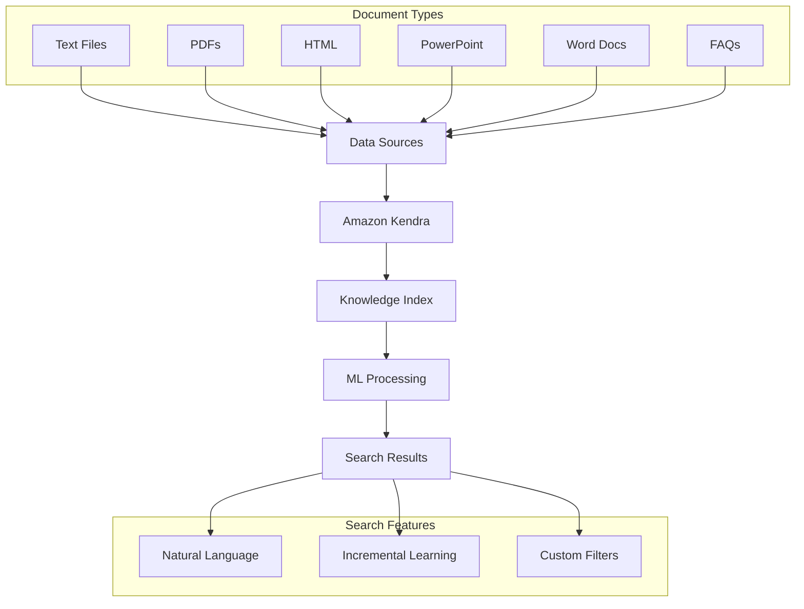
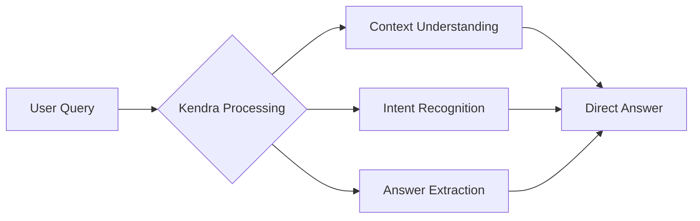

# Amazon Kendra

## Tổng quan
Amazon Kendra là dịch vụ tìm kiếm document được quản lý hoàn toàn, sử dụng machine learning để trích xuất câu trả lời từ các tài liệu với khả năng tìm kiếm bằng ngôn ngữ tự nhiên.

## Kiến trúc và Luồng dữ liệu

## Tính năng chính

### 1. Natural Language Search

Ví dụ:
- Q: "Where is the IT support desk?"
- A: "1st floor"

### 2. Incremental Learning
- Học từ tương tác người dùng
- Cải thiện kết quả theo thời gian
- Promote preferred results
- User feedback integration

### 3. Fine-tuning Capabilities
- Data importance weighting
- Freshness preferences
- Custom filters
- Relevance tuning

## Data Source Integration

### 1. Supported Formats
- Text documents
- PDF files
- HTML pages
- PowerPoint presentations
- Microsoft Word documents
- FAQs
- Custom data sources

### 2. Indexing Process
- Document scanning
- Content extraction
- Metadata processing
- Knowledge base building

## Implementation Guide

### 1. Setup Configuration
1. Create Index
2. Configure data sources
3. Set up sync schedule
4. Define access controls

### 2. Search Optimization
- Query suggestions
- Synonym definition
- Custom vocabularies
- Relevance tuning

### 3. Performance Monitoring
- Search analytics
- User feedback tracking
- Query patterns
- Result accuracy

## Best Practices

### 1. Content Organization
- Structured metadata
- Clear document hierarchy
- Regular updates
- Quality content

### 2. Search Experience
- Natural language support
- Response formatting
- Result ranking
- User feedback collection

### 3. Security
- Access controls
- Document-level security
- Encryption
- Compliance

## Use Cases

### 1. Enterprise Search
- Internal documentation
- Knowledge bases
- Policy documents
- Technical guides

### 2. Customer Support
- FAQs
- Product documentation
- Support articles
- Troubleshooting guides

### 3. Research & Analysis
- Research papers
- Reports
- Case studies
- Market analysis

## Performance Optimization

### 1. Index Management
- Regular updates
- Content freshness
- Synonym management
- Custom tuning

### 2. Query Optimization
- Relevance tuning
- Custom attributes
- Filter optimization
- Response caching

### 3. User Experience
- Fast response times
- Accurate results
- Natural interactions
- Continuous improvement