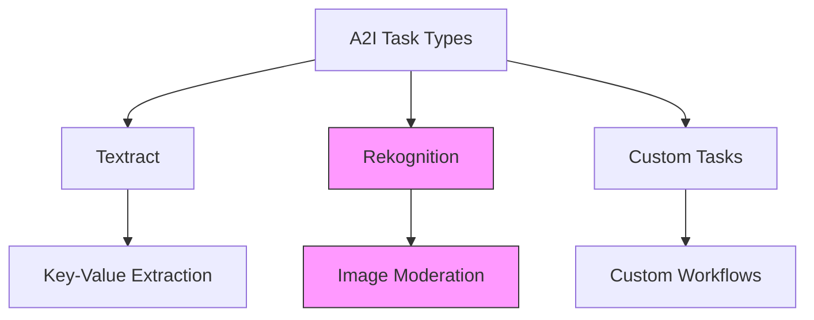
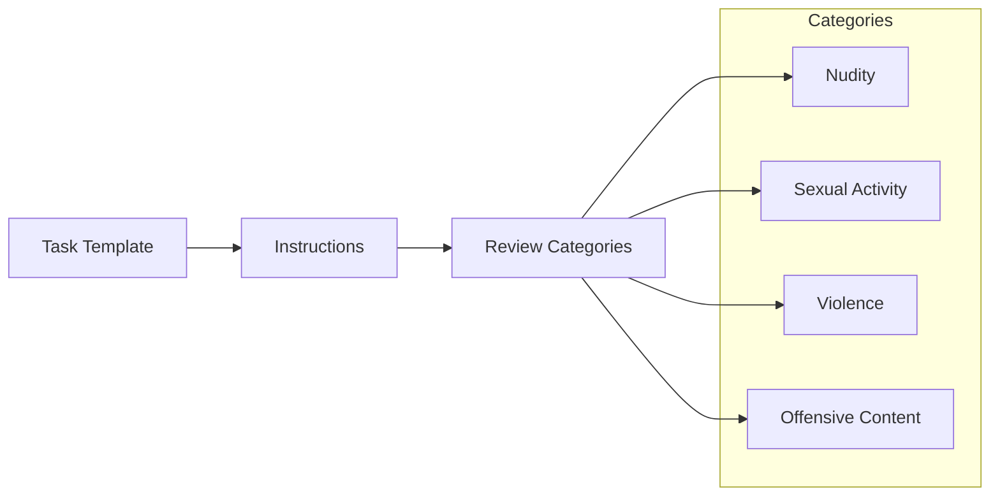
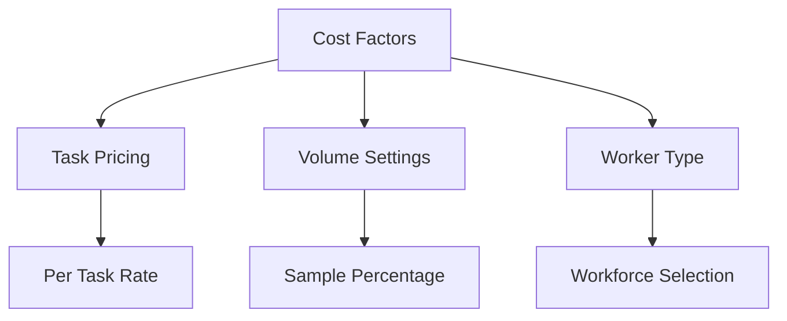
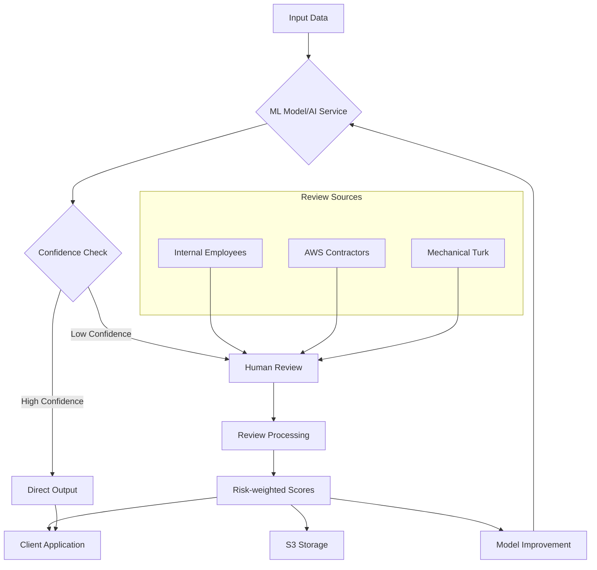
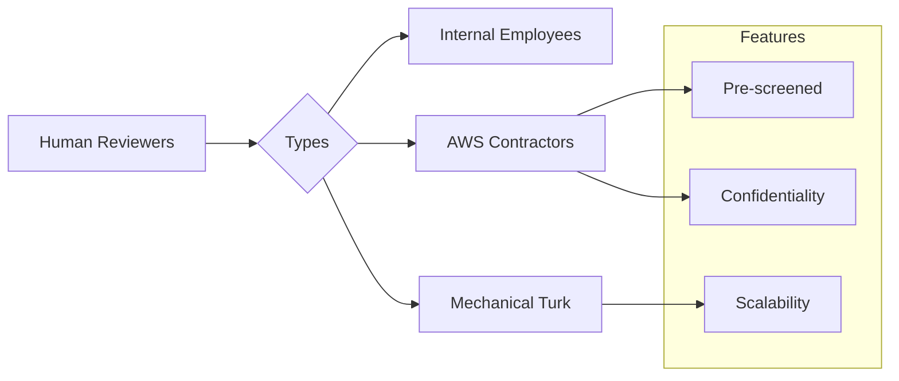

# Amazon Augmented AI (A2I) - Implementation Guide

## SageMaker Integration

### 1. Task Types

## Content Moderation Workflow

### 1. Review Triggers
- Low confidence scores (e.g., 0-50%)
- Random sampling (e.g., 5% of all content)
- Custom criteria

### 2. Worker Task Template

## Worker Options

### 1. Amazon Mechanical Turk
- 500,000+ contractors
- Flexible pricing
  * $0.012 - $1.00 per task
- Global workforce
- Quick scaling

### 2. Private Teams
- Internal employees
- Specialized knowledge
- Confidential content
- Direct oversight

### 3. Vendor Marketplace
- Third-party vendors
- Specialized services
- Pre-screened providers
- Industry expertise

## Implementation Steps

### 1. Workflow Creation
1. Select task type
2. Configure review conditions
3. Design task template
4. Choose workforce

### 2. Review Configuration
- Confidence thresholds
- Sampling rates
- Category definitions
- Review guidelines

### 3. Cost Management

## Best Practices

### 1. Task Design
- Clear instructions
- Specific categories
- Example cases
- Quality criteria

### 2. Workforce Selection
- Task complexity
- Security requirements
- Cost considerations
- Volume needs

### 3. Monitoring
- Review quality
- Cost tracking
- Performance metrics
- Improvement feedback

## Security Considerations

### 1. Data Handling
- Content sensitivity
- Access controls
- Worker screening
- Confidentiality

### 2. Quality Control
- Worker performance
- Review accuracy
- Consistency checks
- Feedback loops
Amazon A2I là dịch vụ cho phép tích hợp human review vào ML workflows để đảm bảo và cải thiện độ chính xác của các dự đoán ML.

## Workflow

## Key Components

### 1. Confidence-based Routing
- High confidence → Direct output
- Low confidence → Human review
- Configurable thresholds
- Real-time decisions

### 2. Human Review Options

### 3. Integration Options
1. **AWS Services**
   - Amazon Rekognition
   - Amazon Textract
   - Other AI services

2. **Custom Models**
   - Amazon SageMaker
   - External hosting
   - Custom integrations

## Implementation Process

### 1. Setup Configuration
- Define confidence thresholds
- Configure review workflow
- Set up reviewer pools
- Establish criteria

### 2. Review Management
- Task distribution
- Result collection
- Score aggregation
- Quality control

### 3. Feedback Loop
- Score storage in S3
- Model retraining
- Performance tracking
- Continuous improvement

## Best Practices

### 1. Workflow Design
- Clear review criteria
- Efficient routing
- Appropriate thresholds
- Quality metrics

### 2. Review Process
- Clear guidelines
- Training materials
- Quality checks
- Performance monitoring

### 3. Security & Compliance
- Data protection
- Reviewer screening
- Access controls
- Audit trails

## Use Cases

### 1. Content Moderation
- Image review
- Text analysis
- Video screening
- Social media content

### 2. Data Validation
- Document processing
- Form validation
- Data entry verification
- Quality assurance

### 3. Decision Support
- Complex decisions
- High-stakes scenarios
- Compliance requirements
- Risk management

## Performance Optimization

### 1. Threshold Tuning
- Confidence levels
- Review triggers
- Cost-benefit analysis
- Efficiency metrics

### 2. Reviewer Management
- Skill matching
- Workload distribution
- Quality monitoring
- Performance metrics

### 3. Process Improvement
- Feedback analysis
- Workflow optimization
- Cost management
- Time efficiency

## Security Considerations

### 1. Data Protection
- Encryption
- Access control
- Data handling
- Privacy compliance

### 2. Reviewer Screening
- Background checks
- NDA requirements
- Training verification
- Performance monitoring

### 3. Audit & Compliance
- Activity logging
- Review tracking
- Quality metrics
- Compliance reporting