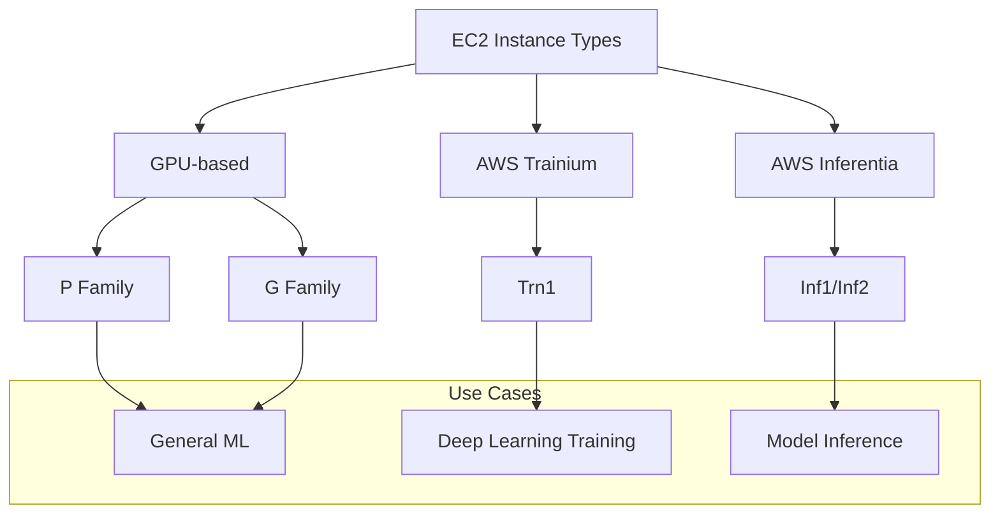
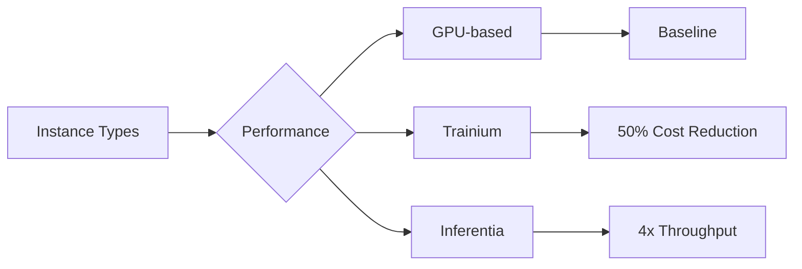

# Amazon EC2 cho AI/ML Workloads

## Tổng quan EC2
Amazon Elastic Compute Cloud (EC2) là dịch vụ cung cấp máy ảo trong cloud, cho phép cấu hình linh hoạt về compute, storage và networking.

## Instance Types cho AI/ML

### 1. GPU-based Instances
- P3, P4, P5 Series
- G3, G5, G6 Series
- Tối ưu cho ML workloads
- High performance computing

### 2. AWS Trainium
- Chip ML đặc biệt
- Training deep learning models
- 100B+ parameters
- 50% cost reduction
- Trn1 instances với 16 accelerators

### 3. AWS Inferentia
- Tối ưu cho model inference
- High performance
- Low cost
- 4x throughput vs GPU
- 70% cost reduction
- Inf1/Inf2 instances

## Hiệu suất và Chi phí

### 1. Performance Comparison

### 2. Cost Benefits
- Trainium: 50% reduction
- Inferentia: 70% reduction
- Lowest environmental footprint
- Efficient resource usage

## Use Cases

### 1. Training
- Deep learning models
- Large parameter models
- Distributed training
- Custom frameworks

### 2. Inference
- Model serving
- High-throughput requirements
- Cost-sensitive applications
- Production deployment

## Best Practices

### 1. Instance Selection
- Workload requirements
- Model size
- Performance needs
- Cost constraints

### 2. Configuration
- Operating system choice
- Storage optimization
- Network settings
- Security groups

### 3. Scaling
- Auto Scaling Groups
- Load balancing
- Resource monitoring
- Cost optimization

## Exam Tips

### 1. Key Points
- EC2 là virtual servers
- Multiple instance types
- GPU vs Trainium vs Inferentia
- Cost/performance tradeoffs

### 2. Environmental Impact
- Trainium/Inferentia efficiency
- Lowest carbon footprint
- Resource optimization
- Green computing

### 3. Performance Metrics
- Throughput improvements
- Cost reductions
- Scaling capabilities
- Use case matching