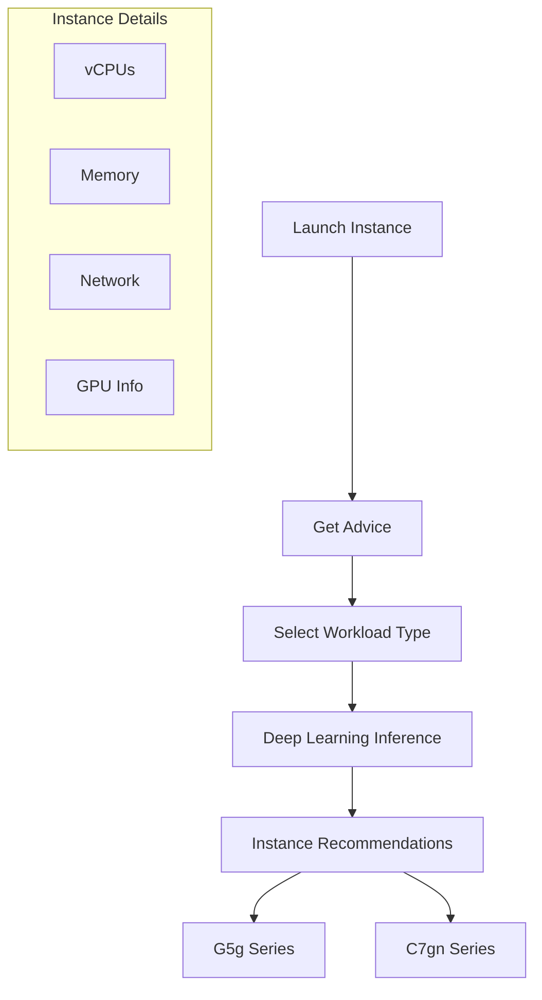
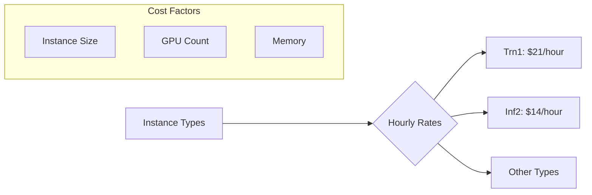
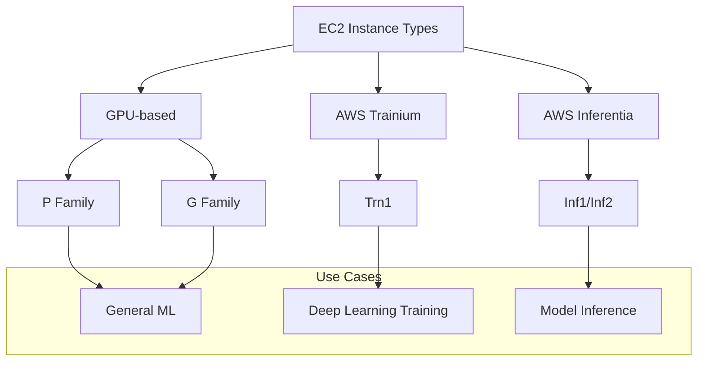
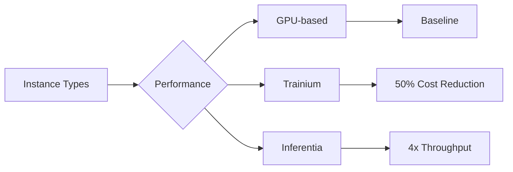

# Amazon EC2 Instance Selection Guide for AI/ML

## Instance Selection Process

### 1. Using Instance Advisor


### 2. Specific Instance Types

#### Training Instances (Trn1)
```json
{
  "instance": "trn1.32xlarge",
  "features": {
    "purpose": "Deep Learning Training",
    "price": "$21/hour",
    "accelerators": "AWS Trainium",
    "use_case": "Large model training"
  }
}
```

#### Inference Instances (Inf2)
```json
{
  "instance": "inf2.48xlarge",
  "features": {
    "purpose": "Model Inference",
    "price": "$14/hour",
    "accelerators": "AWS Inferentia",
    "use_case": "High-throughput inference"
  }
}
```

## GPU Information

### 1. Available GPUs
- NVIDIA T4G Tensor Core
- Custom AWS Accelerators
- Instance-specific options

### 2. Documentation References
- Detailed GPU specs
- Performance metrics
- Compatibility info
- Use case recommendations

## Cost Considerations

### 1. Pricing Structure


### 2. Cost Optimization
- Choose appropriate size
- Monitor usage
- Schedule workloads
- Use spot instances

## Implementation Guide

### 1. Workload Analysis
1. Identify requirements
2. Check performance needs
3. Consider budget
4. Evaluate GPU needs

### 2. Instance Selection
- Use Instance Advisor
- Check GPU availability
- Verify pricing
- Review limitations

### 3. Best Practices
- Start small
- Monitor performance
- Scale as needed
- Optimize costs

## Performance Considerations

### 1. Instance Capabilities
- vCPU count
- Memory size
- Network performance
- GPU specifications

### 2. Workload Matching
- Training requirements
- Inference needs
- Batch processing
- Real-time requirements

## Security and Access

### 1. Configuration
- Security groups
- Network access
- IAM roles
- Encryption settings

### 2. Monitoring
- Performance metrics
- Cost tracking
- Usage patterns
- Resource utilization
Amazon Elastic Compute Cloud (EC2) là dịch vụ cung cấp máy ảo trong cloud, cho phép cấu hình linh hoạt về compute, storage và networking.

## Instance Types cho AI/ML



### 1. GPU-based Instances
- P3, P4, P5 Series
- G3, G5, G6 Series
- Tối ưu cho ML workloads
- High performance computing

### 2. AWS Trainium
- Chip ML đặc biệt
- Training deep learning models
- 100B+ parameters
- 50% cost reduction
- Trn1 instances với 16 accelerators

### 3. AWS Inferentia
- Tối ưu cho model inference
- High performance
- Low cost
- 4x throughput vs GPU
- 70% cost reduction
- Inf1/Inf2 instances

## Hiệu suất và Chi phí

### 1. Performance Comparison


### 2. Cost Benefits
- Trainium: 50% reduction
- Inferentia: 70% reduction
- Lowest environmental footprint
- Efficient resource usage

## Use Cases

### 1. Training
- Deep learning models
- Large parameter models
- Distributed training
- Custom frameworks

### 2. Inference
- Model serving
- High-throughput requirements
- Cost-sensitive applications
- Production deployment

## Best Practices

### 1. Instance Selection
- Workload requirements
- Model size
- Performance needs
- Cost constraints

### 2. Configuration
- Operating system choice
- Storage optimization
- Network settings
- Security groups

### 3. Scaling
- Auto Scaling Groups
- Load balancing
- Resource monitoring
- Cost optimization

## Exam Tips

### 1. Key Points
- EC2 là virtual servers
- Multiple instance types
- GPU vs Trainium vs Inferentia
- Cost/performance tradeoffs

### 2. Environmental Impact
- Trainium/Inferentia efficiency
- Lowest carbon footprint
- Resource optimization
- Green computing

### 3. Performance Metrics
- Throughput improvements
- Cost reductions
- Scaling capabilities
- Use case matching