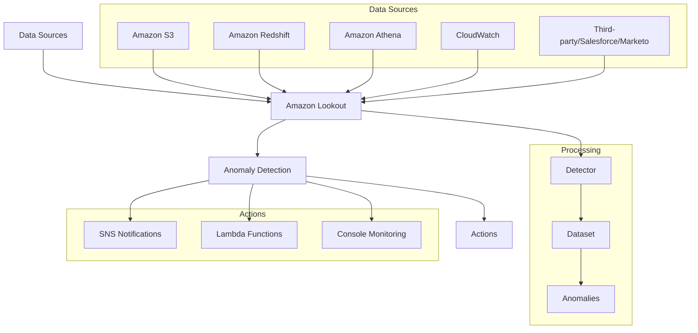
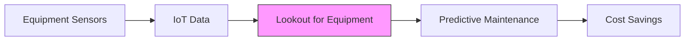
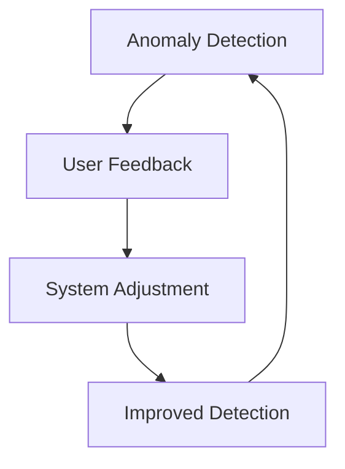

# Amazon Lookout

## Tổng quan
Amazon Lookout là dịch vụ sử dụng machine learning để phát hiện và chẩn đoán các bất thường trong dữ liệu. Dịch vụ này có nhiều phiên bản chuyên biệt cho các use cases khác nhau.

## Kiến trúc và Thành phần

## Phiên bản chuyên biệt

### 1. Lookout for Metrics
- Phát hiện bất thường trong KPIs
- Theo dõi business metrics
- Ad campaign monitoring
- Real-time alerts

### 2. Lookout for Equipment

### 3. Lookout for Vision
- Quality inspection automation
- Computer vision integration
- Assembly line monitoring
- Visual defect detection

## Terminology

### Key Concepts
1. **Detector**
   - Monitoring component
   - Analyzes datasets
   - Finds anomalies

2. **Dataset**
   - Input data source
   - Historical data
   - Real-time data

3. **Anomalies**
   - Detected irregularities
   - Out-of-band behavior
   - Unusual patterns

4. **Measure** (Label)
   - Target metric
   - Optimization goal
   - Performance indicator

5. **Dimensions** (Features)
   - Influencing factors
   - Data attributes
   - Context parameters

## Integration Capabilities

### 1. Data Sources
- Amazon S3
- Amazon Redshift
- Amazon Athena
- Amazon CloudWatch
- Third-party systems
  * Salesforce
  * Marketo

### 2. Actions
- SNS notifications
- Lambda triggers
- Console monitoring
- Custom responses

## Feedback Loop

### 1. Performance Tuning
- Accuracy improvement
- False positive reduction
- Threshold adjustment
- Real-time refinement

### 2. Implementation

## Best Practices

### 1. Setup
- Define clear metrics
- Configure appropriate thresholds
- Set up relevant notifications
- Plan response actions

### 2. Monitoring
- Regular review
- Performance tracking
- Feedback integration
- System optimization

### 3. Response Planning
- Alert prioritization
- Action automation
- Escalation procedures
- Documentation

## Security & Compliance
- Data encryption
- Access control
- Audit logging
- Compliance standards